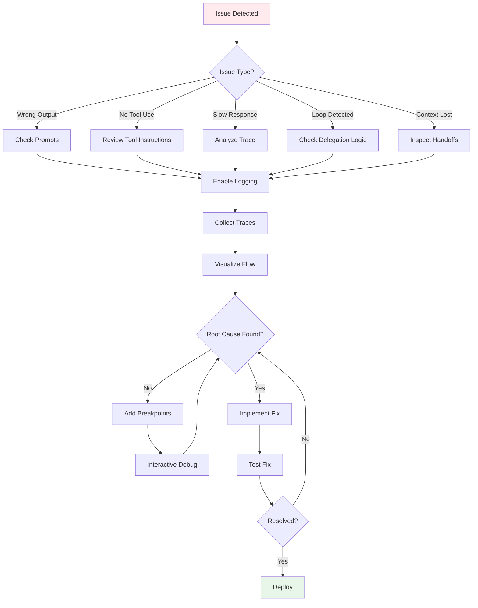
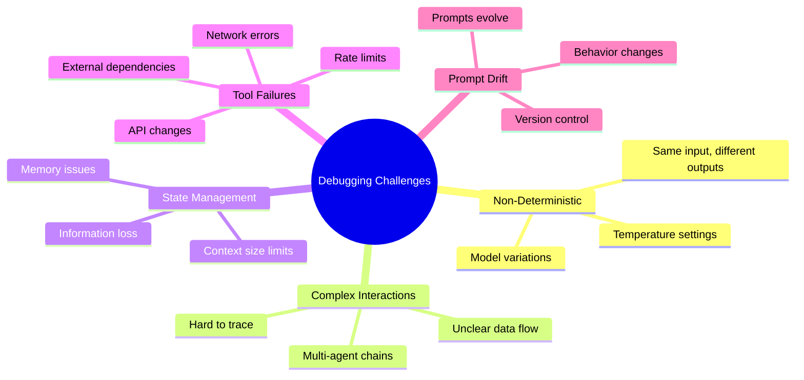
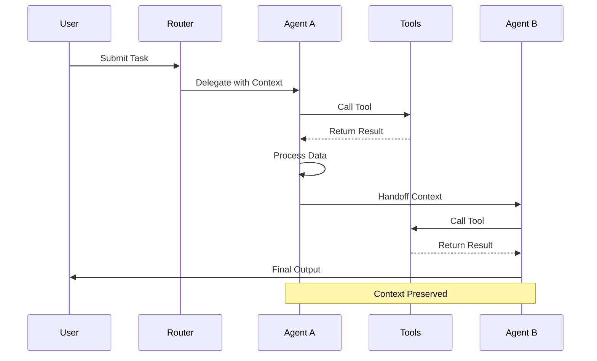

# Debugging


멀티 에이전트 시스템 디버깅 전략과 기법입니다.

## Debugging Workflow



## Debugging Challenges



## Logging Strategy

### Structured Logging

```python
import logging
import json
from datetime import datetime

class AgentLogger:
    def __init__(self, agent_name: str):
        self.agent_name = agent_name
        self.logger = logging.getLogger(agent_name)

    def log_input(self, task: str, context: dict):
        self.logger.info(json.dumps({
            "event": "agent_input",
            "agent": self.agent_name,
            "timestamp": datetime.now().isoformat(),
            "task": task[:500],  # Truncate for logging
            "context_keys": list(context.keys()),
            "context_size": len(str(context))
        }))

    def log_output(self, output: str, tokens: int, latency: float):
        self.logger.info(json.dumps({
            "event": "agent_output",
            "agent": self.agent_name,
            "timestamp": datetime.now().isoformat(),
            "output_length": len(output),
            "tokens_used": tokens,
            "latency_ms": latency
        }))

    def log_tool_call(self, tool: str, args: dict, result: str):
        self.logger.info(json.dumps({
            "event": "tool_call",
            "agent": self.agent_name,
            "tool": tool,
            "arguments": args,
            "result_length": len(result),
            "success": "error" not in result.lower()
        }))

    def log_handoff(self, to_agent: str, context: dict):
        self.logger.info(json.dumps({
            "event": "handoff",
            "from_agent": self.agent_name,
            "to_agent": to_agent,
            "context_passed": list(context.keys())
        }))
```

### Trace Visualization

```python
class TraceViewer:
    def __init__(self):
        self.events = []

    def add_event(self, event: dict):
        self.events.append(event)

    def visualize(self) -> str:
        output = "\n=== Agent Trace ===\n"

        for event in self.events:
            if event["event"] == "agent_input":
                output += f"\n→ [{event['agent']}] Received task\n"
                output += f"  Task: {event['task'][:100]}...\n"

            elif event["event"] == "tool_call":
                output += f"  ⚙ Tool: {event['tool']}\n"
                output += f"    Args: {event['arguments']}\n"
                output += f"    Success: {event['success']}\n"

            elif event["event"] == "handoff":
                output += f"  ↗ Handoff to [{event['to_agent']}]\n"

            elif event["event"] == "agent_output":
                output += f"← [{event['agent']}] Complete\n"
                output += f"  Tokens: {event['tokens_used']}\n"

        return output
```

## Agent Interaction Trace



## Common Issues & Solutions

### Issue 1: Agent Not Using Tools

```python
# Problem: Agent answers without using available tools
# Symptom: Outdated or made-up information

# Diagnosis
def check_tool_usage(trace: list) -> dict:
    tool_calls = [e for e in trace if e["event"] == "tool_call"]
    return {
        "tool_calls": len(tool_calls),
        "tools_used": list(set(e["tool"] for e in tool_calls))
    }

# Solution: Strengthen tool instructions
IMPROVED_PROMPT = """
## IMPORTANT: Tool Usage

You MUST use tools for:
- Any current information (use search_web)
- Any calculations (use calculate)
- Any file content (use read_file)

Do NOT answer from memory when tools are available.
Before answering, ask: "Should I use a tool for this?"
"""
```

### Issue 2: Infinite Loops

```python
# Problem: Agents keep delegating without progress
# Symptom: Max iterations reached, no output

# Diagnosis
def detect_loop(trace: list) -> bool:
    handoffs = [e for e in trace if e["event"] == "handoff"]
    if len(handoffs) < 4:
        return False

    # Check for repeated patterns
    pattern = [(h["from_agent"], h["to_agent"]) for h in handoffs[-4:]]
    return pattern[0] == pattern[2] and pattern[1] == pattern[3]

# Solution: Add loop prevention
LOOP_PREVENTION = """
## Loop Prevention

Track which agents have handled this task.
If you've already seen this task, either:
1. Complete it yourself
2. Request clarification
3. Report inability to proceed

NEVER hand back to an agent that already handled this.
"""
```

### Issue 3: Context Loss

```python
# Problem: Important information lost between agents
# Symptom: Agent asks for info already provided

# Diagnosis
def check_context_transfer(trace: list) -> dict:
    handoffs = [e for e in trace if e["event"] == "handoff"]
    return {
        "handoff_count": len(handoffs),
        "context_preserved": [
            {
                "from": h["from_agent"],
                "to": h["to_agent"],
                "keys": h["context_passed"]
            }
            for h in handoffs
        ]
    }

# Solution: Explicit context passing
CONTEXT_PRESERVATION = """
## Context Handoff Protocol

When handing off, ALWAYS include:
1. Original user request
2. Work completed so far
3. Key findings/data
4. Remaining tasks
5. Any constraints or decisions made

Format:
```
HANDOFF CONTEXT:
- Original Request: [...]
- Completed: [...]
- Findings: [...]
- Remaining: [...]
- Notes: [...]
```
"""
```

### Issue 4: Inconsistent Outputs

```python
# Problem: Same input produces wildly different outputs
# Symptom: Quality varies significantly

# Solution 1: Lower temperature
llm = ChatOpenAI(model="gpt-4", temperature=0)

# Solution 2: Add output validation
def validate_output(output: str, schema: dict) -> bool:
    try:
        data = json.loads(output)
        validate(instance=data, schema=schema)
        return True
    except:
        return False

# Solution 3: Retry with feedback
async def generate_with_retry(prompt: str, max_retries: int = 3):
    for attempt in range(max_retries):
        output = await llm.invoke(prompt)
        if validate_output(output, expected_schema):
            return output
        prompt += f"\n\nPrevious attempt was invalid. Error: {get_validation_error()}"
    raise Exception("Max retries exceeded")
```

## Debugging Tools

### Interactive Debugger

```python
class AgentDebugger:
    def __init__(self, agent):
        self.agent = agent
        self.breakpoints = []
        self.history = []

    def set_breakpoint(self, condition: callable):
        """Set breakpoint on condition"""
        self.breakpoints.append(condition)

    async def run_debug(self, task: str):
        """Run with debugging enabled"""
        state = {"task": task, "step": 0}

        while not state.get("complete"):
            # Check breakpoints
            for bp in self.breakpoints:
                if bp(state):
                    print(f"\n🔴 Breakpoint hit at step {state['step']}")
                    print(f"State: {json.dumps(state, indent=2)}")
                    cmd = input("(c)ontinue, (i)nspect, (m)odify: ")

                    if cmd == "i":
                        print(self.inspect(state))
                    elif cmd == "m":
                        key = input("Key to modify: ")
                        value = input("New value: ")
                        state[key] = value

            # Execute step
            state = await self.agent.step(state)
            self.history.append(state.copy())
            state["step"] += 1

        return state

    def inspect(self, state: dict) -> str:
        """Pretty print state for inspection"""
        return json.dumps(state, indent=2, default=str)

    def replay(self, from_step: int = 0):
        """Replay execution from step"""
        for i, state in enumerate(self.history[from_step:], from_step):
            print(f"\n--- Step {i} ---")
            print(self.inspect(state))
```

### Prompt Diff Tool

```python
import difflib

class PromptDiff:
    def __init__(self):
        self.versions = {}

    def save_version(self, name: str, prompt: str):
        self.versions[name] = prompt

    def diff(self, v1: str, v2: str) -> str:
        p1 = self.versions.get(v1, "")
        p2 = self.versions.get(v2, "")

        diff = difflib.unified_diff(
            p1.splitlines(keepends=True),
            p2.splitlines(keepends=True),
            fromfile=v1,
            tofile=v2
        )
        return "".join(diff)

    def analyze_change_impact(self, v1: str, v2: str) -> dict:
        p1_lines = set(self.versions[v1].splitlines())
        p2_lines = set(self.versions[v2].splitlines())

        return {
            "added": len(p2_lines - p1_lines),
            "removed": len(p1_lines - p2_lines),
            "unchanged": len(p1_lines & p2_lines)
        }
```

## Monitoring Dashboard

```python
from dataclasses import dataclass
from collections import defaultdict

@dataclass
class AgentMetrics:
    invocations: int = 0
    successes: int = 0
    failures: int = 0
    total_tokens: int = 0
    total_latency: float = 0
    tool_calls: int = 0
    handoffs: int = 0

class AgentMonitor:
    def __init__(self):
        self.metrics = defaultdict(AgentMetrics)

    def record(self, agent: str, event: dict):
        m = self.metrics[agent]

        if event["type"] == "invocation":
            m.invocations += 1
            m.total_latency += event["latency"]
            m.total_tokens += event["tokens"]

        elif event["type"] == "success":
            m.successes += 1

        elif event["type"] == "failure":
            m.failures += 1

        elif event["type"] == "tool_call":
            m.tool_calls += 1

        elif event["type"] == "handoff":
            m.handoffs += 1

    def get_dashboard(self) -> str:
        output = "\n=== Agent Dashboard ===\n\n"

        for agent, m in self.metrics.items():
            success_rate = m.successes / m.invocations if m.invocations else 0
            avg_latency = m.total_latency / m.invocations if m.invocations else 0
            avg_tokens = m.total_tokens / m.invocations if m.invocations else 0

            output += f"📊 {agent}\n"
            output += f"   Invocations: {m.invocations}\n"
            output += f"   Success Rate: {success_rate:.1%}\n"
            output += f"   Avg Latency: {avg_latency:.2f}s\n"
            output += f"   Avg Tokens: {avg_tokens:.0f}\n"
            output += f"   Tool Calls: {m.tool_calls}\n"
            output += f"   Handoffs: {m.handoffs}\n\n"

        return output
```

## Best Practices

### Debug Checklist

- [ ] Enable verbose logging
- [ ] Check input/output at each agent
- [ ] Verify tool calls are successful
- [ ] Trace context through handoffs
- [ ] Monitor token usage
- [ ] Check for loops/infinite recursion
- [ ] Validate output format
- [ ] Review error messages

### When to Debug

| Symptom | Likely Cause | Debug Focus |
|---------|--------------|-------------|
| Wrong answer | Prompt issue | Review prompts |
| No tool use | Tool instructions | Check tool prompt |
| Slow response | Too many steps | Trace execution |
| Inconsistent | Temperature/randomness | Lower temperature |
| Context lost | Handoff issue | Check context passing |
| Loops | Unclear delegation | Add loop prevention |
