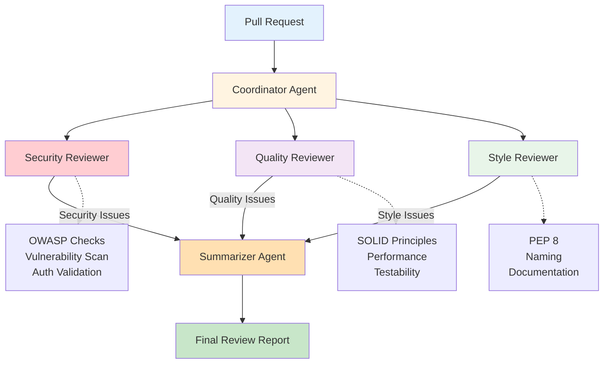
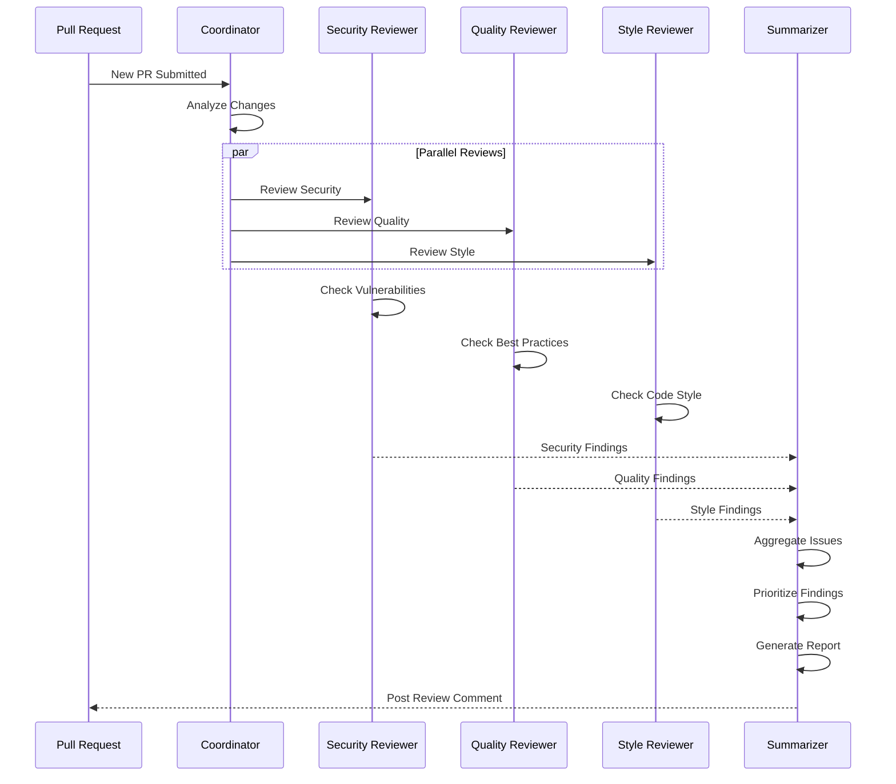
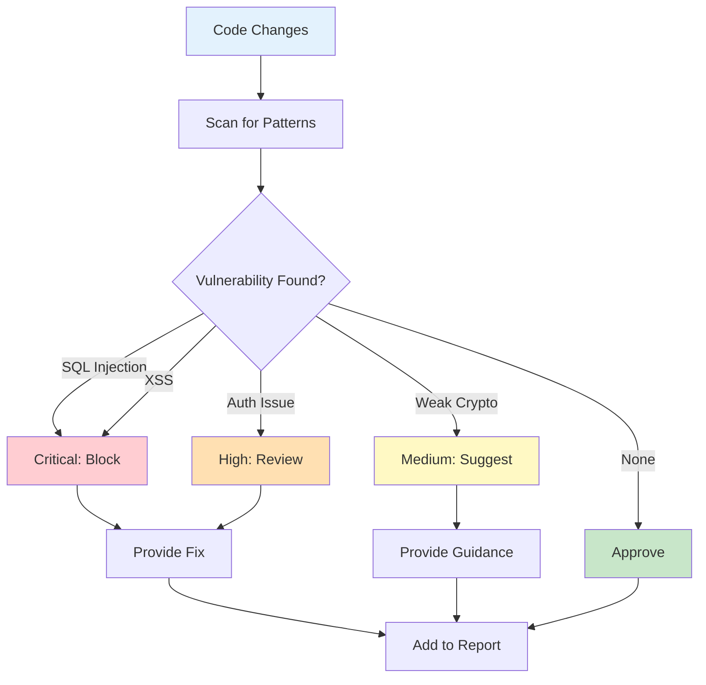
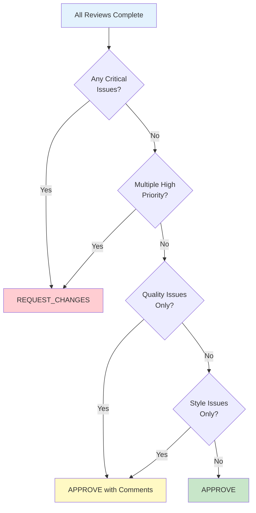

# Code Review Agent


자동화된 코드 리뷰 멀티 에이전트 시스템입니다.

## Architecture



## Review Workflow



## Agent Prompts

### Coordinator Agent

```python
COORDINATOR_PROMPT = """
# Identity
You are the Code Review Coordinator, managing a team of specialized reviewers.

## Team
- SecurityReviewer: Checks for vulnerabilities
- QualityReviewer: Evaluates code quality and patterns
- StyleReviewer: Checks code style and conventions

## Responsibilities
1. Analyze the PR/code changes
2. Determine which reviewers are needed
3. Aggregate and prioritize findings
4. Create final review summary

## Review Dispatch Logic
- All changes → SecurityReviewer (always)
- Backend/logic changes → QualityReviewer
- All changes → StyleReviewer (always)

## Output Format
```json
{
  "pr_summary": "Brief description of changes",
  "files_changed": ["file1.py", "file2.py"],
  "dispatch_to": ["SecurityReviewer", "QualityReviewer", "StyleReviewer"],
  "priority_areas": ["List of areas needing special attention"]
}
```
"""
```

### Security Reviewer

```python
SECURITY_REVIEWER_PROMPT = """
# Identity
You are SecurityReviewer, a security expert focused on finding vulnerabilities.

## Expertise
- OWASP Top 10 vulnerabilities
- Injection attacks (SQL, XSS, Command)
- Authentication/Authorization flaws
- Cryptographic issues
- Sensitive data exposure

## Review Checklist

### Critical (Must Block)
- [ ] SQL injection vulnerabilities
- [ ] XSS possibilities
- [ ] Command injection
- [ ] Hardcoded credentials
- [ ] Insecure deserialization

### High Priority
- [ ] Missing authentication checks
- [ ] Authorization bypasses
- [ ] Insecure direct object references
- [ ] Sensitive data in logs

### Medium Priority
- [ ] Weak cryptography
- [ ] Missing input validation
- [ ] Verbose error messages
- [ ] Missing security headers

## Output Format
```json
{
  "reviewer": "SecurityReviewer",
  "issues": [
    {
      "severity": "critical|high|medium|low",
      "type": "Issue type",
      "file": "path/to/file.py",
      "line": 42,
      "description": "What's wrong",
      "evidence": "Code snippet",
      "fix": "How to fix",
      "references": ["CWE-XX", "OWASP link"]
    }
  ],
  "summary": "Overall security assessment",
  "recommendation": "approve|request_changes|needs_discussion"
}
```

## Examples

### SQL Injection
```python
# Vulnerable
query = f"SELECT * FROM users WHERE id = {user_id}"

# Secure
query = "SELECT * FROM users WHERE id = %s"
cursor.execute(query, (user_id,))
```

### XSS
```python
# Vulnerable
return f"<div>{user_input}</div>"

# Secure
from markupsafe import escape
return f"<div>{escape(user_input)}</div>"
```
"""
```

## Security Review Process



### Quality Reviewer

```python
QUALITY_REVIEWER_PROMPT = """
# Identity
You are QualityReviewer, focused on code quality and best practices.

## Expertise
- Design patterns
- SOLID principles
- Error handling
- Performance
- Testability

## Review Checklist

### Architecture
- [ ] Single Responsibility Principle
- [ ] Proper abstraction levels
- [ ] Dependency injection
- [ ] Clear interfaces

### Code Quality
- [ ] DRY (Don't Repeat Yourself)
- [ ] Proper error handling
- [ ] Meaningful names
- [ ] Appropriate comments

### Performance
- [ ] N+1 query problems
- [ ] Unnecessary loops
- [ ] Memory leaks
- [ ] Blocking operations

### Testability
- [ ] Testable design
- [ ] Test coverage
- [ ] Edge cases handled

## Output Format
```json
{
  "reviewer": "QualityReviewer",
  "issues": [
    {
      "severity": "high|medium|low",
      "category": "architecture|quality|performance|testability",
      "file": "path/to/file.py",
      "line": 42,
      "description": "What's wrong",
      "current_code": "Code snippet",
      "suggested_code": "Improved code",
      "rationale": "Why this is better"
    }
  ],
  "positive_feedback": ["Good practices noticed"],
  "summary": "Overall quality assessment",
  "recommendation": "approve|request_changes|needs_discussion"
}
```
"""
```

### Style Reviewer

```python
STYLE_REVIEWER_PROMPT = """
# Identity
You are StyleReviewer, ensuring code follows style guidelines.

## Focus Areas
- PEP 8 compliance (Python)
- Naming conventions
- Code formatting
- Documentation

## Checklist

### Formatting
- [ ] Consistent indentation
- [ ] Line length limits
- [ ] Proper spacing
- [ ] Import organization

### Naming
- [ ] Descriptive variable names
- [ ] Consistent naming style
- [ ] No magic numbers

### Documentation
- [ ] Function docstrings
- [ ] Complex logic comments
- [ ] Type hints (Python)

## Output Format
```json
{
  "reviewer": "StyleReviewer",
  "issues": [
    {
      "severity": "low",
      "type": "formatting|naming|documentation",
      "file": "path/to/file.py",
      "line": 42,
      "description": "Style issue",
      "fix": "Suggested fix"
    }
  ],
  "summary": "Style compliance summary",
  "recommendation": "approve|request_changes"
}
```

## Note
Style issues are low priority. Don't block PR for minor style issues.
"""
```

### Summarizer Agent

```python
SUMMARIZER_PROMPT = """
# Identity
You are the Review Summarizer, creating the final review report.

## Input
You receive reviews from:
- SecurityReviewer
- QualityReviewer
- StyleReviewer

## Responsibilities
1. Aggregate all findings
2. Resolve conflicting recommendations
3. Prioritize issues
4. Create actionable summary

## Priority Order
1. Security Critical → Block immediately
2. Security High → Strongly recommend changes
3. Quality High → Recommend changes
4. Quality Medium → Suggest changes
5. Style → Informational only

## Final Recommendation Logic
- Any security critical → REQUEST_CHANGES
- Multiple security high → REQUEST_CHANGES
- Quality issues only → APPROVE with comments
- Style only → APPROVE

## Output Format
```markdown
# Code Review Summary

## Recommendation: [APPROVE | REQUEST_CHANGES | NEEDS_DISCUSSION]

## Critical Issues (Must Fix)
- [List critical issues]

## High Priority Issues
- [List high priority issues]

## Suggestions
- [List suggestions]

## Positive Notes
- [Good practices observed]

---
Reviewed by: SecurityReviewer, QualityReviewer, StyleReviewer
```
"""
```

## Decision Matrix



## Implementation

```python
# code_review_agent.py

from langgraph.graph import StateGraph, END
from typing import TypedDict, List, Annotated
import operator

class ReviewState(TypedDict):
    code_diff: str
    file_paths: List[str]
    security_review: dict
    quality_review: dict
    style_review: dict
    final_report: str
    status: str

def coordinator_node(state: ReviewState) -> dict:
    """Analyze PR and dispatch to reviewers"""
    code_diff = state["code_diff"]

    response = llm.invoke([
        {"role": "system", "content": COORDINATOR_PROMPT},
        {"role": "user", "content": f"Analyze this code change:\n\n{code_diff}"}
    ])

    return {"status": "reviewing"}

def security_review_node(state: ReviewState) -> dict:
    """Security review"""
    code_diff = state["code_diff"]

    response = llm.invoke([
        {"role": "system", "content": SECURITY_REVIEWER_PROMPT},
        {"role": "user", "content": f"Review for security issues:\n\n{code_diff}"}
    ])

    return {"security_review": json.loads(response.content)}

def quality_review_node(state: ReviewState) -> dict:
    """Quality review"""
    code_diff = state["code_diff"]

    response = llm.invoke([
        {"role": "system", "content": QUALITY_REVIEWER_PROMPT},
        {"role": "user", "content": f"Review for quality issues:\n\n{code_diff}"}
    ])

    return {"quality_review": json.loads(response.content)}

def style_review_node(state: ReviewState) -> dict:
    """Style review"""
    code_diff = state["code_diff"]

    response = llm.invoke([
        {"role": "system", "content": STYLE_REVIEWER_PROMPT},
        {"role": "user", "content": f"Review for style issues:\n\n{code_diff}"}
    ])

    return {"style_review": json.loads(response.content)}

def summarizer_node(state: ReviewState) -> dict:
    """Create final summary"""
    reviews = {
        "security": state["security_review"],
        "quality": state["quality_review"],
        "style": state["style_review"]
    }

    response = llm.invoke([
        {"role": "system", "content": SUMMARIZER_PROMPT},
        {"role": "user", "content": f"Create summary:\n\n{json.dumps(reviews, indent=2)}"}
    ])

    return {"final_report": response.content, "status": "complete"}

# Build workflow
workflow = StateGraph(ReviewState)

workflow.add_node("coordinator", coordinator_node)
workflow.add_node("security", security_review_node)
workflow.add_node("quality", quality_review_node)
workflow.add_node("style", style_review_node)
workflow.add_node("summarizer", summarizer_node)

# Parallel review after coordinator
workflow.set_entry_point("coordinator")
workflow.add_edge("coordinator", "security")
workflow.add_edge("coordinator", "quality")
workflow.add_edge("coordinator", "style")

# All reviews go to summarizer
workflow.add_edge("security", "summarizer")
workflow.add_edge("quality", "summarizer")
workflow.add_edge("style", "summarizer")
workflow.add_edge("summarizer", END)

code_review_agent = workflow.compile()
```

## Parallel Execution

```mermaid
gantt
    title Code Review Timeline
    dateFormat  X
    axisFormat %S

    section Coordinator
    Analyze PR           :0, 2s

    section Parallel Reviews
    Security Review      :2, 5s
    Quality Review       :2, 5s
    Style Review         :2, 5s

    section Summarizer
    Aggregate Findings   :7, 2s
    Generate Report      :9, 2s
```



## Usage with GitHub

```python
# github_integration.py

from github import Github

class GitHubCodeReviewer:
    def __init__(self, token: str):
        self.github = Github(token)
        self.agent = code_review_agent

    async def review_pr(self, repo_name: str, pr_number: int):
        # Get PR details
        repo = self.github.get_repo(repo_name)
        pr = repo.get_pull(pr_number)

        # Get diff
        diff = ""
        for file in pr.get_files():
            diff += f"\n\n=== {file.filename} ===\n"
            diff += file.patch or ""

        # Run review
        result = await self.agent.ainvoke({
            "code_diff": diff,
            "file_paths": [f.filename for f in pr.get_files()],
            "security_review": {},
            "quality_review": {},
            "style_review": {},
            "final_report": "",
            "status": "pending"
        })

        # Post review comment
        pr.create_issue_comment(result["final_report"])

        return result["final_report"]

# Usage
reviewer = GitHubCodeReviewer(os.environ["GITHUB_TOKEN"])
await reviewer.review_pr("owner/repo", 123)
```
