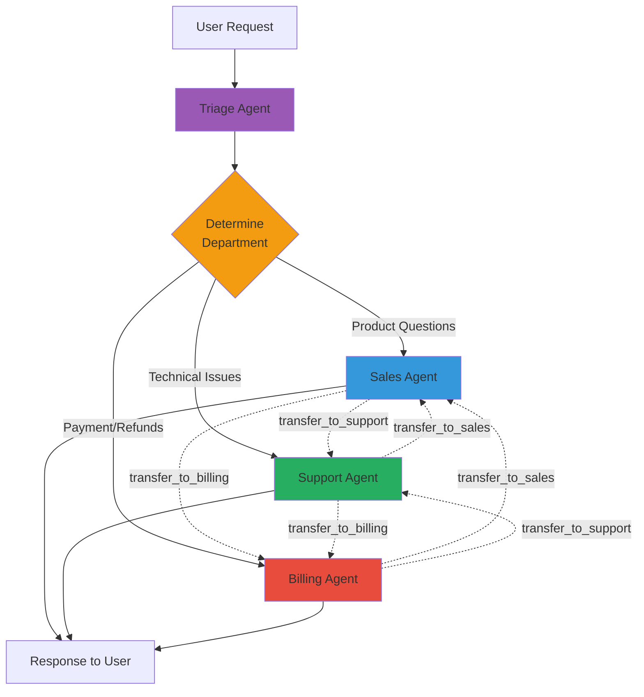
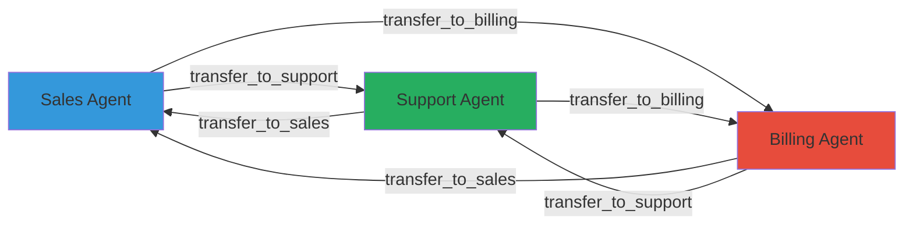
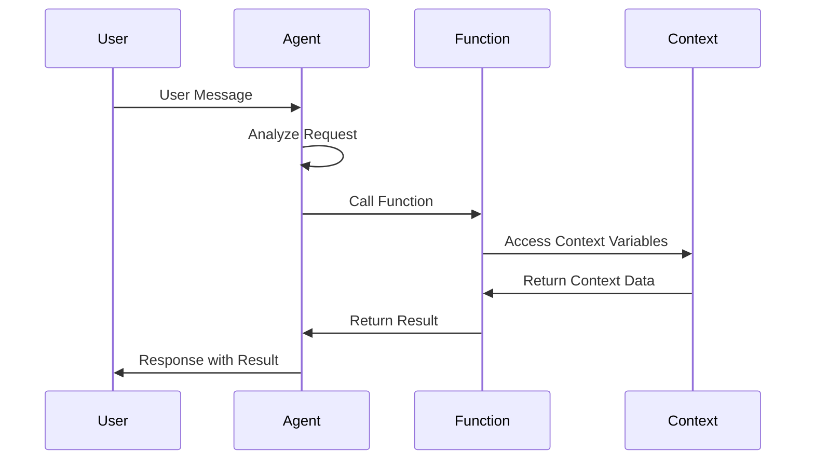
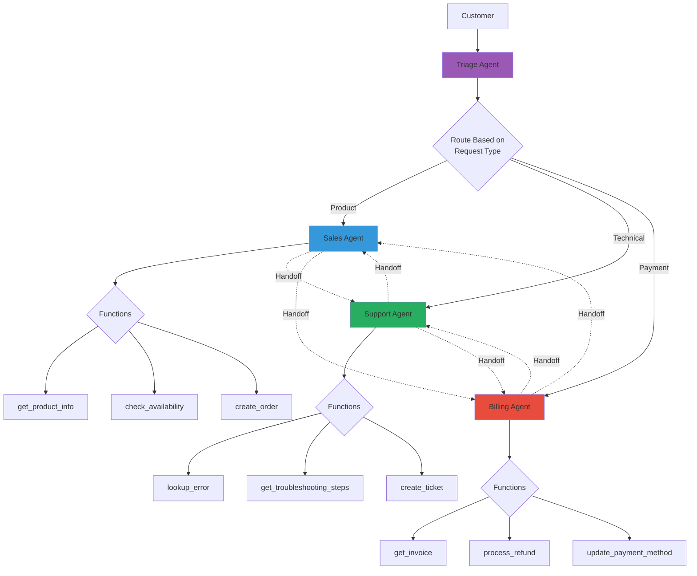

# OpenAI Swarm


OpenAI Swarm을 활용한 경량 멀티 에이전트 오케스트레이션입니다.

## Overview

Swarm은 OpenAI에서 개발한 교육/실험용 경량 멀티 에이전트 프레임워크입니다.

```bash
pip install git+https://github.com/openai/swarm.git
```

:::warning
Swarm은 프로덕션용이 아닌 교육/실험용 프레임워크입니다.
:::

## Handoff Architecture



## Core Concepts

### Agents & Handoffs

```python
from swarm import Swarm, Agent

client = Swarm()

# Define agents with instructions
sales_agent = Agent(
    name="Sales",
    instructions="""You are a sales representative.

    Your responsibilities:
    - Answer product questions
    - Provide pricing information
    - Handle purchase inquiries

    If customer has technical issues, transfer to Support.
    If customer wants refund, transfer to Billing.
    """
)

support_agent = Agent(
    name="Support",
    instructions="""You are a technical support specialist.

    Your responsibilities:
    - Troubleshoot technical issues
    - Provide step-by-step solutions
    - Document problems

    If customer wants to purchase, transfer to Sales.
    If customer needs billing help, transfer to Billing.
    """
)

billing_agent = Agent(
    name="Billing",
    instructions="""You are a billing specialist.

    Your responsibilities:
    - Handle payment questions
    - Process refunds
    - Update billing information

    If customer has product questions, transfer to Sales.
    If customer has technical issues, transfer to Support.
    """
)
```

### Handoff Functions



```python
def transfer_to_sales():
    """Transfer to sales agent for product inquiries."""
    return sales_agent

def transfer_to_support():
    """Transfer to support agent for technical issues."""
    return support_agent

def transfer_to_billing():
    """Transfer to billing agent for payment issues."""
    return billing_agent

# Add handoff functions to agents
sales_agent.functions = [transfer_to_support, transfer_to_billing]
support_agent.functions = [transfer_to_sales, transfer_to_billing]
billing_agent.functions = [transfer_to_sales, transfer_to_support]
```

## Agent Instructions Pattern

### Basic Instructions

```python
AGENT_INSTRUCTIONS = """
# Identity
You are {role} in our customer service team.

# Responsibilities
{responsibilities}

# Communication Style
- Be friendly and professional
- Use customer's name when known
- Show empathy for their situation

# Handoff Rules
{handoff_rules}

# Important Notes
- Never share internal information
- Escalate complex issues appropriately
- Document all interactions
"""

sales_agent = Agent(
    name="Sales",
    instructions=AGENT_INSTRUCTIONS.format(
        role="a sales representative",
        responsibilities="""
        - Answer product and pricing questions
        - Help customers find the right product
        - Process orders and upsells
        """,
        handoff_rules="""
        - Technical problems → Transfer to Support
        - Billing issues → Transfer to Billing
        - Complex complaints → Transfer to Manager
        """
    )
)
```

### Context-Aware Instructions

```python
def get_dynamic_instructions(context_variables):
    customer_tier = context_variables.get("customer_tier", "standard")
    language = context_variables.get("language", "en")

    base = """You are a customer service representative."""

    if customer_tier == "premium":
        base += """

        This is a PREMIUM customer. Provide:
        - Priority support
        - Extended options
        - Proactive suggestions
        """

    if language == "ko":
        base += """

        Communicate in Korean (한국어).
        Use appropriate honorifics.
        """

    return base

agent = Agent(
    name="DynamicAgent",
    instructions=get_dynamic_instructions
)
```

## Functions (Tools)

### Function Execution Flow



### Defining Functions

```python
def get_order_status(order_id: str) -> str:
    """
    Look up the status of an order.

    Args:
        order_id: The order ID to look up

    Returns:
        Order status information
    """
    # In production, query database
    return f"Order {order_id}: Shipped, arriving in 2 days"

def process_refund(order_id: str, reason: str) -> str:
    """
    Process a refund for an order.

    Args:
        order_id: The order to refund
        reason: Reason for refund

    Returns:
        Refund confirmation
    """
    return f"Refund processed for order {order_id}. Reason: {reason}"

def update_customer_info(field: str, value: str) -> str:
    """
    Update customer information.

    Args:
        field: Field to update (email, phone, address)
        value: New value

    Returns:
        Confirmation of update
    """
    return f"Updated {field} to {value}"

# Add functions to agent
billing_agent = Agent(
    name="Billing",
    instructions="...",
    functions=[
        get_order_status,
        process_refund,
        update_customer_info,
        transfer_to_sales,
        transfer_to_support
    ]
)
```

### Function with Context

```python
def get_customer_history(context_variables: dict) -> str:
    """Get purchase history for current customer."""
    customer_id = context_variables.get("customer_id")
    if not customer_id:
        return "No customer ID in context"

    # Query database
    history = db.get_purchases(customer_id)
    return format_history(history)

# Context is automatically passed
agent = Agent(
    name="Sales",
    instructions="...",
    functions=[get_customer_history]
)
```

## Context Variables

### Context Flow

```mermaid
graph LR
    Start[Initial Context] --> Agent1[Triage Agent]
    Agent1 --> Context1[(Context)]

    Context1 --> Agent2[Sales Agent]
    Agent2 --> Update1[Update Context]
    Update1 --> Context2[(Updated Context)]

    Context2 --> Agent3[Support Agent]
    Agent3 --> Update2[Update Context]
    Update2 --> Context3[(Final Context)]

    Context3 --> End[End with Context]

    style Context1 fill:#95A5A6
    style Context2 fill:#95A5A6
    style Context3 fill:#95A5A6
    style Agent1 fill:#9B59B6
    style Agent2 fill:#3498DB
    style Agent3 fill:#27AE60
```



### Passing Context

```python
from swarm import Swarm

client = Swarm()

# Initial context
context = {
    "customer_id": "12345",
    "customer_name": "John Doe",
    "customer_tier": "premium",
    "language": "en"
}

response = client.run(
    agent=triage_agent,
    messages=[{"role": "user", "content": "I need help with my order"}],
    context_variables=context
)

# Context persists through handoffs
print(response.context_variables)
```

### Updating Context

```python
def update_context(key: str, value: str, context_variables: dict):
    """Update a context variable."""
    context_variables[key] = value
    return f"Updated {key}"

def process_login(email: str, context_variables: dict):
    """Process customer login and update context."""
    customer = db.get_customer(email)

    # Update context
    context_variables["customer_id"] = customer.id
    context_variables["customer_name"] = customer.name
    context_variables["customer_tier"] = customer.tier

    return f"Welcome back, {customer.name}!"
```

## Complete Example

### Customer Service Swarm Architecture



### Customer Service Swarm

```python
from swarm import Swarm, Agent

# Initialize
client = Swarm()

# Define triage agent
triage_agent = Agent(
    name="Triage",
    instructions="""You are the first point of contact.

    Understand the customer's needs and route appropriately:
    - Product/pricing questions → Sales
    - Technical issues → Support
    - Billing/refunds → Billing

    For simple greetings, respond yourself.
    Always be friendly and helpful.
    """
)

# Define specialized agents
sales_agent = Agent(
    name="Sales",
    instructions="""You are a sales specialist.

    Help customers with:
    - Product information
    - Pricing and plans
    - Purchase decisions
    - Order placement

    Use the product catalog to answer questions.
    Transfer to Support for technical issues.
    """,
    functions=[
        get_product_info,
        check_availability,
        create_order,
        transfer_to_support,
        transfer_to_billing
    ]
)

support_agent = Agent(
    name="Support",
    instructions="""You are a technical support expert.

    Help customers with:
    - Troubleshooting issues
    - Product setup
    - Error resolution
    - Usage guidance

    Follow the troubleshooting guide.
    Create tickets for complex issues.
    """,
    functions=[
        lookup_error,
        get_troubleshooting_steps,
        create_ticket,
        check_system_status,
        transfer_to_sales,
        transfer_to_billing
    ]
)

billing_agent = Agent(
    name="Billing",
    instructions="""You are a billing specialist.

    Help customers with:
    - Payment questions
    - Invoice lookup
    - Refund processing
    - Subscription changes

    Verify customer identity before making changes.
    """,
    functions=[
        get_invoice,
        process_refund,
        update_payment_method,
        change_subscription,
        transfer_to_sales,
        transfer_to_support
    ]
)

# Handoff functions
def transfer_to_triage():
    """Return to triage for re-routing."""
    return triage_agent

def transfer_to_sales():
    """Transfer to sales for product inquiries."""
    return sales_agent

def transfer_to_support():
    """Transfer to support for technical issues."""
    return support_agent

def transfer_to_billing():
    """Transfer to billing for payment issues."""
    return billing_agent

# Add handoffs to triage
triage_agent.functions = [
    transfer_to_sales,
    transfer_to_support,
    transfer_to_billing
]

# Run conversation
def chat(user_message: str, context: dict = None):
    context = context or {"customer_id": "guest"}

    messages = [{"role": "user", "content": user_message}]

    response = client.run(
        agent=triage_agent,
        messages=messages,
        context_variables=context
    )

    return {
        "response": response.messages[-1]["content"],
        "agent": response.agent.name,
        "context": response.context_variables
    }

# Example usage
result = chat("I can't log into my account")
print(f"[{result['agent']}]: {result['response']}")
```

## Best Practices

### Agent Design

```python
# Good: Clear scope and handoff rules
agent = Agent(
    name="SalesSpecialist",
    instructions="""
    # Scope
    Handle: Product questions, pricing, orders
    Don't handle: Technical issues, billing

    # Handoff Rules
    - "error", "not working" → Support
    - "refund", "payment" → Billing

    # Guidelines
    - Confirm understanding before answering
    - Suggest relevant products
    - Upsell when appropriate
    """
)

# Bad: Vague instructions
agent = Agent(
    name="Agent",
    instructions="Help the customer"
)
```

### Function Design

```python
# Good: Clear description, typed parameters
def search_products(
    query: str,
    category: str = None,
    max_results: int = 5
) -> str:
    """
    Search product catalog.

    Args:
        query: Search terms
        category: Optional category filter
        max_results: Maximum results to return

    Returns:
        Formatted list of matching products
    """
    pass

# Bad: Unclear function
def search(q):
    pass
```

### Handoff Design

```python
# Good: Descriptive handoff function
def transfer_to_technical_support():
    """
    Transfer to technical support for:
    - Error messages
    - Product not working
    - Setup assistance
    - Performance issues
    """
    return support_agent

# Bad: No context
def goto_support():
    return support_agent
```

## Limitations

| Aspect | Limitation |
|--------|------------|
| Persistence | No built-in memory |
| Complexity | Not for complex workflows |
| Production | Educational purpose only |
| Async | No native async support |

## Resources

- [OpenAI Swarm GitHub](https://github.com/openai/swarm)
- [Swarm Examples](https://github.com/openai/swarm/tree/main/examples)
