# System Architecture

멀티 에이전트 시스템의 아키텍처를 설계합니다.


## Architecture Overview

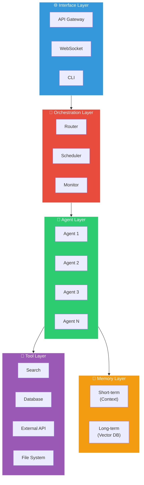

## Layer Details

### 1. Interface Layer

사용자 및 외부 시스템과의 인터페이스:

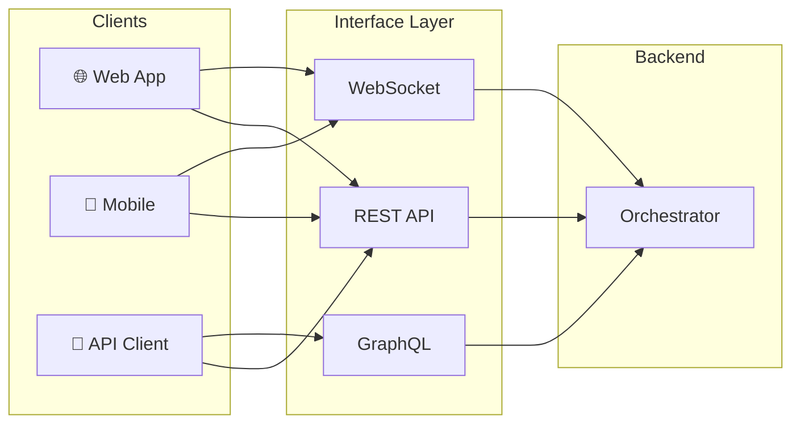

```python
from fastapi import FastAPI, WebSocket

app = FastAPI()

@app.post("/agent/run")
async def run_agent(request: AgentRequest):
    """REST API endpoint for agent execution"""
    result = await orchestrator.run(request)
    return result

@app.websocket("/agent/stream")
async def stream_agent(websocket: WebSocket):
    """WebSocket for streaming responses"""
    await websocket.accept()
    async for chunk in orchestrator.stream():
        await websocket.send_text(chunk)
```

### 2. Orchestration Layer

에이전트 조율 및 작업 관리:

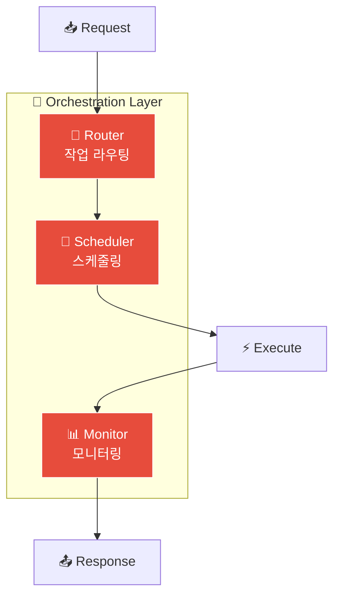

```python
class Orchestrator:
    def __init__(self):
        self.router = Router()
        self.scheduler = Scheduler()
        self.monitor = Monitor()

    async def run(self, request):
        # 1. Route to appropriate agent(s)
        agents = self.router.route(request)

        # 2. Schedule tasks
        tasks = self.scheduler.schedule(agents, request)

        # 3. Execute with monitoring
        async with self.monitor.track():
            results = await self.execute(tasks)

        return results
```

### 3. Agent Layer

개별 에이전트 구현:

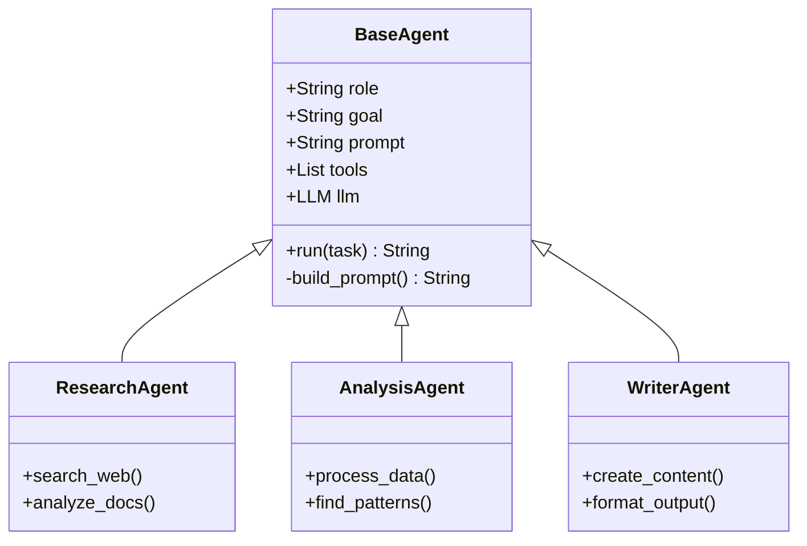

```python
class BaseAgent:
    def __init__(self, config: AgentConfig):
        self.role = config.role
        self.goal = config.goal
        self.prompt = self._build_prompt(config)
        self.tools = config.tools
        self.llm = config.llm

    def _build_prompt(self, config) -> str:
        return f"""
        Role: {config.role}
        Goal: {config.goal}

        Instructions:
        {config.instructions}

        Available Tools:
        {self._format_tools(config.tools)}
        """

    async def run(self, task: str) -> str:
        messages = [
            {"role": "system", "content": self.prompt},
            {"role": "user", "content": task}
        ]
        return await self.llm.complete(messages, tools=self.tools)
```

### 4. Tool Layer

외부 도구 및 API 통합:

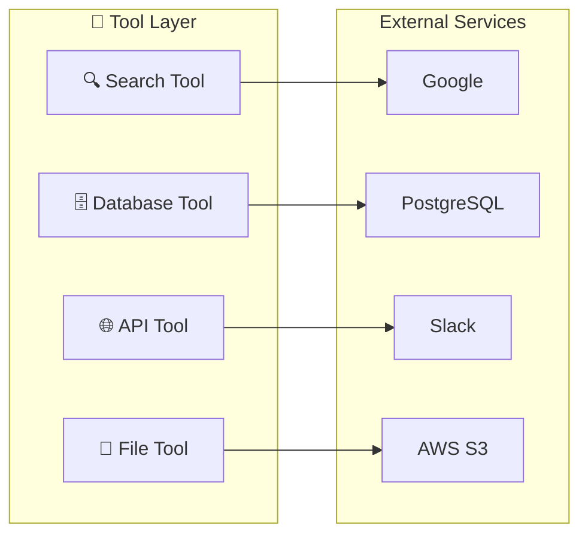

```python
from pydantic import BaseModel
from typing import Any

class Tool(BaseModel):
    name: str
    description: str
    parameters: dict

    async def execute(self, **kwargs) -> Any:
        raise NotImplementedError

class SearchTool(Tool):
    name = "search"
    description = "Search the web for information"
    parameters = {
        "query": {"type": "string", "description": "Search query"}
    }

    async def execute(self, query: str) -> list:
        # Implementation
        return await self.search_api.search(query)
```

### 5. Memory Layer

상태 및 컨텍스트 관리:

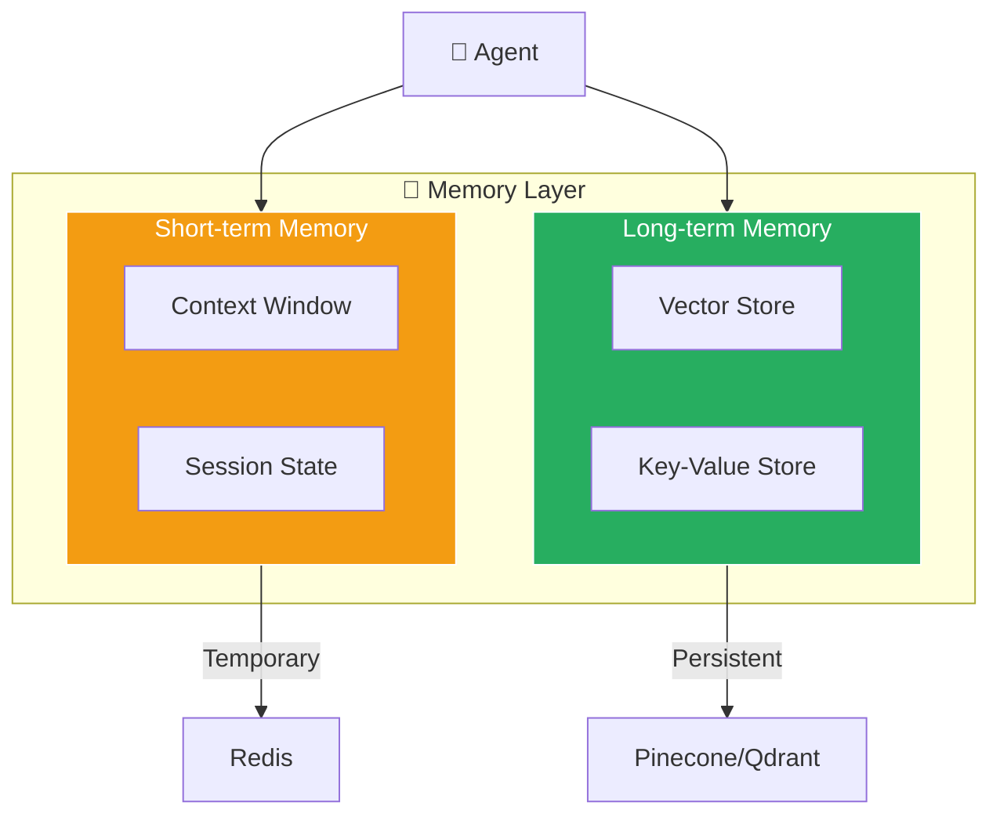

```python
class MemoryManager:
    def __init__(self):
        self.short_term = ShortTermMemory()  # In-memory
        self.long_term = LongTermMemory()    # Vector DB

    async def store(self, key: str, value: Any, ttl: int = None):
        """Store in short-term memory"""
        await self.short_term.set(key, value, ttl)

    async def persist(self, content: str, metadata: dict):
        """Store in long-term memory (vector DB)"""
        embedding = await self.embed(content)
        await self.long_term.insert(embedding, metadata)

    async def recall(self, query: str, k: int = 5) -> list:
        """Retrieve relevant memories"""
        embedding = await self.embed(query)
        return await self.long_term.search(embedding, k)
```

## Design Patterns

### Microservices Architecture

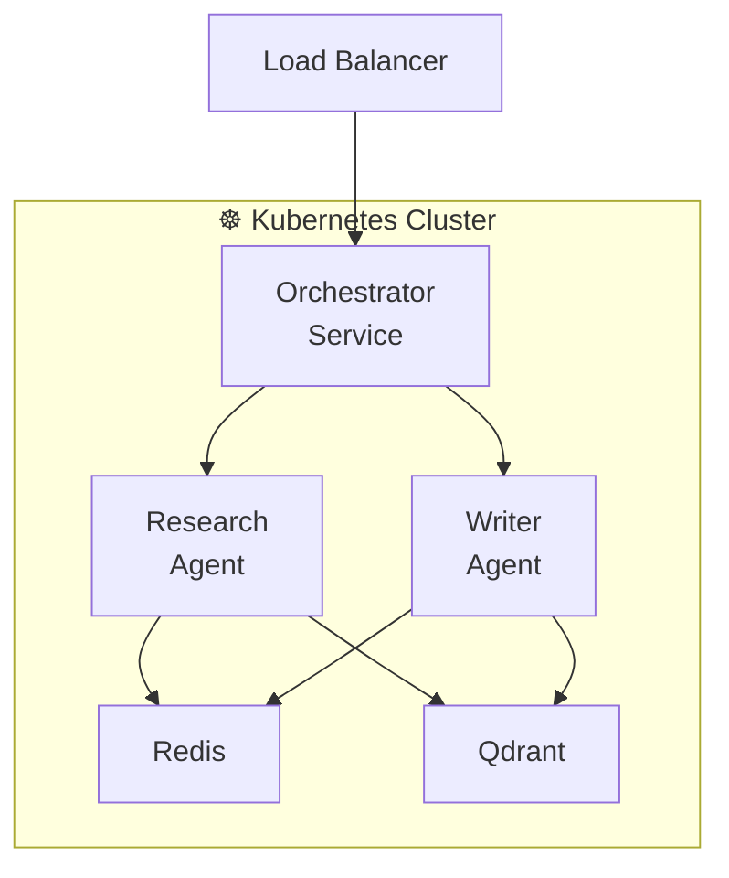

각 에이전트를 독립 서비스로 배포:

```yaml
# docker-compose.yml
services:
  orchestrator:
    image: agent-orchestrator
    ports:
      - "8000:8000"

  researcher:
    image: agent-researcher
    environment:
      - AGENT_TYPE=researcher

  writer:
    image: agent-writer
    environment:
      - AGENT_TYPE=writer

  redis:
    image: redis:alpine

  qdrant:
    image: qdrant/qdrant
```

### Event-Driven Architecture

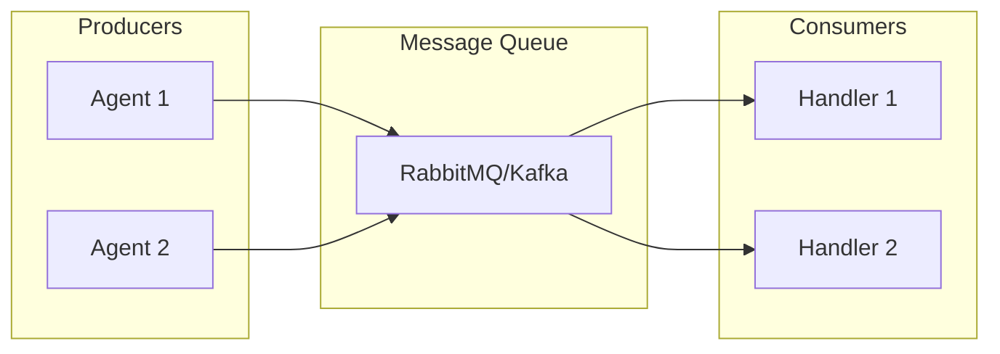

이벤트 기반 통신:

```python
from aio_pika import connect_robust

class EventBus:
    async def publish(self, event: str, data: dict):
        await self.channel.default_exchange.publish(
            Message(json.dumps(data).encode()),
            routing_key=event
        )

    async def subscribe(self, event: str, handler: Callable):
        queue = await self.channel.declare_queue(event)
        await queue.consume(handler)
```

## Scaling Strategies

### Horizontal Scaling

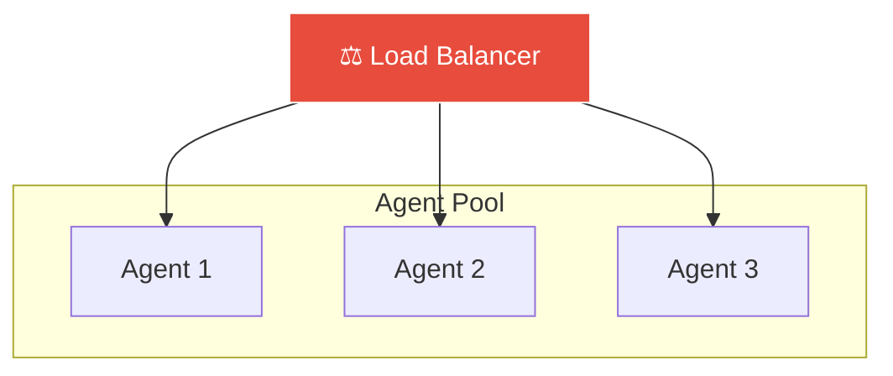

```python
# Load balancer configuration
agents = [
    AgentInstance("researcher-1", host="10.0.0.1"),
    AgentInstance("researcher-2", host="10.0.0.2"),
    AgentInstance("researcher-3", host="10.0.0.3"),
]

load_balancer = RoundRobinBalancer(agents)
```

### Agent Pool

```python
class AgentPool:
    def __init__(self, agent_class, size: int = 10):
        self.pool = asyncio.Queue(maxsize=size)
        for _ in range(size):
            self.pool.put_nowait(agent_class())

    async def acquire(self) -> Agent:
        return await self.pool.get()

    async def release(self, agent: Agent):
        await self.pool.put(agent)
```

## Security Considerations

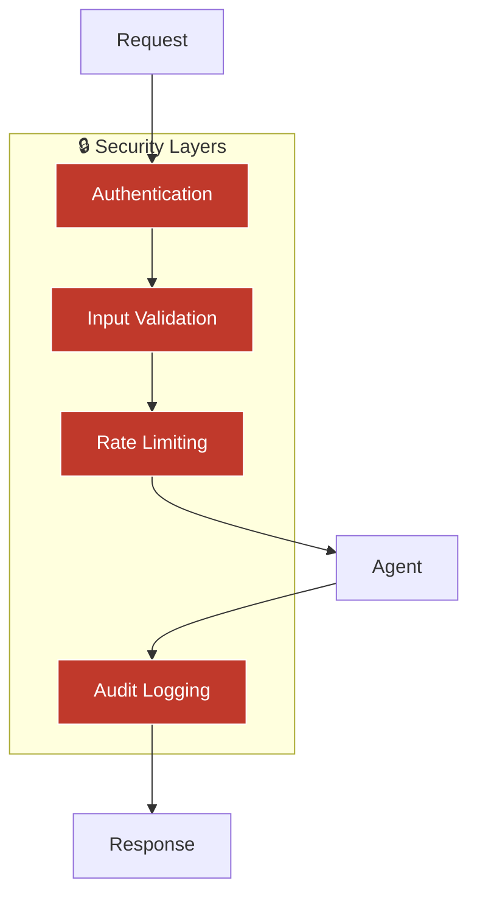

### Input Validation

```python
from pydantic import BaseModel, validator

class AgentRequest(BaseModel):
    task: str
    context: dict = {}

    @validator('task')
    def validate_task(cls, v):
        if len(v) > 10000:
            raise ValueError("Task too long")
        # Sanitize input
        return sanitize(v)
```

### Rate Limiting

```python
from slowapi import Limiter

limiter = Limiter(key_func=get_remote_address)

@app.post("/agent/run")
@limiter.limit("10/minute")
async def run_agent(request: Request):
    ...
```

## Monitoring & Observability

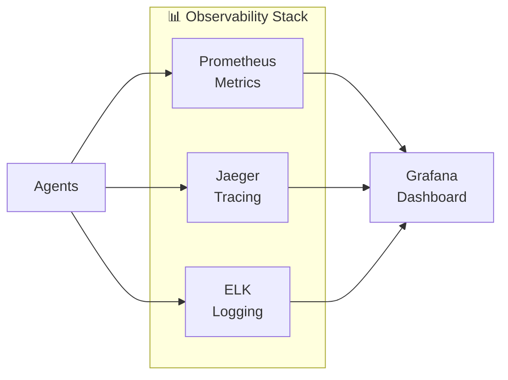

### Metrics Collection

```python
from prometheus_client import Counter, Histogram

agent_requests = Counter(
    'agent_requests_total',
    'Total agent requests',
    ['agent_type', 'status']
)

agent_latency = Histogram(
    'agent_latency_seconds',
    'Agent response latency',
    ['agent_type']
)
```

### Tracing

```python
from opentelemetry import trace

tracer = trace.get_tracer(__name__)

async def run_agent(task):
    with tracer.start_as_current_span("agent.run") as span:
        span.set_attribute("agent.type", self.type)
        span.set_attribute("task.length", len(task))
        result = await self._execute(task)
        return result
```
