# Core Concepts

멀티 에이전트 시스템의 핵심 개념을 이해합니다.


## Agent란?

Agent는 환경을 인식하고, 목표를 달성하기 위해 자율적으로 행동하는 AI 엔티티입니다.

```mermaid
flowchart TB
    subgraph Agent["🤖 Agent"]
        direction TB
        SP["📝 System Prompt<br/>(Role, Goal, Constraints)"]
        LLM["🧠 LLM<br/>(Reasoning Engine)"]
        Tools["🔧 Tools<br/>(Actions & Capabilities)"]
        Memory["💾 Memory<br/>(Context & History)"]
    end

    Input["📥 Input"] --> SP
    SP --> LLM
    LLM --> Tools
    Tools --> Memory
    Memory --> Output["📤 Output"]

    style Agent fill:#2c3e50,stroke:#fff
    style SP fill:#3498db,stroke:#fff,color:#fff
    style LLM fill:#e74c3c,stroke:#fff,color:#fff
    style Tools fill:#27ae60,stroke:#fff,color:#fff
    style Memory fill:#f39c12,stroke:#fff,color:#fff
```

### Agent Components

| 구성요소 | 설명 | 예시 |
|---------|------|------|
| **System Prompt** | 에이전트의 역할, 목표, 제약 정의 | "You are a code reviewer..." |
| **LLM** | 추론 엔진 | GPT-4, Claude, Gemini |
| **Tools** | 외부 시스템과 상호작용 | Web search, DB query |
| **Memory** | 컨텍스트 및 대화 기록 | Short-term, Long-term |

## Prompt의 역할

프롬프트는 에이전트의 "두뇌"를 구성합니다:

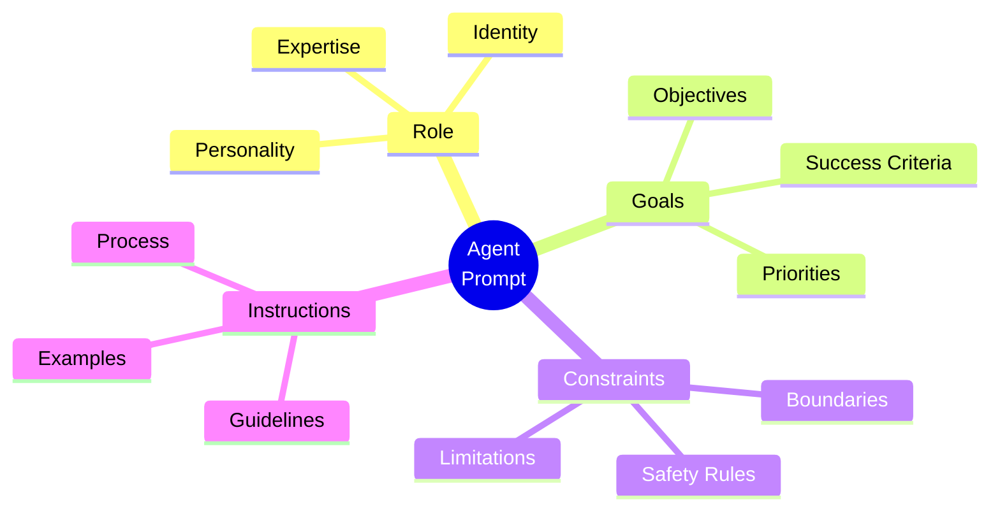

```python
AGENT_PROMPT = """
# Role Definition
You are a [ROLE] specialized in [DOMAIN].

# Goals
Your primary objectives are:
1. [Goal 1]
2. [Goal 2]

# Constraints
You must:
- [Constraint 1]
- [Constraint 2]

# Available Tools
[tools]

# Output Format
[format_instructions]
"""
```

## Multi-Agent vs Single-Agent

### Single-Agent System

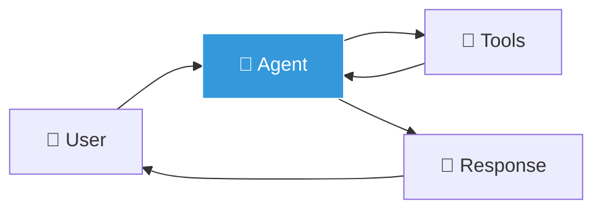

**장점**: 간단함, 빠른 개발
**단점**: 복잡한 작업에 한계

### Multi-Agent System

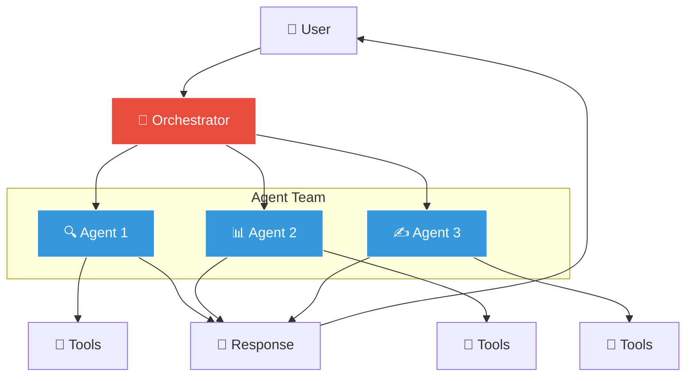

**장점**: 전문화, 확장성, 병렬 처리
**단점**: 복잡성 증가, 조율 필요

## Key Concepts

### 1. Role Definition

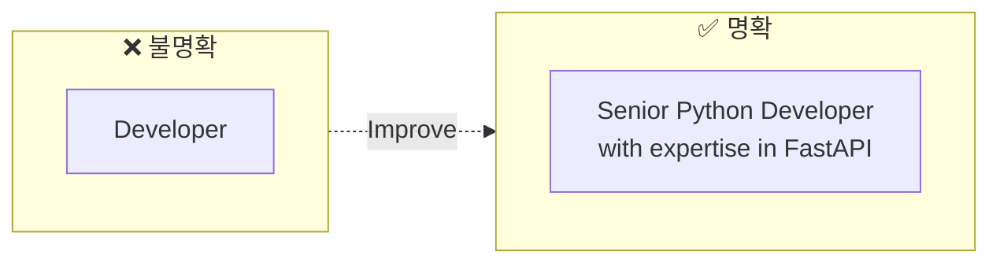

에이전트에게 명확한 역할 부여:

```python
# Good: Specific role
role="Senior Python Developer with expertise in FastAPI"

# Bad: Vague role
role="Developer"
```

### 2. Goal Setting

측정 가능한 목표 설정:

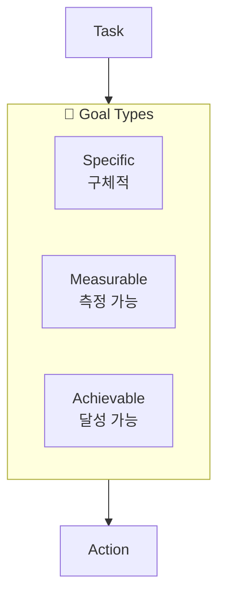

```python
# Good: Clear, measurable goal
goal="Review code for security vulnerabilities and suggest fixes"

# Bad: Vague goal
goal="Help with code"
```

### 3. Context Sharing

에이전트 간 효과적인 정보 공유:

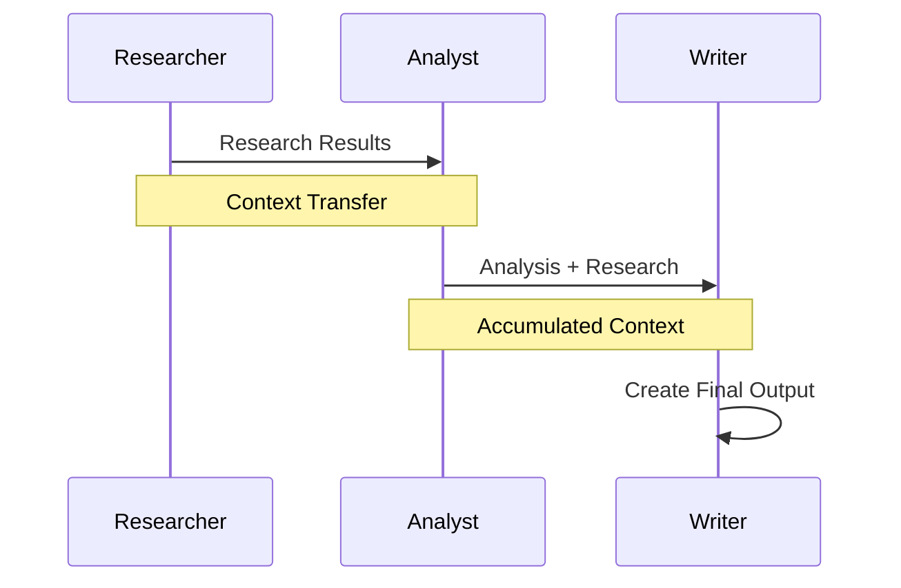

```python
# Task with context from previous task
writing_task = Task(
    description="Write article based on research",
    agent=writer,
    context=[research_task]  # 이전 태스크 결과 참조
)
```

### 4. Tool Binding

에이전트에게 필요한 도구 제공:

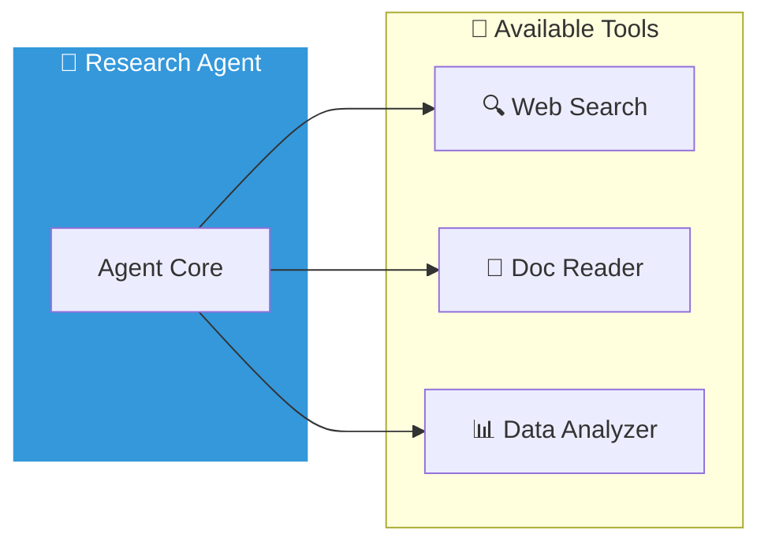

```python
from crewai_tools import SerperDevTool, WebsiteSearchTool

researcher = Agent(
    role="Researcher",
    tools=[
        SerperDevTool(),      # 웹 검색
        WebsiteSearchTool()   # 웹사이트 스크래핑
    ]
)
```

## Agent Communication Patterns

### Direct Communication


에이전트가 직접 소통:

```python
# Agent A → Agent B
agent_b.receive_message(agent_a.send_message())
```

### Blackboard Pattern

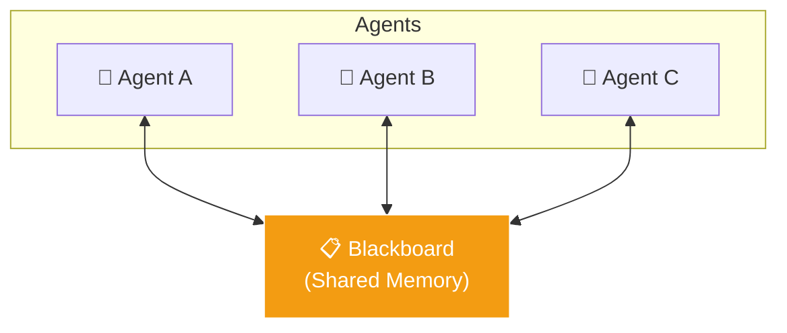

공유 메모리 사용:

```python
# All agents read/write to shared memory
blackboard.write("research_results", data)
other_agent.read("research_results")
```

### Message Queue

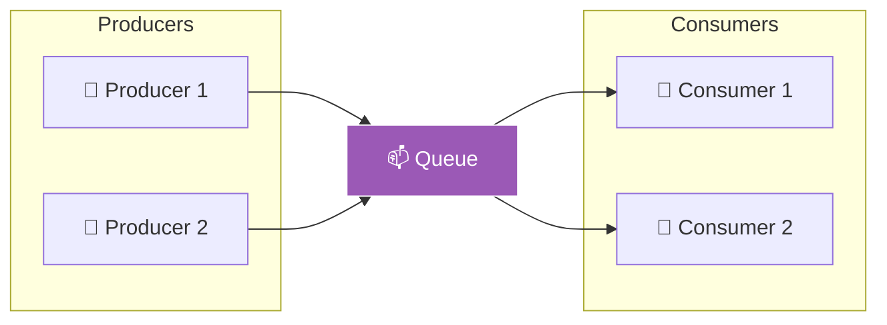

비동기 메시지 전달:

```python
# Producer-Consumer pattern
queue.put({"from": "agent_a", "data": results})
message = queue.get()
```

## State Management

### Stateless Agents

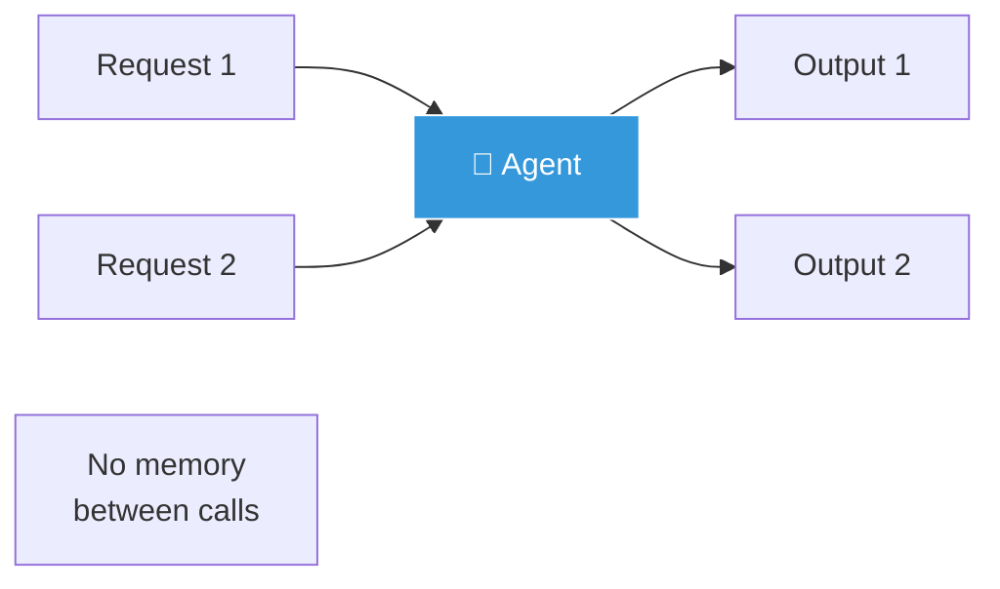

각 호출이 독립적:

```python
# No memory between calls
response = agent.run("Analyze this data")
```

### Stateful Agents

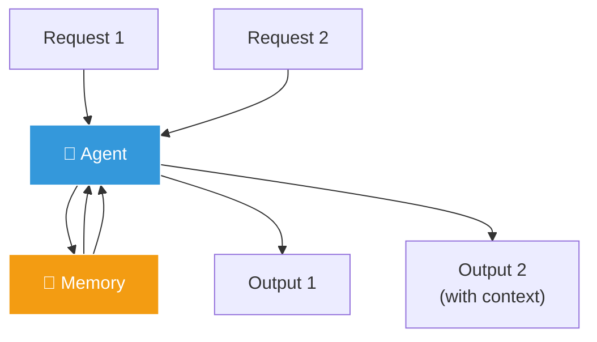

상태 유지:

```python
# Memory persists across calls
agent = Agent(
    role="Assistant",
    memory=True,  # Enable memory
    memory_config={
        "provider": "redis",
        "ttl": 3600
    }
)
```

## Error Handling

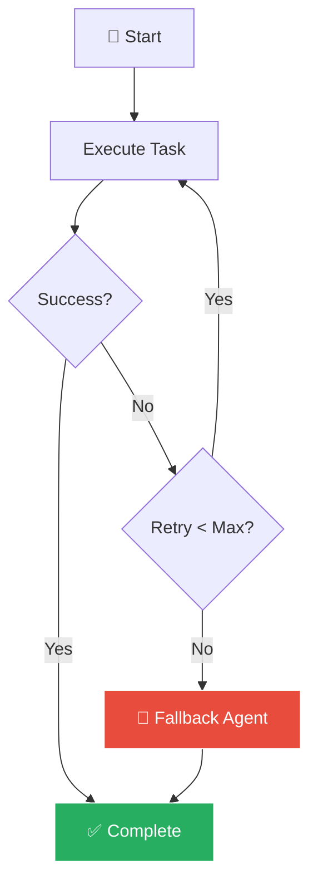

### Retry Strategy

```python
agent = Agent(
    role="Researcher",
    max_iter=5,        # 최대 시도 횟수
    max_retry=3,       # 오류 시 재시도
    timeout=120        # 타임아웃 (초)
)
```

### Fallback Agent

```python
# 주 에이전트 실패 시 백업 에이전트 사용
try:
    result = primary_agent.run(task)
except AgentError:
    result = fallback_agent.run(task)
```

## Summary

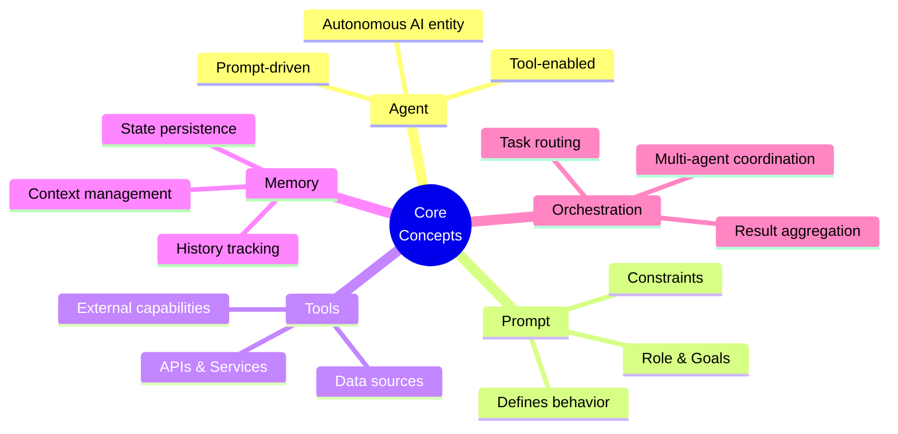

| Concept | Description |
|---------|-------------|
| Agent | 자율적으로 작업을 수행하는 AI 엔티티 |
| Prompt | 에이전트의 역할과 행동을 정의 |
| Tools | 에이전트가 사용할 수 있는 기능 |
| Memory | 컨텍스트와 히스토리 관리 |
| Orchestration | 다중 에이전트 조율 |
