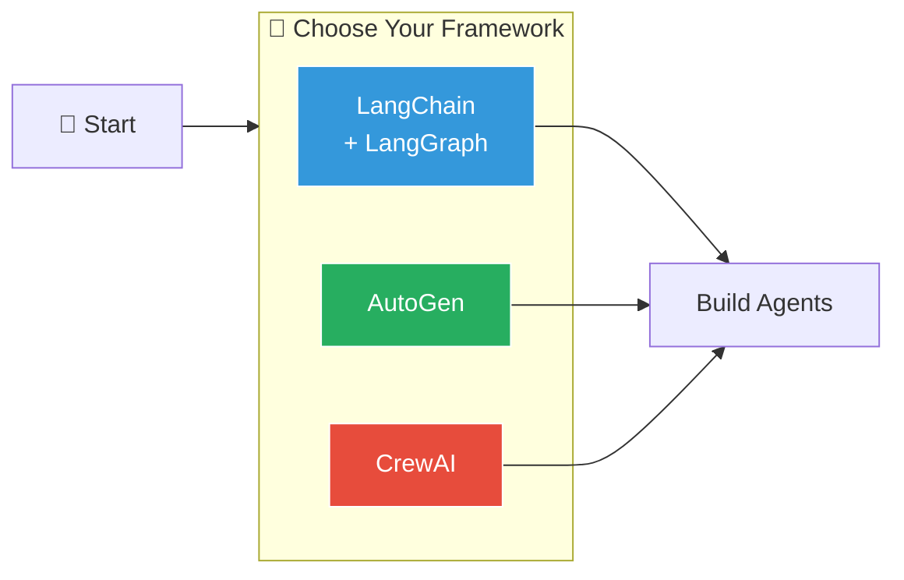
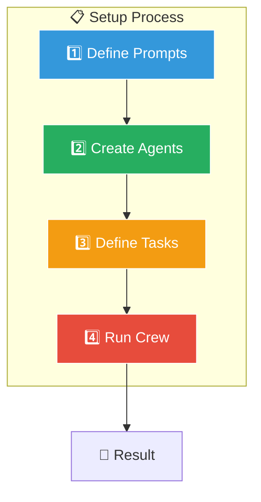
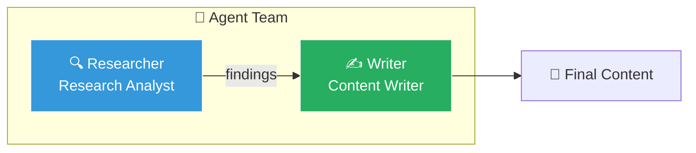
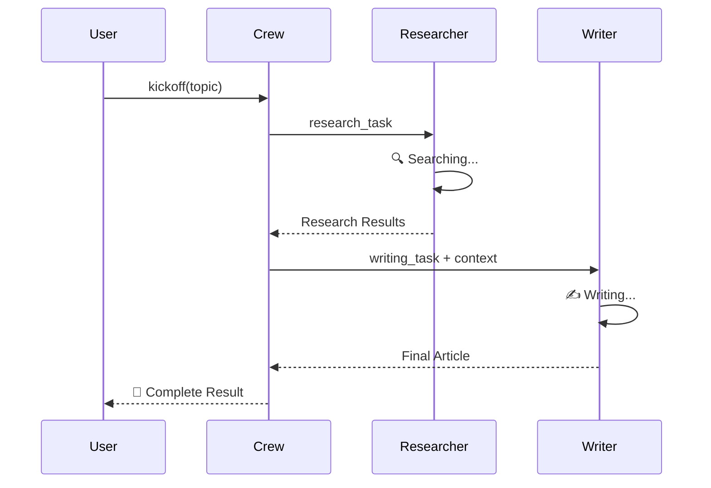
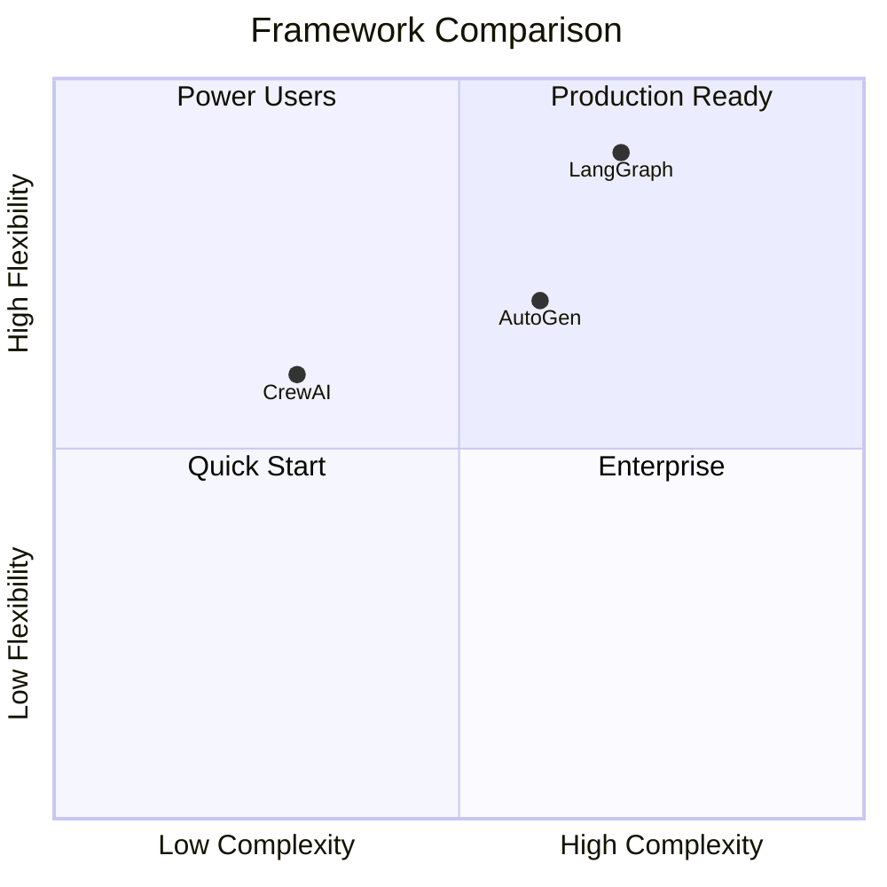
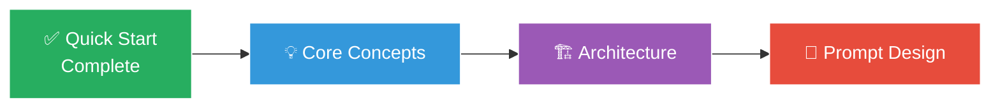
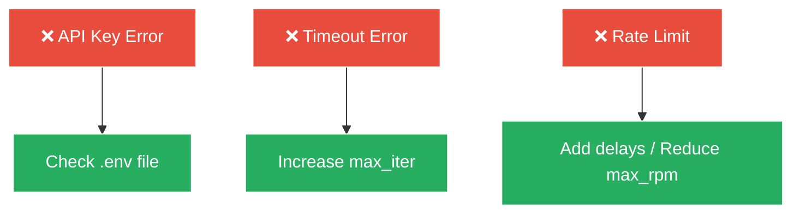

# Quick Start

멀티 에이전트 프롬프트 설계를 빠르게 시작하는 가이드입니다.


## Prerequisites

```bash
# Python 3.10+
python --version

# pip or uv package manager
pip --version
```

## Installation

선호하는 프레임워크를 설치하세요:



```bash
# LangChain + LangGraph
pip install langchain langgraph langchain-openai

# AutoGen
pip install autogen-agentchat autogen-ext

# CrewAI
pip install crewai crewai-tools
```

## Environment Setup

```bash
# .env 파일 생성
export OPENAI_API_KEY="your-api-key"
export ANTHROPIC_API_KEY="your-api-key"
```

## Your First Multi-Agent System



### Step 1: Define Agent Prompts

각 에이전트의 역할을 명확히 정의합니다:

```python
# prompts.py

RESEARCHER_PROMPT = """
You are a Research Analyst specialized in gathering information.

## Your Role
- Search for relevant information on given topics
- Verify facts from multiple sources
- Summarize findings concisely

## Guidelines
- Always cite your sources
- Prioritize recent information
- Flag any conflicting information

## Output Format
Provide findings in structured markdown format.
"""

WRITER_PROMPT = """
You are a Content Writer who creates engaging articles.

## Your Role
- Transform research into readable content
- Maintain consistent tone and style
- Ensure accuracy of information

## Guidelines
- Use clear, simple language
- Break complex topics into digestible sections
- Include relevant examples

## Output Format
Deliver content in markdown with proper headings.
"""
```

### Step 2: Create Agents



```python
# agents.py
from crewai import Agent

researcher = Agent(
    role="Research Analyst",
    goal="Find accurate and relevant information",
    backstory=RESEARCHER_PROMPT,
    verbose=True,
    allow_delegation=False
)

writer = Agent(
    role="Content Writer",
    goal="Create engaging and accurate content",
    backstory=WRITER_PROMPT,
    verbose=True,
    allow_delegation=False
)
```

### Step 3: Define Tasks

```python
# tasks.py
from crewai import Task

research_task = Task(
    description="""
    Research the topic: {topic}

    Find:
    - Key concepts and definitions
    - Recent developments (2024-2025)
    - Expert opinions and insights
    - Relevant statistics
    """,
    expected_output="Comprehensive research summary in markdown",
    agent=researcher
)

writing_task = Task(
    description="""
    Based on the research, write an article about: {topic}

    Requirements:
    - 800-1000 words
    - Include introduction and conclusion
    - Use subheadings for organization
    - Cite sources appropriately
    """,
    expected_output="Complete article in markdown format",
    agent=writer,
    context=[research_task]
)
```

### Step 4: Run the Crew



```python
# main.py
from crewai import Crew, Process

crew = Crew(
    agents=[researcher, writer],
    tasks=[research_task, writing_task],
    process=Process.sequential,
    verbose=True
)

result = crew.kickoff(inputs={"topic": "Multi-Agent AI Systems"})
print(result)
```

## Expected Output

```
[Researcher] Starting research on Multi-Agent AI Systems...
[Researcher] Found 15 relevant sources...
[Researcher] Research complete. Summary ready.

[Writer] Received research data...
[Writer] Creating article structure...
[Writer] Writing content...
[Writer] Article complete.

=== Final Output ===
# Multi-Agent AI Systems: A Comprehensive Guide
...
```

## Framework Comparison



| Framework | Best For | Learning Curve |
|-----------|----------|----------------|
| **CrewAI** | 빠른 시작, 직관적 API | ⭐ Easy |
| **LangGraph** | 복잡한 워크플로우, 상태 관리 | ⭐⭐⭐ Advanced |
| **AutoGen** | 대화형 에이전트, 그룹 채팅 | ⭐⭐ Medium |

## Next Steps



- [Core Concepts](/docs/getting-started/concepts) - 핵심 개념 깊이 이해
- [Architecture Patterns](/docs/getting-started/architecture) - 아키텍처 패턴 학습
- [Prompt Design Principles](/docs/prompt-design/principles) - 프롬프트 설계 원칙

## Troubleshooting

### API Key Issues

```python
import os
from dotenv import load_dotenv

load_dotenv()  # .env 파일 로드
assert os.getenv("OPENAI_API_KEY"), "API key not found!"
```

### Agent Not Responding

```python
# Timeout 설정
agent = Agent(
    role="Research Analyst",
    goal="...",
    max_iter=10,  # 최대 반복 횟수
    max_rpm=10,   # 분당 최대 요청
)
```

### Common Errors


