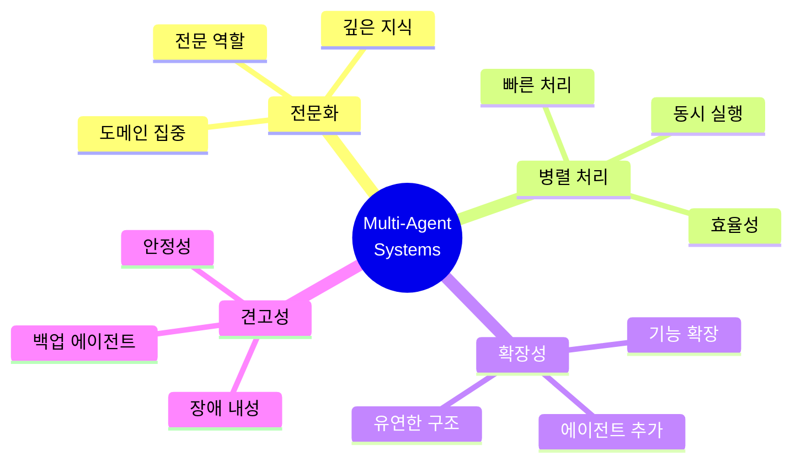
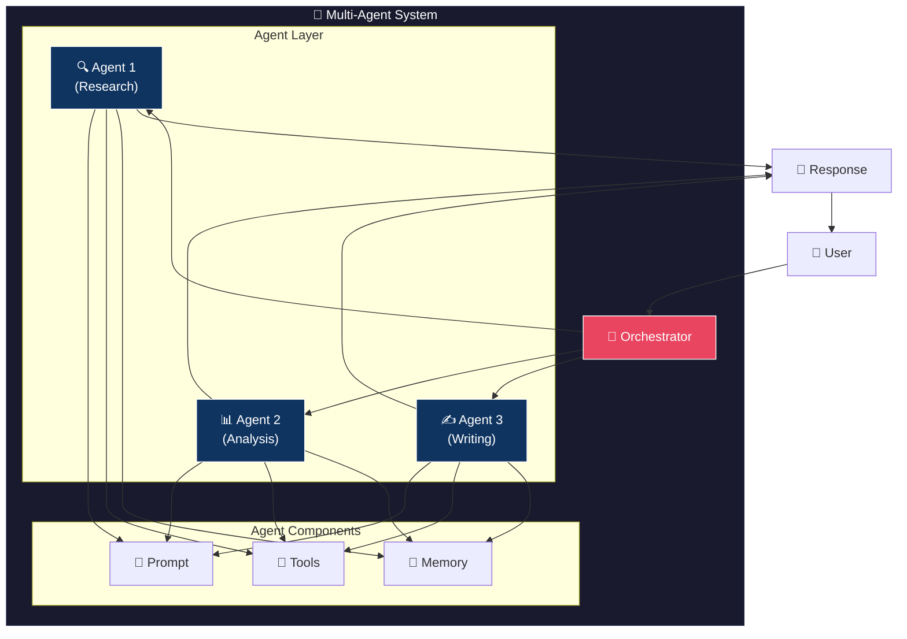
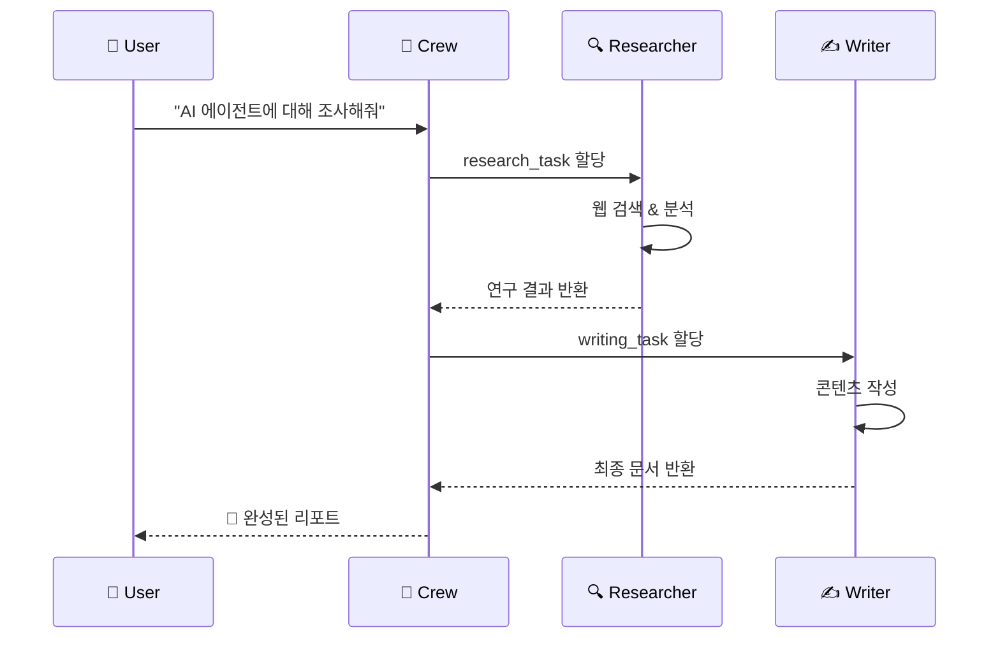
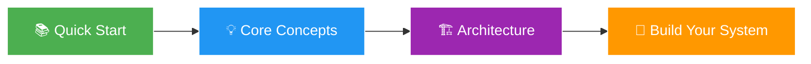
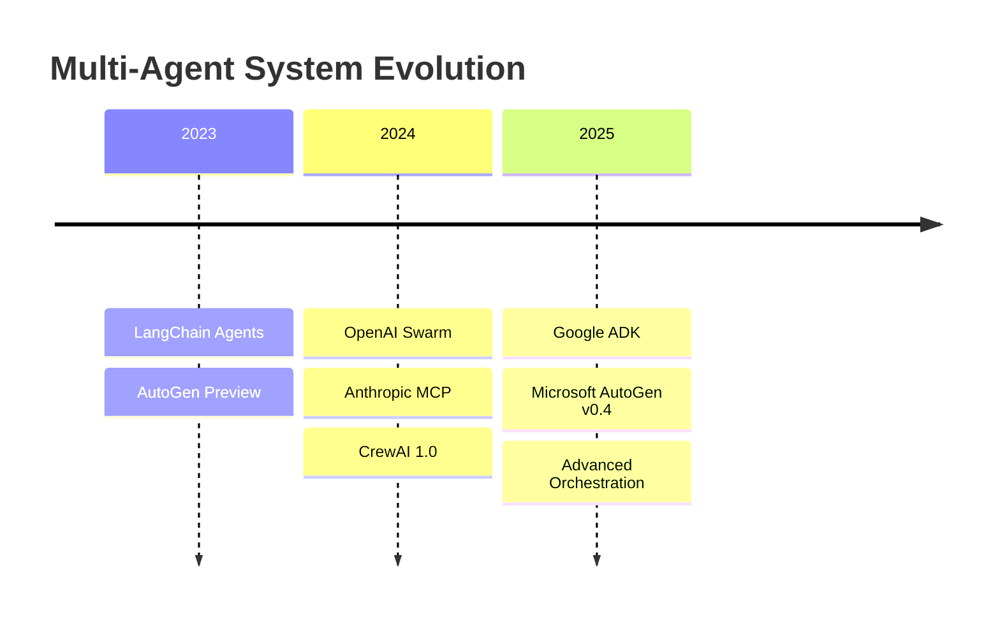

# Multi-Agent Prompt Guide

멀티 에이전트 시스템에서 효과적인 프롬프트를 설계하기 위한 종합 가이드입니다.


## Overview

멀티 에이전트 시스템은 여러 AI 에이전트가 협력하여 복잡한 작업을 수행하는 아키텍처입니다. 각 에이전트는 특정 역할과 책임을 가지며, 프롬프트는 이들의 행동을 정의하는 핵심 요소입니다.

## Why Multi-Agent Systems?



| 특성 | 설명 |
|------|------|
| **전문화 (Specialization)** | 각 에이전트가 특정 도메인에 집중 |
| **병렬 처리 (Parallelization)** | 동시에 여러 작업 수행 |
| **확장성 (Scalability)** | 에이전트 추가로 기능 확장 |
| **견고성 (Robustness)** | 개별 에이전트 실패에 대한 내성 |

## Core Components



## What You'll Learn

이 가이드에서 다루는 내용:

| 주제 | 설명 | 아이콘 |
|------|------|--------|
| **Prompt Design** | 에이전트 프롬프트 설계 원칙과 패턴 | 📝 |
| **Multi-Agent Patterns** | Orchestrator, Supervisor, Swarm 등 아키텍처 패턴 | 🏗️ |
| **Frameworks** | LangChain, AutoGen, CrewAI 등 프레임워크 활용 | 🔧 |
| **Tools & MCP** | 도구 정의 및 Model Context Protocol | 🔌 |
| **Best Practices** | 디버깅, 평가, 보안 모범 사례 | ✅ |

## Quick Example

간단한 멀티 에이전트 시스템 예시:



```python
from crewai import Agent, Task, Crew

# Research Agent
researcher = Agent(
    role="Research Analyst",
    goal="Find and analyze relevant information",
    backstory="""You are an expert researcher with deep
    knowledge in finding and synthesizing information.""",
    tools=[search_tool, web_scraper]
)

# Writer Agent
writer = Agent(
    role="Content Writer",
    goal="Create clear and engaging content",
    backstory="""You are a skilled writer who transforms
    complex information into readable content.""",
    tools=[text_editor]
)

# Create crew
crew = Crew(
    agents=[researcher, writer],
    tasks=[research_task, writing_task],
    verbose=True
)

result = crew.kickoff()
```

## Getting Started

멀티 에이전트 프롬프트 설계를 시작하려면:



1. [Quick Start](/docs/getting-started/quick-start) - 빠른 시작 가이드
2. [Core Concepts](/docs/getting-started/concepts) - 핵심 개념 이해
3. [Architecture](/docs/getting-started/architecture) - 시스템 아키텍처

## Industry Trends (2024-2025)


최신 멀티 에이전트 시스템 동향:



- **OpenAI Swarm**: 경량 에이전트 오케스트레이션
- **Anthropic Claude MCP**: Model Context Protocol 표준화
- **Google ADK**: Agent Development Kit 출시
- **Microsoft AutoGen v0.4**: 차세대 에이전트 프레임워크

## Community & Resources

- [LangChain Documentation](https://python.langchain.com/)
- [AutoGen Documentation](https://microsoft.github.io/autogen/)
- [CrewAI Documentation](https://docs.crewai.com/)
- [OpenAI Cookbook](https://cookbook.openai.com/)
