# Hierarchical Pattern

다층 구조로 에이전트들을 조직화하는 패턴입니다.


## Pattern Overview

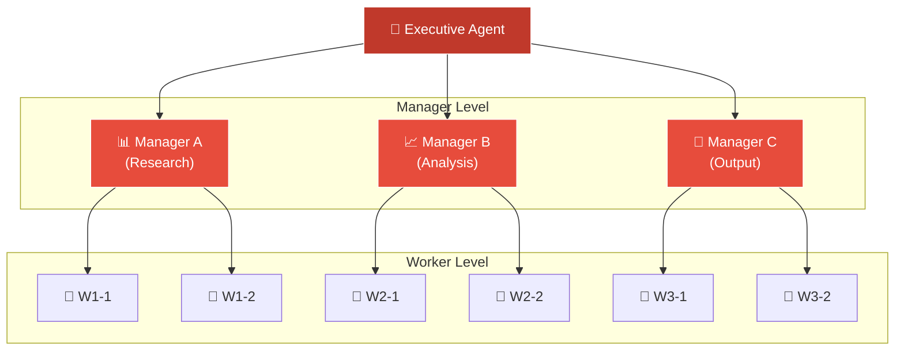

## When to Use

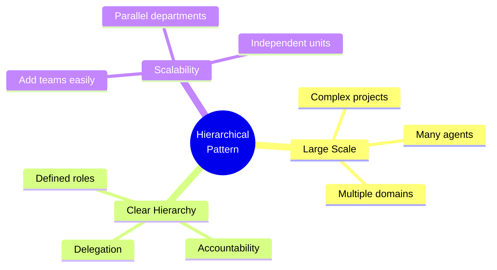

- 대규모 복잡한 프로젝트
- 전문 영역별 분리가 필요할 때
- 명확한 책임 분리가 필요할 때
- 확장 가능한 팀 구조가 필요할 때

## Level Definitions

### Executive Level

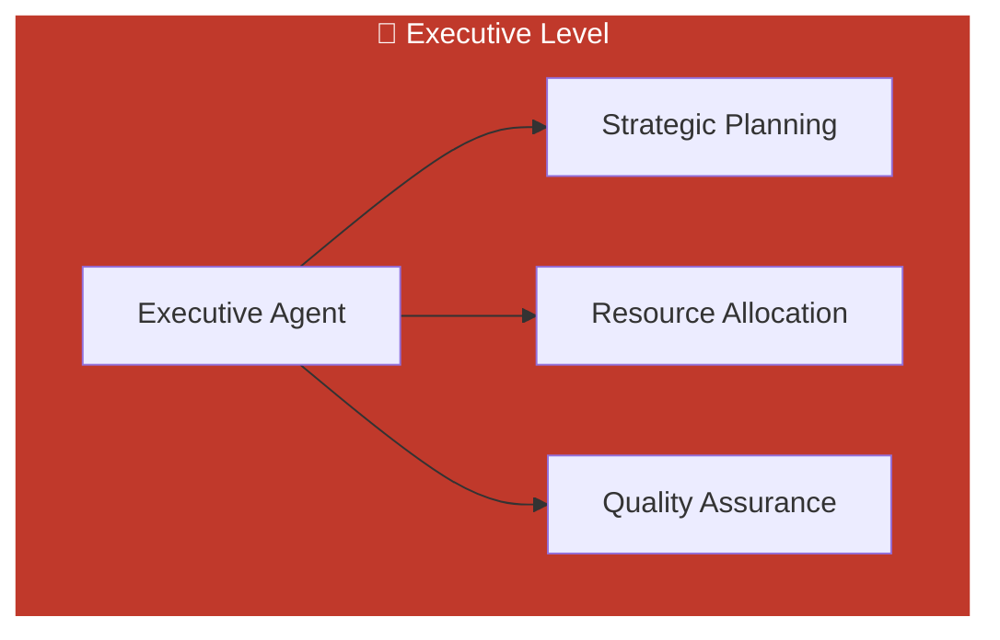

```python
EXECUTIVE_PROMPT = """
# Identity

You are the Executive Agent, the highest-level decision maker
in this multi-agent organization.

## Authority
- Define strategic direction
- Allocate resources across departments
- Make cross-department decisions
- Approve major deliverables

## Direct Reports
- Research Manager: Oversees information gathering
- Analysis Manager: Oversees data processing
- Output Manager: Oversees content creation

## Responsibilities

### Strategic Planning
- Understand the overall objective
- Break down into departmental goals
- Set priorities and timelines

### Resource Allocation
- Assign projects to managers
- Balance workload across departments
- Resolve resource conflicts

### Quality Assurance
- Review manager-level outputs
- Ensure alignment with objectives
- Approve final deliverables
"""
```

### Manager Level

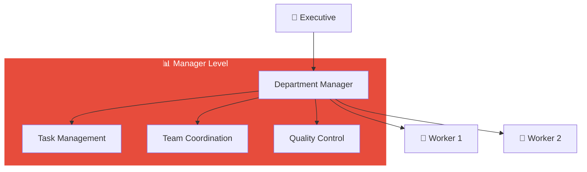

### Worker Level

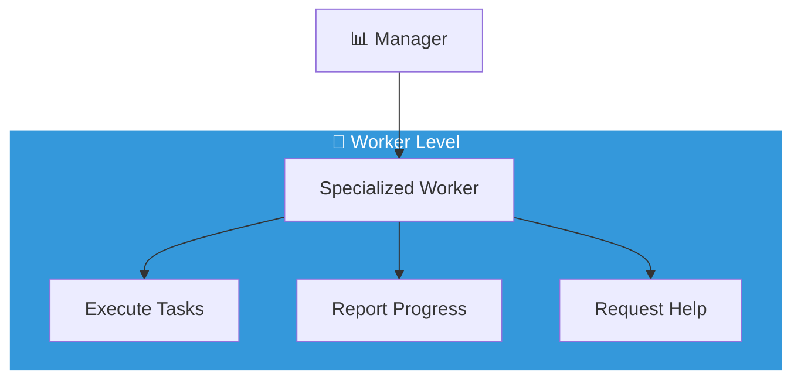

## Implementation

### LangGraph Hierarchical Implementation

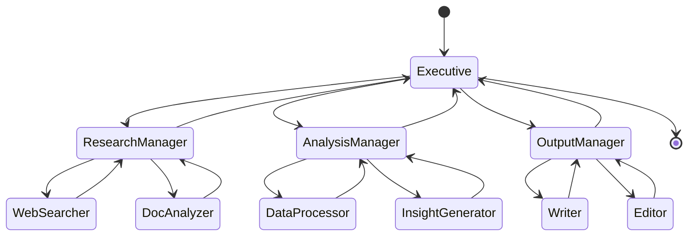

```python
from langgraph.graph import StateGraph, END
from typing import TypedDict, List, Optional

class HierarchicalState(TypedDict):
    objective: str
    executive_plan: dict
    manager_tasks: dict
    worker_outputs: dict
    final_output: str

def executive_node(state: HierarchicalState) -> HierarchicalState:
    """Executive creates strategic plan"""
    objective = state["objective"]

    plan = executive_llm.invoke(
        EXECUTIVE_PROMPT +
        f"\n\nObjective: {objective}\n\nCreate strategic plan:"
    )

    return {"executive_plan": parse_json(plan)}

def manager_router(state: HierarchicalState) -> str:
    """Route to appropriate manager"""
    plan = state["executive_plan"]

    # Find next manager with pending work
    for manager in ["research", "analysis", "output"]:
        if manager_has_pending_work(plan, manager):
            return f"{manager}_manager"

    return "executive_review"

# Build graph
workflow = StateGraph(HierarchicalState)

# Add nodes
workflow.add_node("executive", executive_node)
workflow.add_node("research_manager", research_manager_node)
workflow.add_node("analysis_manager", analysis_manager_node)
workflow.add_node("output_manager", output_manager_node)
workflow.add_node("executive_review", executive_review_node)

# Add edges
workflow.set_entry_point("executive")
workflow.add_conditional_edges("executive", manager_router)
workflow.add_edge("executive_review", END)

app = workflow.compile()
```

## Communication Protocols

### Top-Down Communication

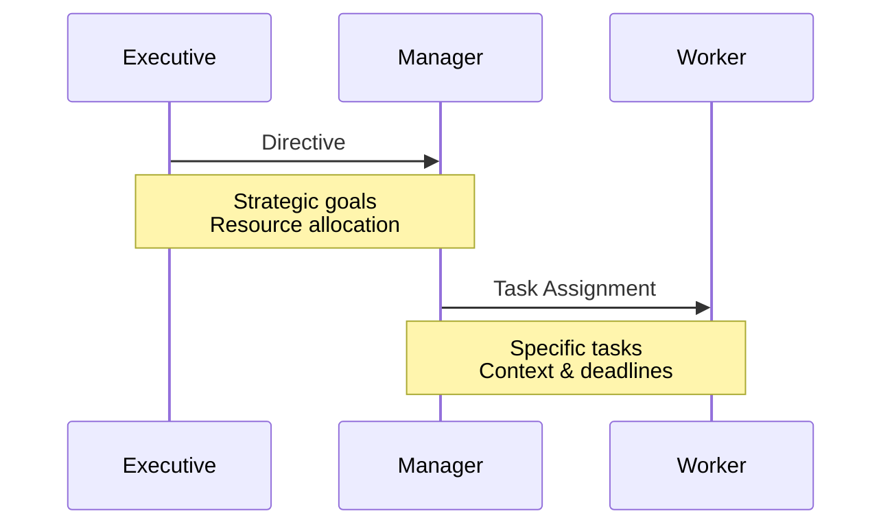

### Bottom-Up Communication

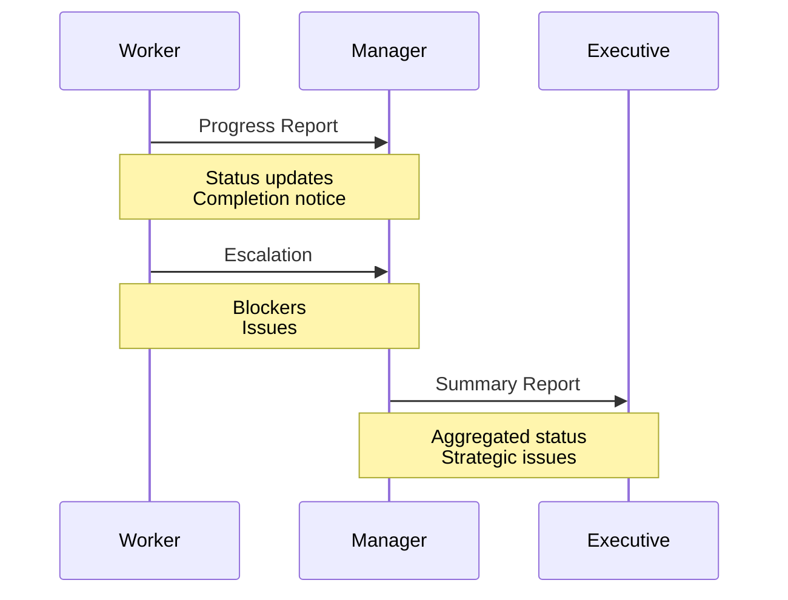

## Benefits & Trade-offs

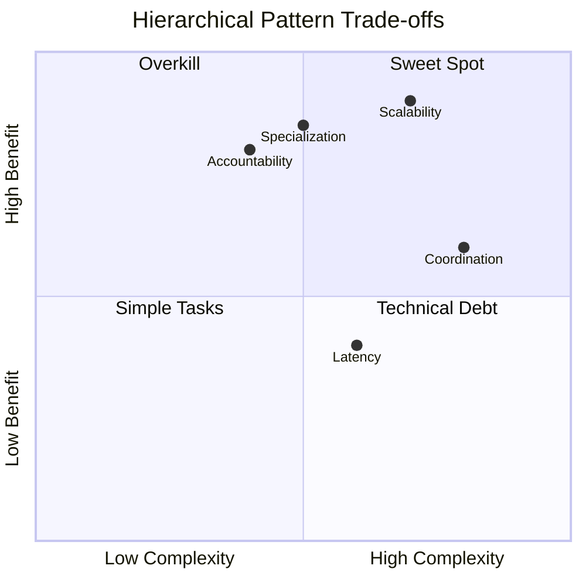

| Benefit | Description |
|---------|-------------|
| **Scalability** | Easy to add more workers/managers |
| **Specialization** | Each level focuses on appropriate scope |
| **Clear Accountability** | Defined responsibilities |
| **Parallel Execution** | Departments work independently |

## Use Cases

### Enterprise Document Generation

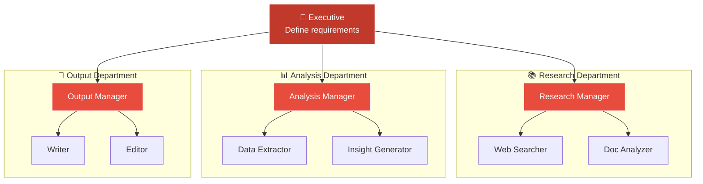

### Software Development

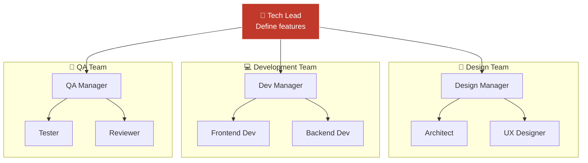
