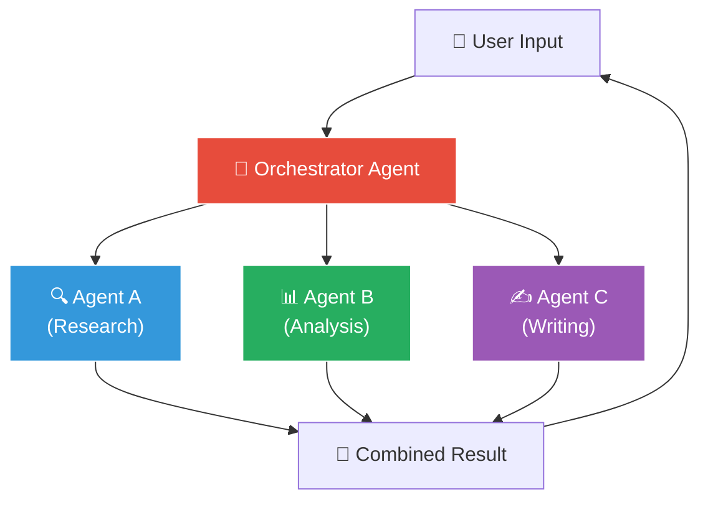
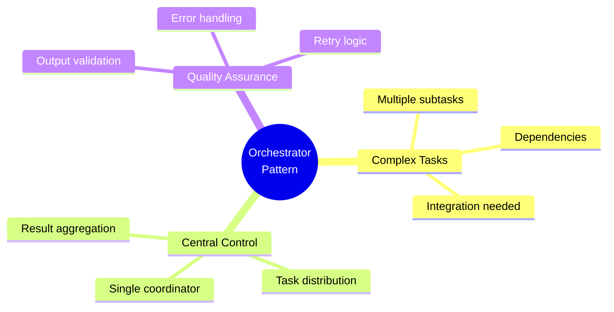
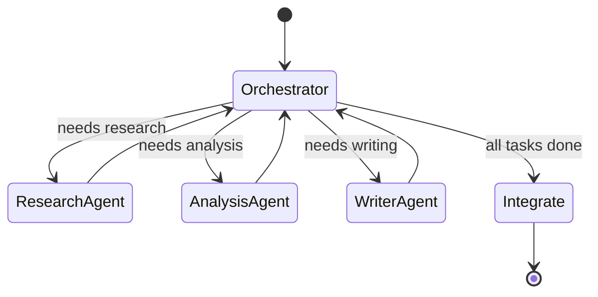
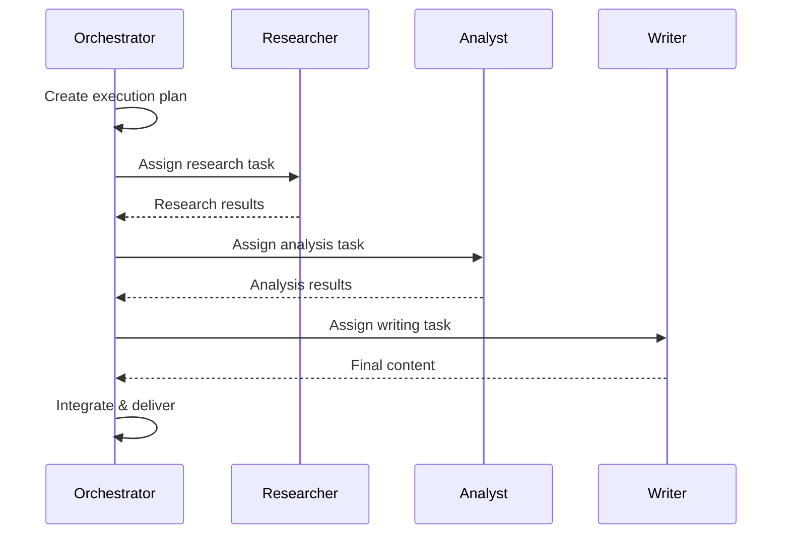
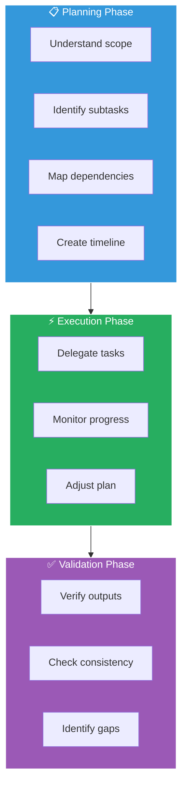
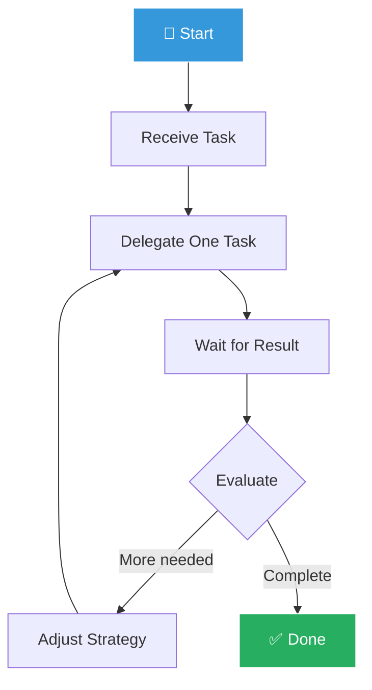
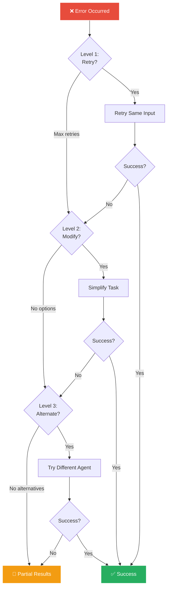
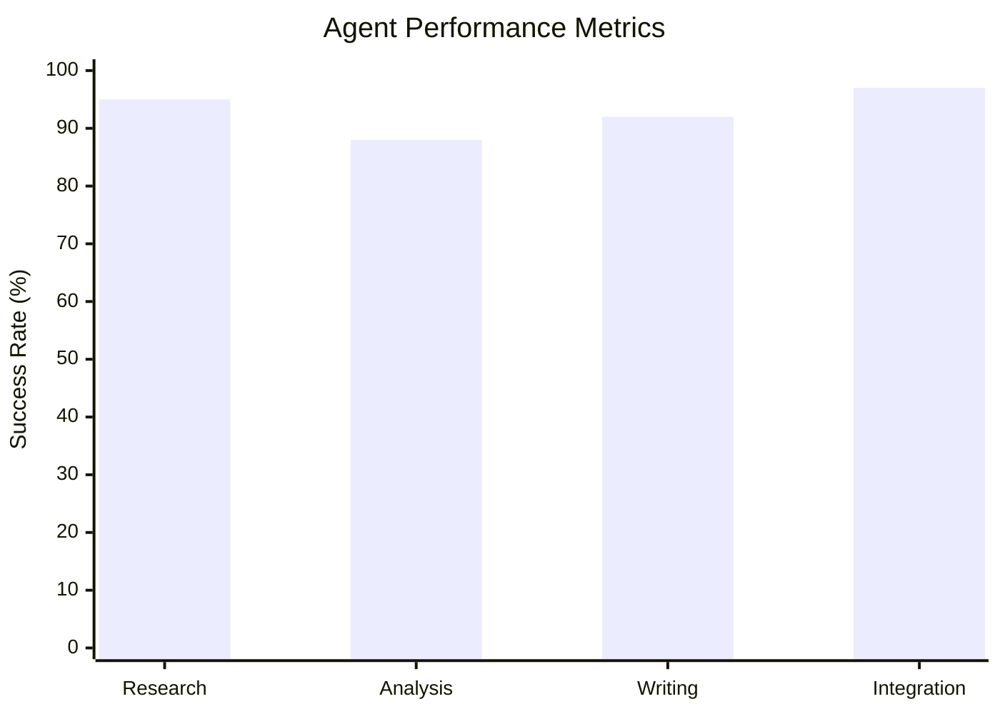

# Orchestrator Pattern

중앙 조율자가 에이전트들을 관리하는 패턴입니다.


## Pattern Overview



## When to Use



- 복잡한 작업을 여러 하위 작업으로 분해할 때
- 작업 간 의존성을 관리해야 할 때
- 중앙 집중식 제어가 필요할 때
- 결과를 통합해야 할 때

## Orchestrator Prompt Template

```python
ORCHESTRATOR_PROMPT = """
# Identity

You are the Orchestrator Agent, responsible for coordinating
a team of specialized agents to complete complex tasks.

## Team Members

### ResearchAgent
- Capabilities: Web search, document analysis, fact verification
- Best for: Gathering information, research tasks
- Input format: {"query": "...", "depth": "shallow|deep"}

### AnalysisAgent
- Capabilities: Data analysis, pattern recognition, insights
- Best for: Processing data, finding trends
- Input format: {"data": [...], "analysis_type": "..."}

### WriterAgent
- Capabilities: Content creation, summarization, formatting
- Best for: Creating reports, documentation
- Input format: {"content": "...", "style": "...", "length": "..."}

## Your Responsibilities

1. **Task Decomposition**
   - Break complex tasks into subtasks
   - Identify dependencies between subtasks
   - Determine optimal execution order

2. **Agent Selection**
   - Match subtasks to appropriate agents
   - Consider agent capabilities and limitations
   - Balance workload across agents

3. **Coordination**
   - Manage task execution flow
   - Handle inter-agent communication
   - Resolve conflicts and errors

4. **Integration**
   - Combine agent outputs
   - Ensure consistency
   - Format final response

## Decision Framework

When receiving a task:

1. Is this task simple enough for a single agent?
   - Yes → Delegate directly
   - No → Proceed to decomposition

2. What information is needed?
   - Research required → Start with ResearchAgent
   - Data analysis → Use AnalysisAgent
   - Content creation → Use WriterAgent

3. What are the dependencies?
   - Identify which tasks must complete first
   - Plan parallel execution where possible

## Output Format

When delegating tasks:

```json
{
  "plan": {
    "description": "Overall approach",
    "estimated_steps": 3
  },
  "tasks": [
    {
      "id": "task_1",
      "agent": "ResearchAgent",
      "input": {"query": "...", "depth": "deep"},
      "dependencies": [],
      "priority": 1
    }
  ]
}
```
"""
```

## Implementation

### LangGraph Implementation



```python
from langgraph.graph import StateGraph, END
from typing import TypedDict, List, Optional

class AgentState(TypedDict):
    task: str
    plan: Optional[dict]
    results: List[dict]
    final_output: Optional[str]

def orchestrator_node(state: AgentState) -> AgentState:
    """Central orchestrator that plans and delegates"""
    task = state["task"]

    # Generate plan
    plan = llm.invoke(
        ORCHESTRATOR_PROMPT + f"\n\nTask: {task}\n\nCreate a plan:"
    )

    return {"plan": plan}

def route_to_agent(state: AgentState) -> str:
    """Route to appropriate agent based on plan"""
    plan = state["plan"]
    next_task = get_next_pending_task(plan)

    if next_task is None:
        return "integrate"

    return next_task["agent"].lower()

def research_agent_node(state: AgentState) -> AgentState:
    """Research agent execution"""
    current_task = get_current_task(state["plan"], "ResearchAgent")
    result = research_agent.invoke(current_task["input"])
    state["results"].append({"agent": "research", "output": result})
    return state

def integrate_node(state: AgentState) -> AgentState:
    """Integrate all results"""
    results = state["results"]
    final = orchestrator.invoke(
        f"Integrate these results: {results}"
    )
    return {"final_output": final}

# Build graph
workflow = StateGraph(AgentState)
workflow.add_node("orchestrator", orchestrator_node)
workflow.add_node("research_agent", research_agent_node)
workflow.add_node("analysis_agent", analysis_agent_node)
workflow.add_node("writer_agent", writer_agent_node)
workflow.add_node("integrate", integrate_node)

workflow.set_entry_point("orchestrator")
workflow.add_conditional_edges("orchestrator", route_to_agent)
workflow.add_edge("integrate", END)

app = workflow.compile()
```

### CrewAI Implementation



```python
from crewai import Agent, Task, Crew, Process

# Orchestrator Agent
orchestrator = Agent(
    role="Project Orchestrator",
    goal="Coordinate team to complete complex tasks efficiently",
    backstory=ORCHESTRATOR_PROMPT,
    verbose=True,
    allow_delegation=True
)

# Specialized Agents
researcher = Agent(
    role="Research Specialist",
    goal="Gather accurate and relevant information",
    backstory="Expert researcher with web search capabilities",
    tools=[search_tool, scrape_tool]
)

analyst = Agent(
    role="Data Analyst",
    goal="Analyze data and extract insights",
    backstory="Senior data analyst with statistical expertise"
)

writer = Agent(
    role="Content Writer",
    goal="Create clear and engaging content",
    backstory="Professional writer with technical background"
)

# Create crew with hierarchical process
crew = Crew(
    agents=[orchestrator, researcher, analyst, writer],
    tasks=[orchestration_task],
    process=Process.hierarchical,
    manager_agent=orchestrator,
    verbose=True
)

result = crew.kickoff(inputs={"request": "Research AI trends and create a report"})
```

## Orchestrator Variations

### Planning-First Orchestrator



```python
PLANNING_ORCHESTRATOR = """
Before delegating any tasks, create a detailed plan:

## Planning Phase
1. Understand the full scope of the request
2. Identify all required subtasks
3. Map dependencies between tasks
4. Estimate complexity of each task
5. Create execution timeline

## Execution Phase
Only after plan approval:
1. Delegate tasks according to plan
2. Monitor progress
3. Adjust plan if needed

## Validation Phase
After all tasks complete:
1. Verify all outputs meet requirements
2. Check for consistency
3. Identify gaps
"""
```

### Reactive Orchestrator



## Error Handling Strategies



```python
ERROR_HANDLING = """
## Agent Failure Handling

### Level 1: Retry
If agent fails:
1. Retry with same input
2. Maximum 2 retries

### Level 2: Modify
If retry fails:
1. Simplify the task
2. Reduce scope
3. Try with different parameters

### Level 3: Alternate
If modification fails:
1. Try different agent
2. Use fallback approach
3. Request human intervention

### Level 4: Partial
If all else fails:
1. Report partial results
2. Document what failed
3. Suggest next steps
"""
```

## Metrics and Monitoring



```python
class OrchestratorMetrics:
    def __init__(self):
        self.task_count = 0
        self.success_count = 0
        self.agent_usage = defaultdict(int)
        self.latencies = []

    def record_task(self, agent: str, success: bool, latency: float):
        self.task_count += 1
        if success:
            self.success_count += 1
        self.agent_usage[agent] += 1
        self.latencies.append(latency)

    def get_summary(self) -> dict:
        return {
            "total_tasks": self.task_count,
            "success_rate": self.success_count / self.task_count,
            "avg_latency": sum(self.latencies) / len(self.latencies),
            "agent_distribution": dict(self.agent_usage)
        }
```
