# Peer-to-Peer Pattern

동등한 에이전트들이 직접 협력하는 패턴입니다.


## Pattern Overview

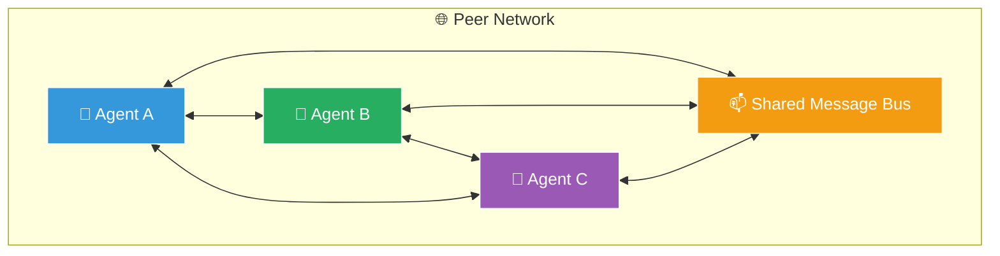

## When to Use

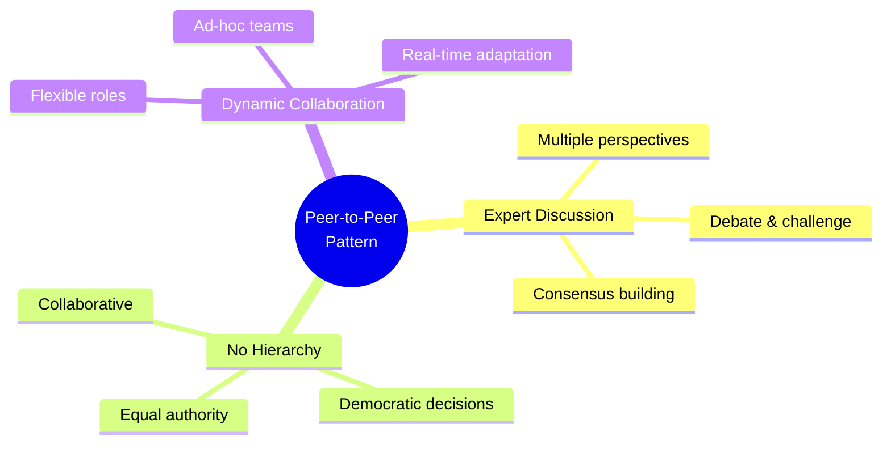

- 전문가 간 토론/논쟁이 필요할 때
- 합의 기반 의사결정이 필요할 때
- 계층 구조가 적합하지 않을 때
- 동적 협업이 필요할 때

## Technical Review Panel Example

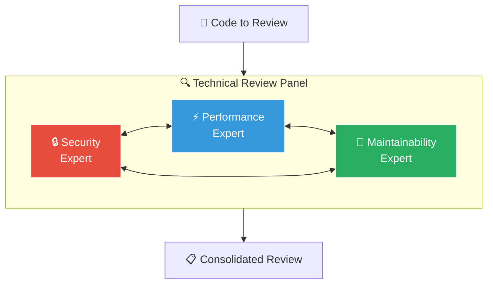

## Research Debate Panel

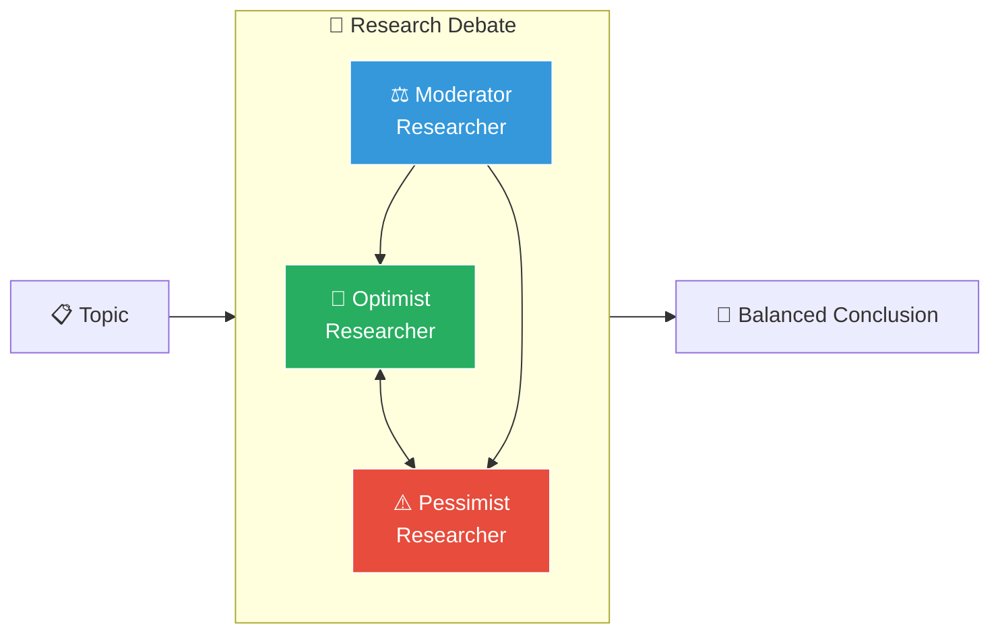

## Peer Agent Prompt Template

```python
PEER_AGENT_TEMPLATE = """
# Identity

You are {agent_name}, a peer agent in a collaborative team.

## Your Expertise
{expertise_description}

## Your Peers
{peer_descriptions}

## Collaboration Protocol

### Communication
- Address peers by name
- Share your perspective clearly
- Ask clarifying questions
- Acknowledge valid points from others

### Discussion
- Present your analysis based on your expertise
- Challenge ideas constructively
- Build on others' contributions
- Propose compromises when disagreements arise

### Consensus Building
- Look for common ground
- Identify areas of agreement
- Propose solutions that address concerns
- Vote on final decisions when needed

## Discussion Stages

1. **Opening**: Each peer presents initial analysis
2. **Discussion**: Peers exchange views and challenge ideas
3. **Synthesis**: Peers work toward common understanding
4. **Resolution**: Reach consensus or vote

Always be respectful and constructive.
"""
```

## Implementation

### AutoGen Group Chat

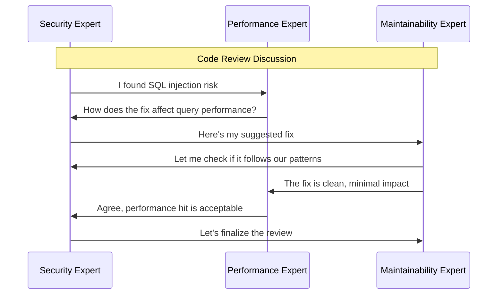

```python
from autogen import AssistantAgent, GroupChat, GroupChatManager

# Create peer agents
security_expert = AssistantAgent(
    name="SecurityExpert",
    system_message=SECURITY_EXPERT,
    llm_config=llm_config
)

performance_expert = AssistantAgent(
    name="PerformanceExpert",
    system_message=PERFORMANCE_EXPERT,
    llm_config=llm_config
)

maintainability_expert = AssistantAgent(
    name="MaintainabilityExpert",
    system_message=MAINTAINABILITY_EXPERT,
    llm_config=llm_config
)

# Create group chat
group_chat = GroupChat(
    agents=[security_expert, performance_expert, maintainability_expert],
    messages=[],
    max_round=15,
    speaker_selection_method="round_robin"  # Equal speaking time
)

manager = GroupChatManager(
    groupchat=group_chat,
    llm_config=llm_config
)

# Start discussion
security_expert.initiate_chat(
    manager,
    message="""
    Let's review this code change:

    ```python
    def get_user(user_id: str):
        query = f"SELECT * FROM users WHERE id = '{user_id}'"
        return db.execute(query)
    ```

    Each expert, please provide your perspective.
    """
)
```

### Message Bus Implementation

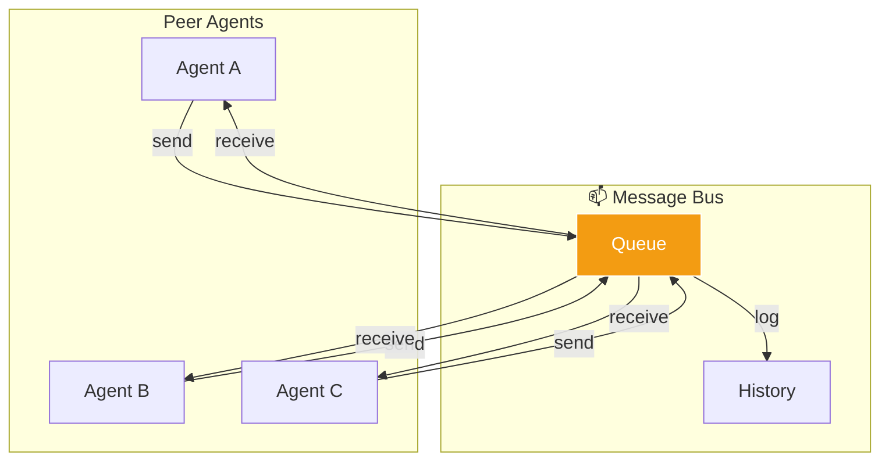

```python
from dataclasses import dataclass
from typing import List, Optional
from queue import Queue
import threading

@dataclass
class PeerMessage:
    id: str
    sender: str
    recipient: str  # "all" for broadcast
    message_type: str
    content: str
    references: List[str] = None
    timestamp: float = None

class MessageBus:
    def __init__(self):
        self.queues: dict[str, Queue] = {}
        self.history: List[PeerMessage] = []
        self.lock = threading.Lock()

    def register(self, agent_id: str):
        self.queues[agent_id] = Queue()

    def send(self, message: PeerMessage):
        with self.lock:
            message.id = str(uuid4())
            message.timestamp = time.time()
            self.history.append(message)

            if message.recipient == "all":
                for agent_id, queue in self.queues.items():
                    if agent_id != message.sender:
                        queue.put(message)
            else:
                if message.recipient in self.queues:
                    self.queues[message.recipient].put(message)

    def get_context(self, limit: int = 10) -> str:
        """Get recent messages as context"""
        recent = self.history[-limit:]
        context = "## Recent Discussion\n\n"
        for msg in recent:
            context += f"**{msg.sender}** → {msg.recipient}: {msg.content}\n\n"
        return context
```

## Consensus Mechanisms

### Voting System

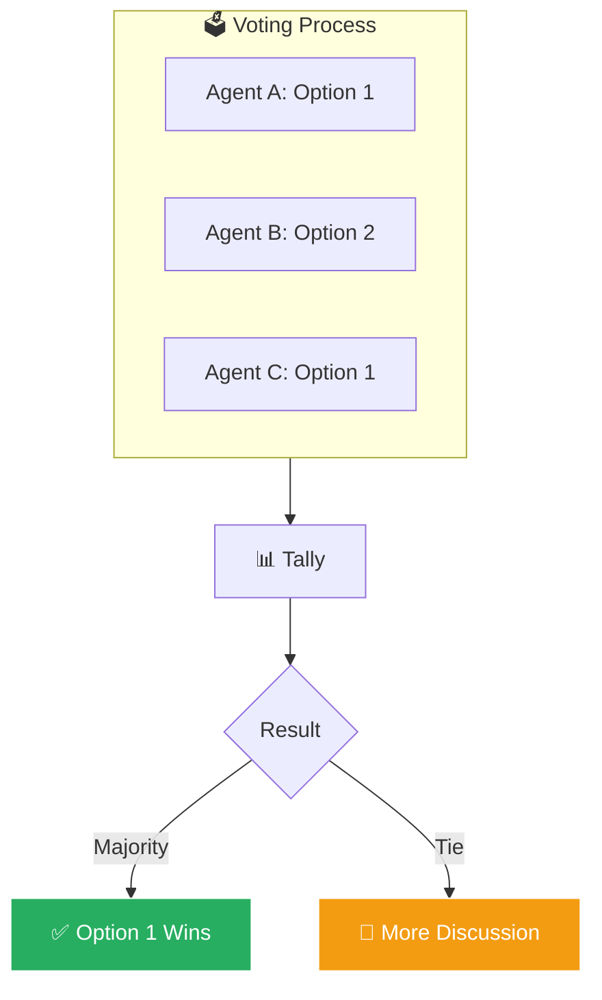

```python
class VotingSystem:
    def __init__(self, agents: List[str]):
        self.agents = agents
        self.votes = {}

    def cast_vote(self, agent: str, option: str):
        self.votes[agent] = option

    def tally(self) -> dict:
        results = {}
        for vote in self.votes.values():
            results[vote] = results.get(vote, 0) + 1
        return results

    def get_winner(self) -> Optional[str]:
        results = self.tally()
        if not results:
            return None

        max_votes = max(results.values())
        winners = [k for k, v in results.items() if v == max_votes]

        if len(winners) == 1:
            return winners[0]
        return None  # Tie

    def has_consensus(self, threshold: float = 0.66) -> bool:
        results = self.tally()
        total = len(self.votes)
        if total == 0:
            return False

        max_votes = max(results.values())
        return (max_votes / total) >= threshold
```

### Consensus Builder

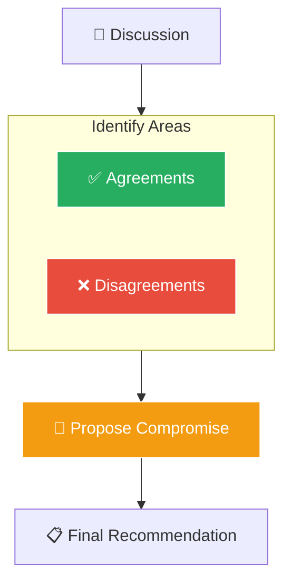

## Use Cases

### Code Review Panel

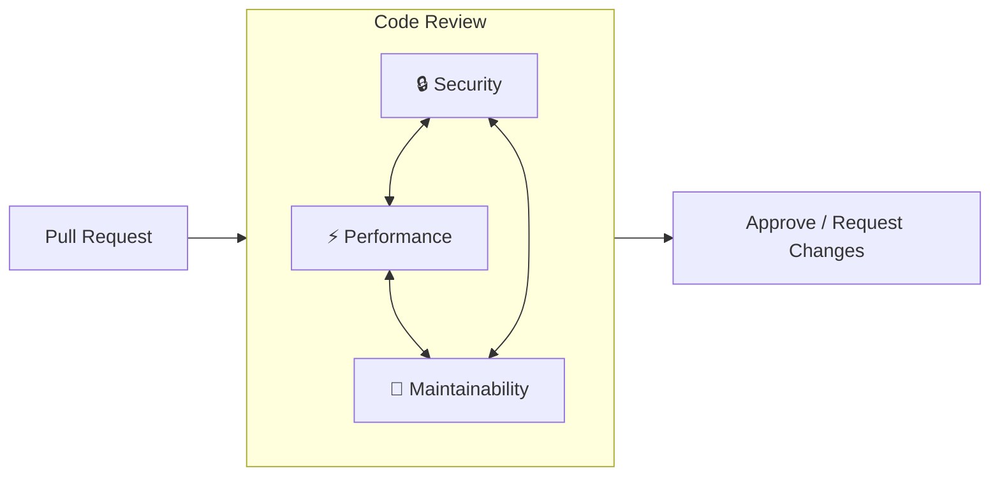

### Investment Committee

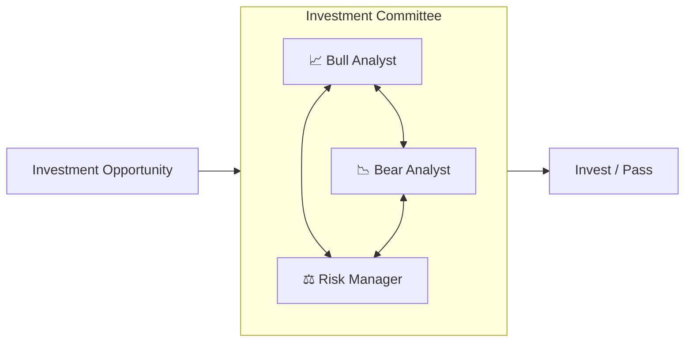

### Design Review

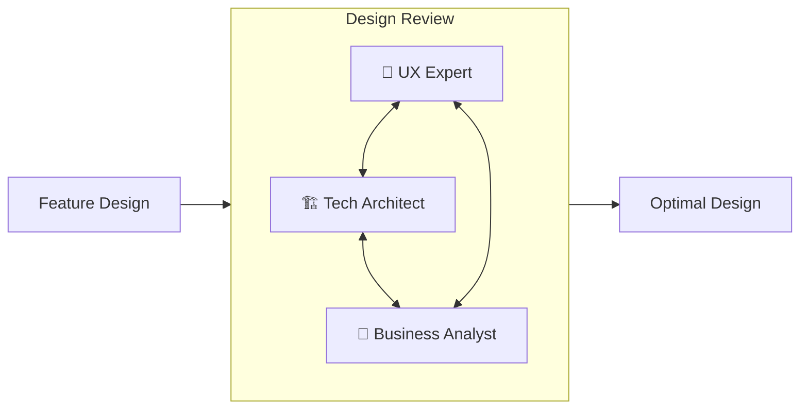
