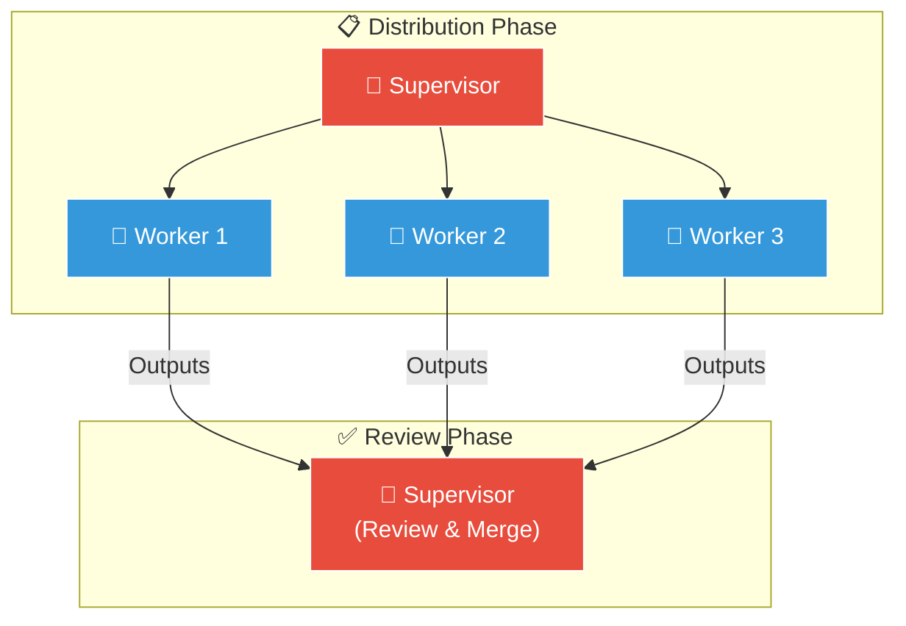
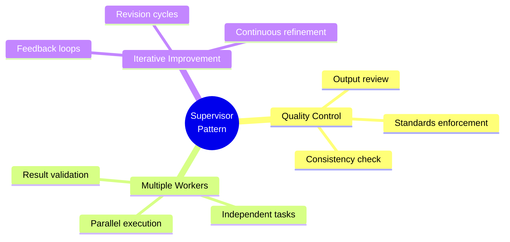
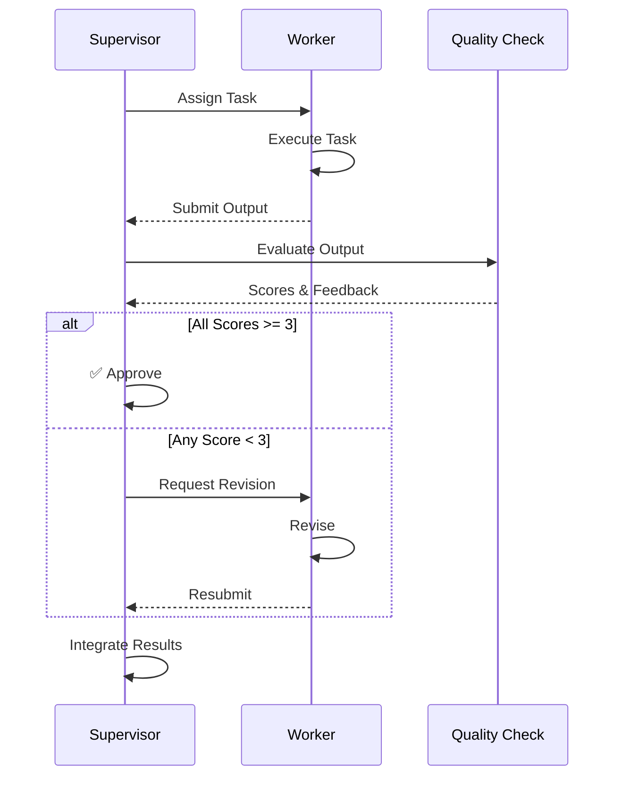
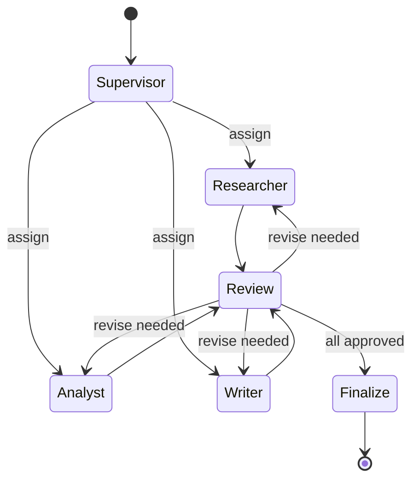
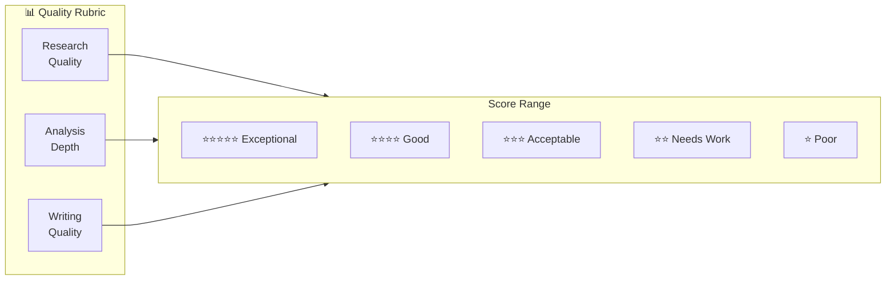
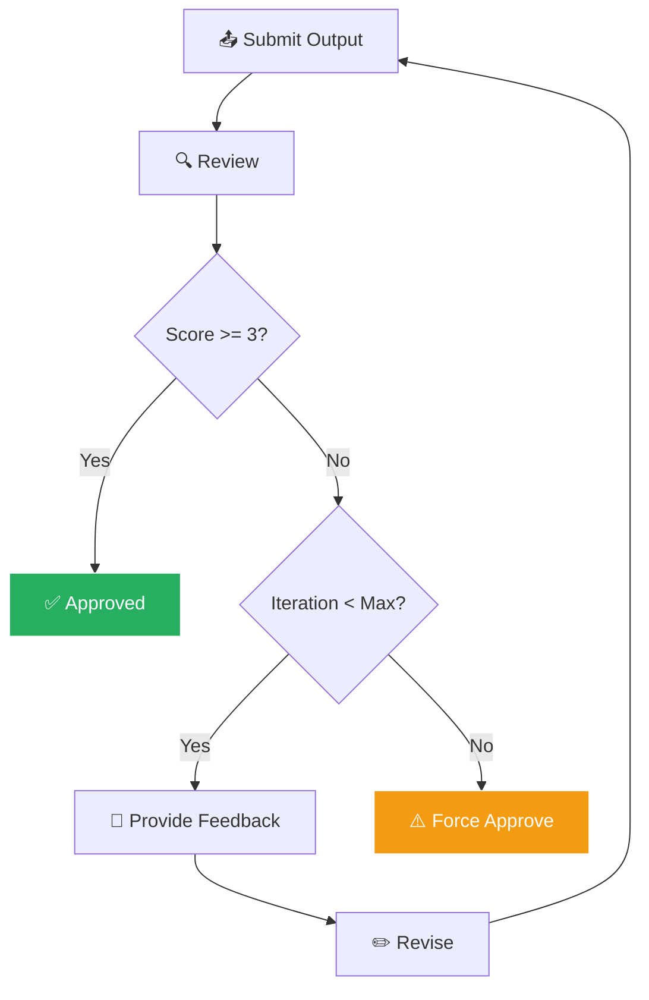
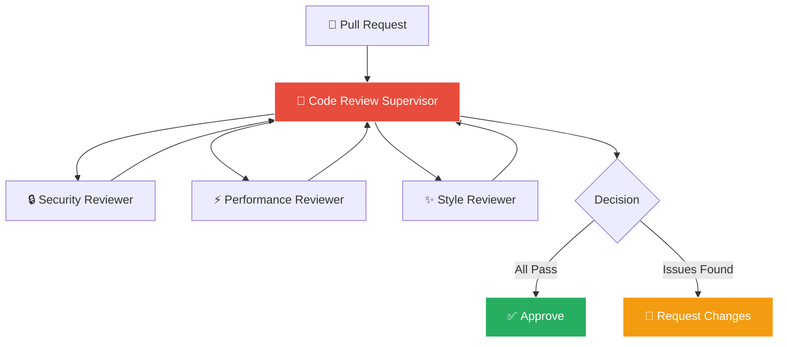
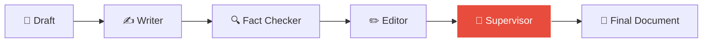

# Supervisor Pattern

감독자가 작업자 에이전트들을 관리하고 품질을 보장하는 패턴입니다.


## Pattern Overview



## When to Use



- 출력 품질 보장이 중요할 때
- 복수의 독립적인 작업을 수행할 때
- 결과 검증이 필요할 때
- 반복적인 개선이 필요할 때

## Supervisor Prompt Template

```python
SUPERVISOR_PROMPT = """
# Identity

You are a Supervisor Agent responsible for managing a team of
worker agents and ensuring high-quality outputs.

## Your Role

### Task Distribution
- Assign appropriate tasks to workers
- Balance workload
- Prioritize based on urgency and importance

### Quality Control
- Review all worker outputs
- Verify accuracy and completeness
- Ensure consistency across outputs

### Feedback & Improvement
- Provide constructive feedback
- Request revisions when needed
- Track improvement over time

## Worker Team

### Worker-Researcher
- Skills: Information gathering, source verification
- Quality metrics: Accuracy, source credibility, completeness

### Worker-Analyst
- Skills: Data analysis, insight generation
- Quality metrics: Depth of analysis, actionable insights

### Worker-Writer
- Skills: Content creation, summarization
- Quality metrics: Clarity, structure, engagement

## Review Framework

For each worker output, evaluate:

### Accuracy (1-5)
- 5: Completely accurate, verified facts
- 3: Mostly accurate, minor issues
- 1: Significant inaccuracies

### Completeness (1-5)
- 5: Fully addresses requirements
- 3: Partially complete
- 1: Missing major components

### Quality (1-5)
- 5: Exceptional quality
- 3: Acceptable quality
- 1: Below standards

### Minimum Threshold
- All scores must be ≥ 3 to pass
- If any score < 3, request revision
"""
```

## Review Workflow



## Implementation

### LangGraph Implementation



```python
from langgraph.graph import StateGraph, END
from typing import TypedDict, Literal

class SupervisorState(TypedDict):
    task: str
    worker_outputs: dict
    reviews: dict
    approved: list
    final_output: str
    iteration: int

def supervisor_route(state: SupervisorState) -> str:
    """Determine next action"""
    if len(state["approved"]) == 3:  # All workers approved
        return "finalize"

    pending = [w for w in ["researcher", "analyst", "writer"]
               if w not in state["approved"]]

    if pending:
        return pending[0]

    return "finalize"

def supervisor_review(state: SupervisorState, worker: str) -> SupervisorState:
    """Review worker output"""
    output = state["worker_outputs"].get(worker)

    if not output:
        return state  # Worker hasn't submitted yet

    # Review with LLM
    review = llm.invoke(
        SUPERVISOR_PROMPT +
        f"\n\nReview this {worker} output:\n{output}\n\nProvide review:"
    )

    review_data = parse_json(review)
    state["reviews"][worker] = review_data

    if review_data["action"] == "approve":
        state["approved"].append(worker)
    else:
        state["iteration"] += 1
        if state["iteration"] > 3:
            # Force approval after 3 iterations
            state["approved"].append(worker)

    return state
```

### AutoGen Implementation

```python
from autogen import AssistantAgent, GroupChat, GroupChatManager

# Supervisor Agent
supervisor = AssistantAgent(
    name="Supervisor",
    system_message=SUPERVISOR_PROMPT,
    llm_config=llm_config
)

# Worker Agents
researcher = AssistantAgent(
    name="Researcher",
    system_message=RESEARCHER_PROMPT,
    llm_config=llm_config
)

analyst = AssistantAgent(
    name="Analyst",
    system_message=ANALYST_PROMPT,
    llm_config=llm_config
)

writer = AssistantAgent(
    name="Writer",
    system_message=WRITER_PROMPT,
    llm_config=llm_config
)

# Group Chat with Supervisor as Manager
group_chat = GroupChat(
    agents=[supervisor, researcher, analyst, writer],
    messages=[],
    max_round=20,
    speaker_selection_method="auto"
)

manager = GroupChatManager(
    groupchat=group_chat,
    llm_config=llm_config
)
```

## Quality Control Strategies

### Rubric-Based Evaluation



| Score | Research | Analysis | Writing |
|-------|----------|----------|---------|
| **5** | Multiple credible sources | Deep insights, novel connections | Exceptional clarity |
| **4** | Good sources, main points | Meaningful analysis | Clear and organized |
| **3** | Adequate sources | Basic analysis | Readable |
| **2** | Limited sources | Surface-level | Unclear in places |
| **1** | Unreliable sources | No meaningful analysis | Confusing |

### Automated Checks

```python
class QualityChecker:
    def __init__(self):
        self.checks = [
            self.check_length,
            self.check_sources,
            self.check_structure,
            self.check_factual
        ]

    def check_length(self, output: str) -> dict:
        words = len(output.split())
        return {
            "check": "length",
            "pass": 100 <= words <= 2000,
            "value": words,
            "message": f"Word count: {words}"
        }

    def check_sources(self, output: str) -> dict:
        urls = re.findall(r'https?://\S+', output)
        return {
            "check": "sources",
            "pass": len(urls) >= 2,
            "value": len(urls),
            "message": f"Sources cited: {len(urls)}"
        }

    def run_all(self, output: str) -> dict:
        results = [check(output) for check in self.checks]
        passed = all(r["pass"] for r in results)
        return {
            "passed": passed,
            "checks": results
        }
```

## Iteration Management



```python
class IterationManager:
    def __init__(self, max_iterations: int = 3):
        self.max_iterations = max_iterations
        self.history = []

    def should_continue(self, worker: str, review: dict) -> bool:
        worker_history = [h for h in self.history if h["worker"] == worker]

        if len(worker_history) >= self.max_iterations:
            return False

        if review["action"] == "approve":
            return False

        return True

    def get_improvement_trend(self, worker: str) -> str:
        history = [h for h in self.history if h["worker"] == worker]
        if len(history) < 2:
            return "insufficient_data"

        scores = [h["review"]["scores"]["overall"] for h in history]
        if scores[-1] > scores[0]:
            return "improving"
        elif scores[-1] < scores[0]:
            return "declining"
        return "stable"
```

## Use Cases

### Code Review Supervisor



### Document Review Supervisor


