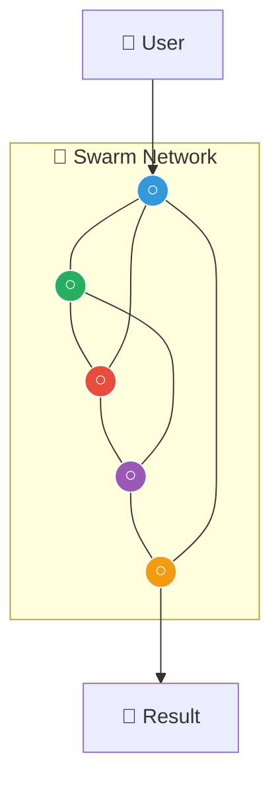
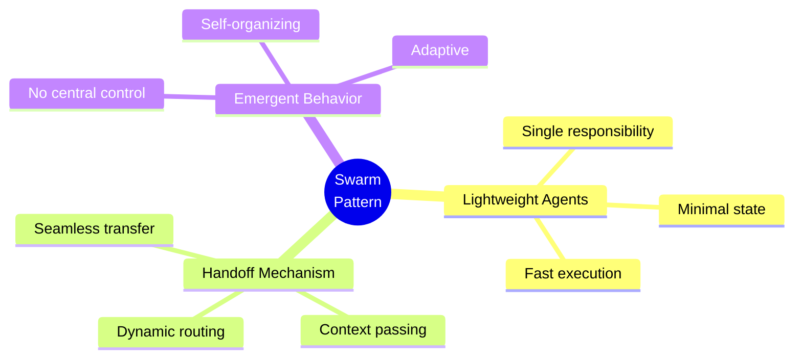
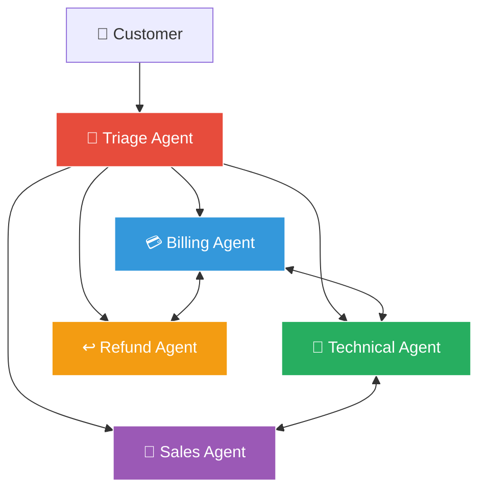
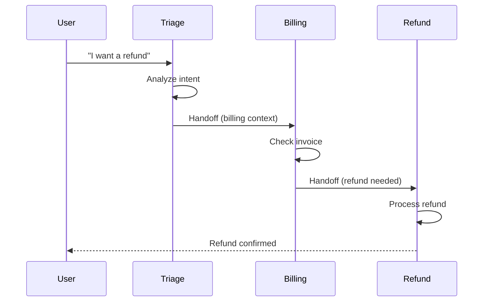
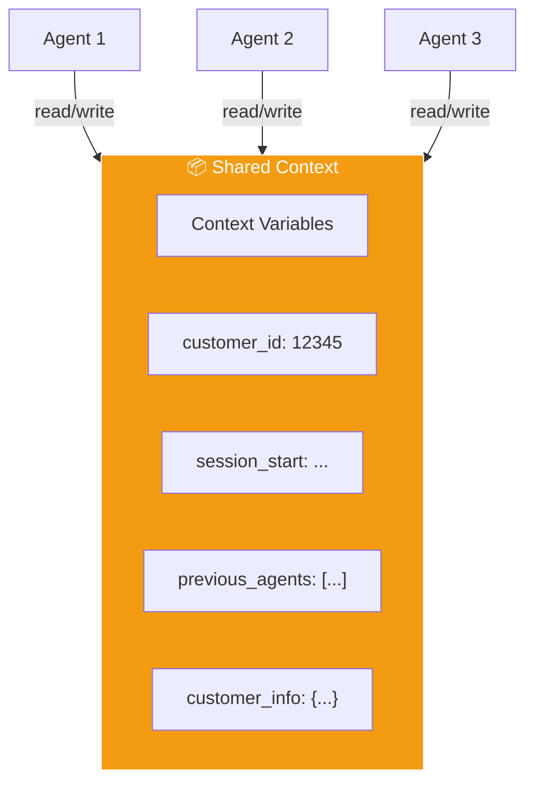
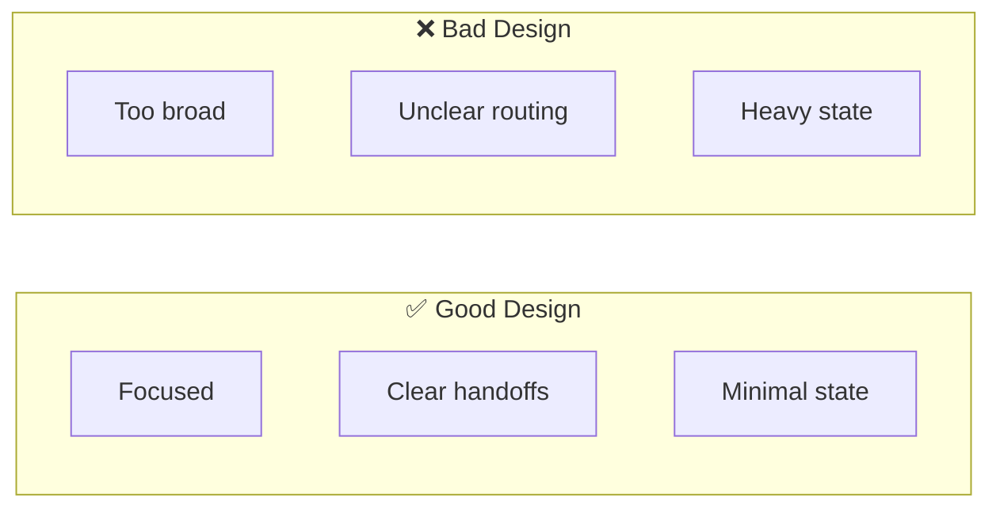
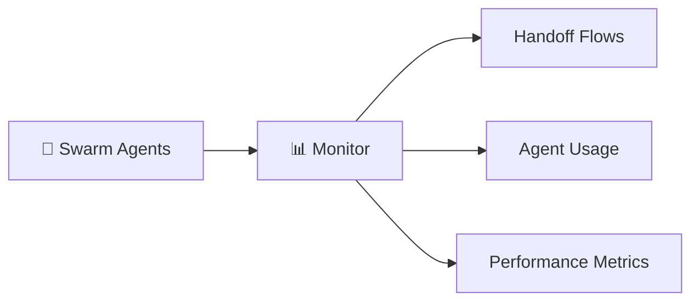
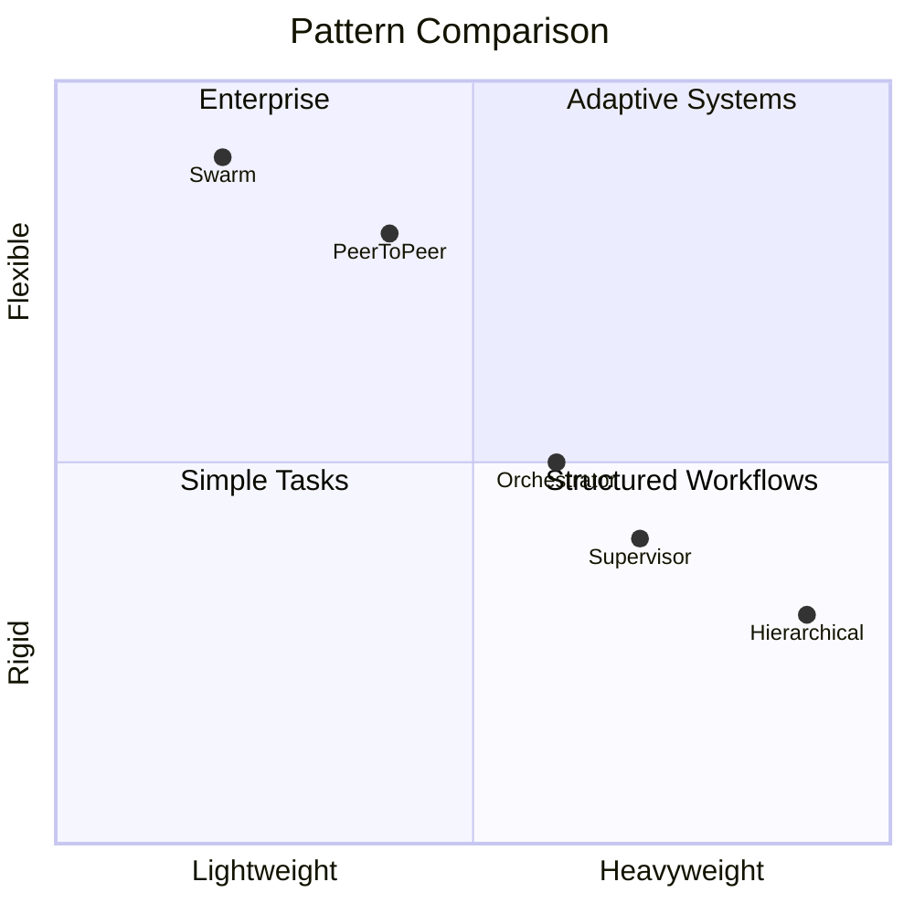

# Swarm Pattern

다수의 경량 에이전트가 협력하는 창발적 패턴입니다.


## Pattern Overview



## What is Swarm?

OpenAI Swarm에서 영감을 받은 패턴으로, 경량 에이전트들이 핸드오프(handoff)를 통해 협력합니다.



### Key Concepts

| Concept | Description |
|---------|-------------|
| **Agent** | 특정 작업을 수행하는 경량 단위 |
| **Handoff** | 다른 에이전트로 제어권 이전 |
| **Context Variables** | 에이전트 간 공유 상태 |
| **Routines** | 재사용 가능한 작업 패턴 |

## When to Use

- 유연한 대화 흐름이 필요할 때
- 동적 에이전트 전환이 필요할 때
- 가벼운 오케스트레이션이 필요할 때
- 확장 가능한 에이전트 네트워크 구축 시

## Customer Service Swarm Example



## Swarm Agent Prompt

```python
SWARM_AGENT_TEMPLATE = """
# Identity

You are {agent_name}, a specialized agent in the swarm.

## Your Specialty
{specialty_description}

## Available Handoffs

You can hand off to these agents when appropriate:
{handoff_options}

## When to Handle vs Handoff

### Handle Yourself When:
{handle_criteria}

### Handoff When:
{handoff_criteria}

## Handoff Protocol

When you need to handoff:

1. Complete your current subtask if possible
2. Summarize what you've done
3. Explain why handoff is needed
4. Provide context for receiving agent

## Context Variables

You have access to shared context variables.
You can read and update context as needed.
"""

TRIAGE_AGENT = """
# Identity
You are TriageAgent, the first point of contact.

## Your Role
- Understand customer intent
- Route to appropriate specialist
- Handle simple queries directly

## Handoff Options
- BillingAgent: Payment and invoice issues
- TechnicalAgent: Product technical problems
- SalesAgent: Purchases and upgrades
- RefundAgent: Return and refund requests

## Decision Rules
- Billing keywords → BillingAgent
- Technical/error keywords → TechnicalAgent
- Purchase/upgrade keywords → SalesAgent
- Refund/return keywords → RefundAgent
- Simple FAQ → Handle yourself
"""

BILLING_AGENT = """
# Identity
You are BillingAgent, handling payment issues.

## Your Specialty
- Invoice inquiries
- Payment processing
- Subscription management
- Payment method updates

## Tools Available
- lookup_invoice(customer_id)
- check_payment_status(invoice_id)
- update_payment_method(customer_id, method)

## Handoff Options
- TriageAgent: For non-billing issues
- RefundAgent: For refund processing
- TechnicalAgent: For payment system errors
"""
```

## Research Swarm Example


## Implementation

### OpenAI Swarm Style



```python
from dataclasses import dataclass
from typing import Callable, List, Optional, Union

@dataclass
class Agent:
    name: str
    instructions: str
    functions: List[Callable] = None
    handoffs: List['Agent'] = None

    def __post_init__(self):
        self.functions = self.functions or []
        self.handoffs = self.handoffs or []

@dataclass
class Response:
    agent: Agent
    messages: List[dict]
    context_variables: dict

class Swarm:
    def __init__(self, client):
        self.client = client

    def run(
        self,
        agent: Agent,
        messages: List[dict],
        context_variables: dict = None,
        max_turns: int = 10
    ) -> Response:
        context_variables = context_variables or {}
        current_agent = agent
        history = messages.copy()

        for _ in range(max_turns):
            # Build prompt with handoff info
            prompt = self._build_prompt(current_agent, context_variables)

            # Get response
            response = self.client.chat.completions.create(
                model="gpt-4",
                messages=[{"role": "system", "content": prompt}] + history,
                functions=self._get_functions(current_agent)
            )

            message = response.choices[0].message
            history.append(message.model_dump())

            # Check for handoff
            if message.function_call:
                result = self._handle_function(
                    current_agent,
                    message.function_call,
                    context_variables
                )

                if isinstance(result, Agent):
                    # Handoff to new agent
                    current_agent = result
                    continue

            # No function call, conversation complete
            break

        return Response(
            agent=current_agent,
            messages=history,
            context_variables=context_variables
        )
```

### Usage Example

```python
# Define agents
triage = Agent(
    name="Triage",
    instructions=TRIAGE_AGENT
)

billing = Agent(
    name="Billing",
    instructions=BILLING_AGENT,
    functions=[lookup_invoice, check_payment]
)

technical = Agent(
    name="Technical",
    instructions=TECHNICAL_AGENT,
    functions=[check_status, lookup_error]
)

# Set up handoffs
triage.handoffs = [billing, technical]
billing.handoffs = [triage, technical]
technical.handoffs = [triage, billing]

# Run swarm
swarm = Swarm(openai_client)
result = swarm.run(
    agent=triage,
    messages=[{
        "role": "user",
        "content": "I'm having trouble with my payment"
    }],
    context_variables={"customer_id": "12345"}
)

print(f"Final agent: {result.agent.name}")
```

## Context Variables



## Best Practices

### Agent Design



- Keep agents focused and lightweight
- Clear handoff criteria
- Minimal state in each agent
- Well-defined interfaces

### Monitoring



```python
class SwarmMonitor:
    def __init__(self):
        self.handoffs = []
        self.agent_usage = defaultdict(int)

    def record_handoff(self, from_agent: str, to_agent: str, reason: str):
        self.handoffs.append({
            "from": from_agent,
            "to": to_agent,
            "reason": reason,
            "timestamp": datetime.now()
        })
        self.agent_usage[to_agent] += 1

    def get_flow_diagram(self) -> str:
        """Generate handoff flow visualization"""
        flows = defaultdict(int)
        for h in self.handoffs:
            key = f"{h['from']} → {h['to']}"
            flows[key] += 1

        diagram = "Handoff Flows:\n"
        for flow, count in sorted(flows.items(), key=lambda x: -x[1]):
            diagram += f"  {flow}: {count}x\n"
        return diagram
```

## Swarm vs Other Patterns



| Pattern | Best For | Complexity |
|---------|----------|------------|
| **Swarm** | Dynamic routing, customer service | ⭐ Low |
| **Orchestrator** | Complex workflows | ⭐⭐ Medium |
| **Supervisor** | Quality-critical tasks | ⭐⭐ Medium |
| **Hierarchical** | Enterprise scale | ⭐⭐⭐ High |
| **Peer-to-Peer** | Expert discussions | ⭐⭐ Medium |
