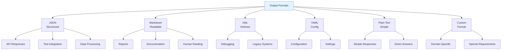
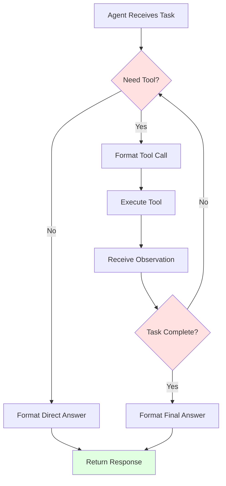
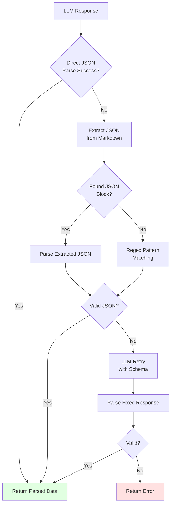
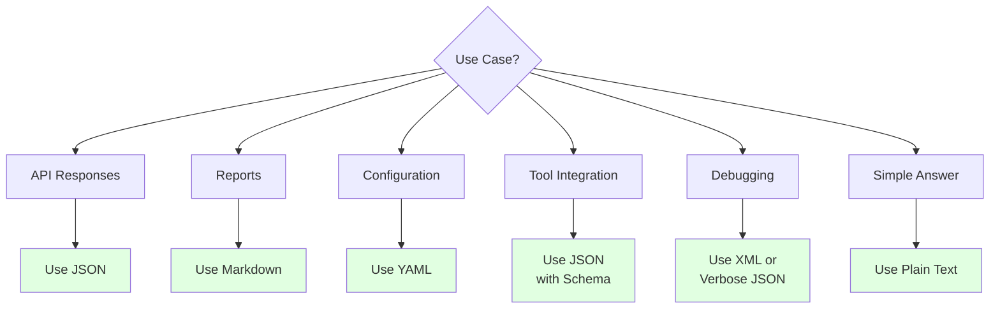

# Output Formatting


에이전트 출력 형식을 정의하고 파싱합니다.

## Output Format Types



## JSON Output

### Basic JSON Format

```python
JSON_OUTPUT_INSTRUCTION = """
## Output Format

Respond with valid JSON only. No additional text outside JSON.

```json
{
  "status": "success" | "error" | "partial",
  "data": {
    // Your structured response here
  },
  "metadata": {
    "confidence": 0.0-1.0,
    "sources": ["source1", "source2"],
    "processing_notes": "Optional notes"
  }
}
```

Important:
- Ensure all JSON is valid and parseable
- Use null for missing optional fields
- Escape special characters in strings
"""
```

### Pydantic Schema

```python
from pydantic import BaseModel, Field
from typing import Optional, List

class AnalysisResult(BaseModel):
    summary: str = Field(description="Brief summary of analysis")
    findings: List[str] = Field(description="Key findings")
    confidence: float = Field(ge=0.0, le=1.0)
    recommendations: Optional[List[str]] = None

# Generate output instructions from schema
def schema_to_prompt(model: type[BaseModel]) -> str:
    schema = model.model_json_schema()
    return f"""
## Output Format

Respond with JSON matching this schema:

```json
{json.dumps(schema, indent=2)}
```

Example:
```json
{model.model_config.get('json_schema_extra', {}).get('example', '{}')}
```
"""
```

### JSON with Reasoning

```python
JSON_WITH_REASONING = """
## Output Format

Use this JSON structure that includes your reasoning:

```json
{
  "thinking": {
    "observations": ["What you noticed in the input"],
    "considerations": ["Factors you considered"],
    "trade_offs": ["Trade-offs you evaluated"]
  },
  "answer": {
    "conclusion": "Your final answer",
    "confidence": 0.85,
    "alternatives": ["Other possible answers considered"]
  },
  "action": {
    "recommended": "Recommended action",
    "steps": ["Step 1", "Step 2"],
    "caveats": ["Important considerations"]
  }
}
```
"""
```

## Markdown Output

### Structured Markdown

```python
MARKDOWN_OUTPUT = """
## Output Format

Structure your response in markdown:

# Title

## Executive Summary
[2-3 sentence overview]

## Key Findings
| Finding | Impact | Priority |
|---------|--------|----------|
| Finding 1 | High | P1 |
| Finding 2 | Medium | P2 |

## Detailed Analysis

### Topic 1
[Analysis content]

### Topic 2
[Analysis content]

## Recommendations
1. **Recommendation 1**: Description
2. **Recommendation 2**: Description

## Next Steps
- [ ] Action item 1
- [ ] Action item 2

---
*Generated on {date}*
"""
```

### Code Output

```python
CODE_OUTPUT = """
## Output Format

When providing code, use this structure:

### Solution

```python
# Description of what this code does

def function_name(param: type) -> return_type:
    \"\"\"
    Docstring explaining the function.

    Args:
        param: Description

    Returns:
        Description of return value
    \"\"\"
    # Implementation
    pass
```

### Explanation
[Explain the code and any important decisions]

### Usage Example
```python
# How to use the code
result = function_name(input)
```

### Tests
```python
def test_function_name():
    assert function_name(input) == expected
```
"""
```

## Structured Output with Tool Calls



### Function Calling Format

```python
TOOL_CALL_FORMAT = """
## Output Format

When you need to use a tool, respond with:

```json
{
  "thought": "Why you need to use this tool",
  "tool_call": {
    "name": "tool_name",
    "arguments": {
      "arg1": "value1",
      "arg2": "value2"
    }
  }
}
```

When providing a final answer (no tool needed):

```json
{
  "thought": "Summary of your reasoning",
  "answer": "Your final response to the user"
}
```
"""
```

### ReAct Format

```python
REACT_FORMAT = """
## Output Format

Use the ReAct (Reasoning + Acting) format:

Thought: [Your reasoning about what to do next]
Action: [Tool name to use]
Action Input: [Input for the tool in JSON]

After receiving observation:

Thought: [Reasoning about the observation]
Action: [Next tool or "Final Answer"]
Action Input: [Input or final response]

Example:
Thought: I need to search for recent information about AI trends
Action: search_web
Action Input: {"query": "AI trends 2024", "limit": 5}

Observation: [Search results will appear here]

Thought: The search results show three main trends...
Action: Final Answer
Action Input: Based on my research, the top AI trends are...
"""
```

## Output Parsing



### JSON Parser

```python
import json
import re
from typing import Optional

class OutputParser:
    def parse_json(self, response: str) -> Optional[dict]:
        """Extract and parse JSON from response"""
        # Try direct parse first
        try:
            return json.loads(response)
        except json.JSONDecodeError:
            pass

        # Try to extract JSON block
        patterns = [
            r'```json\s*([\s\S]*?)\s*```',
            r'```\s*([\s\S]*?)\s*```',
            r'\{[\s\S]*\}'
        ]

        for pattern in patterns:
            match = re.search(pattern, response)
            if match:
                try:
                    json_str = match.group(1) if '```' in pattern else match.group()
                    return json.loads(json_str)
                except (json.JSONDecodeError, IndexError):
                    continue

        return None

    def parse_with_retry(self, response: str, llm, schema: dict) -> dict:
        """Parse with LLM retry on failure"""
        result = self.parse_json(response)
        if result:
            return result

        # Ask LLM to fix the format
        fix_prompt = f"""
The following response could not be parsed as JSON:

{response}

Please reformat as valid JSON matching this schema:
{json.dumps(schema, indent=2)}
"""
        fixed_response = llm.complete(fix_prompt)
        return self.parse_json(fixed_response)
```

### Markdown Parser

```python
import re
from dataclasses import dataclass

@dataclass
class ParsedSection:
    title: str
    level: int
    content: str

class MarkdownParser:
    def parse_sections(self, text: str) -> list[ParsedSection]:
        """Parse markdown into sections"""
        sections = []
        current_section = None
        current_content = []

        for line in text.split('\n'):
            # Check for heading
            heading_match = re.match(r'^(#{1,6})\s+(.+)$', line)
            if heading_match:
                # Save previous section
                if current_section:
                    current_section.content = '\n'.join(current_content).strip()
                    sections.append(current_section)

                # Start new section
                level = len(heading_match.group(1))
                title = heading_match.group(2)
                current_section = ParsedSection(title, level, "")
                current_content = []
            else:
                current_content.append(line)

        # Save last section
        if current_section:
            current_section.content = '\n'.join(current_content).strip()
            sections.append(current_section)

        return sections

    def extract_code_blocks(self, text: str) -> list[dict]:
        """Extract code blocks with language"""
        pattern = r'```(\w+)?\s*([\s\S]*?)```'
        matches = re.findall(pattern, text)
        return [
            {"language": m[0] or "text", "code": m[1].strip()}
            for m in matches
        ]
```

## Format Validation

```python
from jsonschema import validate, ValidationError

class OutputValidator:
    def __init__(self, schema: dict):
        self.schema = schema

    def validate(self, output: dict) -> dict:
        """Validate output against schema"""
        try:
            validate(instance=output, schema=self.schema)
            return {"valid": True, "errors": []}
        except ValidationError as e:
            return {
                "valid": False,
                "errors": [str(e.message)],
                "path": list(e.path)
            }

# Usage
schema = {
    "type": "object",
    "required": ["summary", "confidence"],
    "properties": {
        "summary": {"type": "string", "minLength": 10},
        "confidence": {"type": "number", "minimum": 0, "maximum": 1}
    }
}

validator = OutputValidator(schema)
result = validator.validate({"summary": "Test", "confidence": 0.5})
```

## Best Practices

### Format Selection Guide



| Use Case | Recommended Format |
|----------|-------------------|
| API responses | JSON |
| Human-readable reports | Markdown |
| Configuration | YAML |
| Tool integration | JSON with schema |
| Verbose debugging | XML |
| Simple responses | Plain text |

### Common Pitfalls

```python
# ❌ Don't: Vague format instructions
output_instructions = "Return the results"

# ✅ Do: Explicit format with example
output_instructions = """
Return results as JSON:
```json
{
  "items": [{"name": "...", "score": 0.0}],
  "total": 0
}
```
"""

# ❌ Don't: Assume format compliance
result = llm.complete(prompt)
data = json.loads(result)  # May fail!

# ✅ Do: Parse with error handling
parser = OutputParser()
data = parser.parse_with_retry(result, llm, schema)
```
