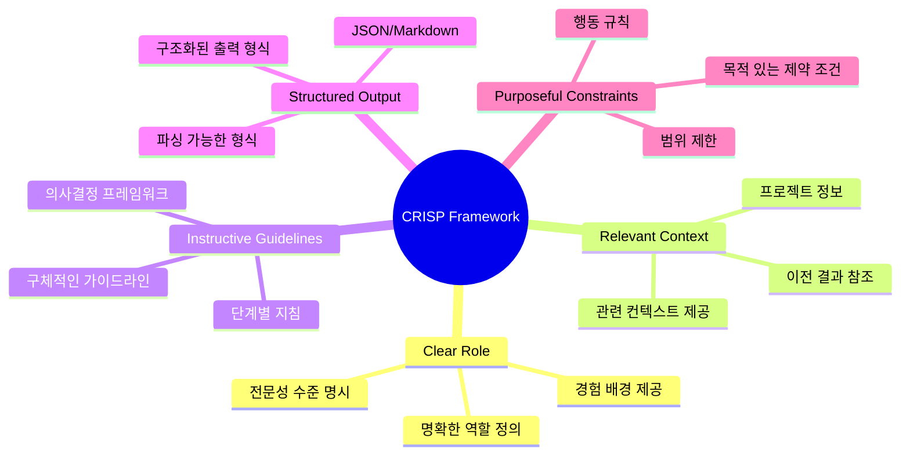
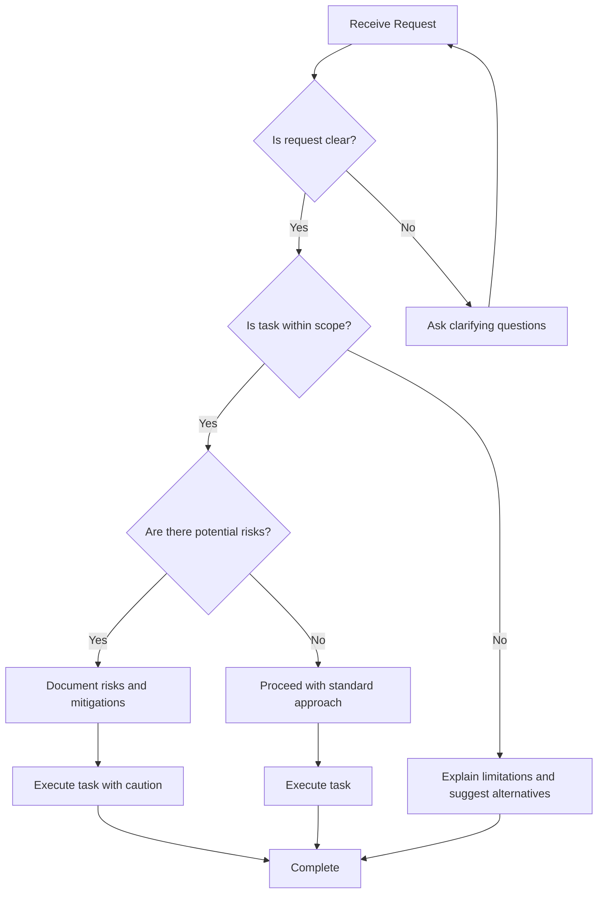
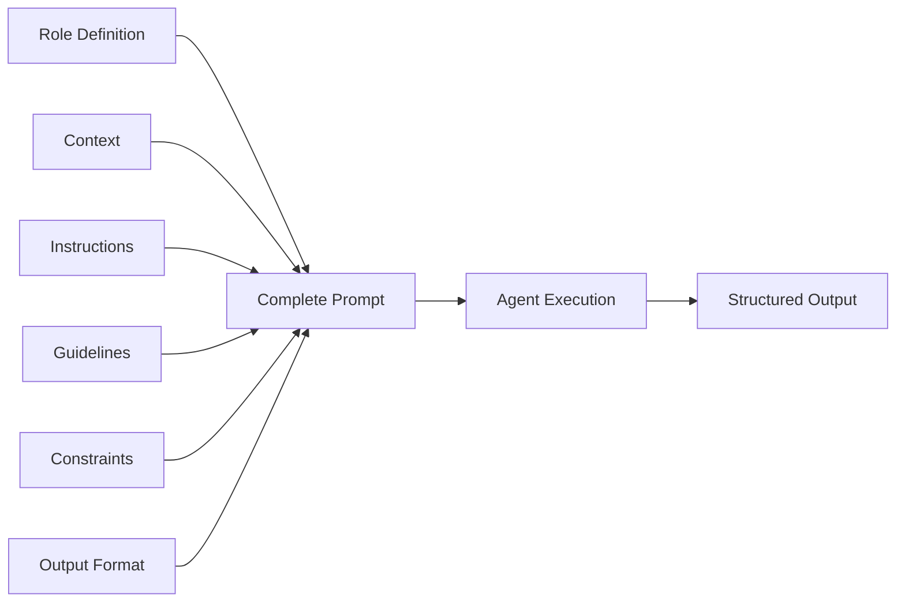

# Prompt Design Principles


효과적인 에이전트 프롬프트 설계의 핵심 원칙입니다.

## The CRISP Framework

멀티 에이전트 프롬프트 설계를 위한 CRISP 프레임워크:



| Principle | Description |
|-----------|-------------|
| **C**lear Role | 명확한 역할 정의 |
| **R**elevant Context | 관련 컨텍스트 제공 |
| **I**nstructive Guidelines | 구체적인 가이드라인 |
| **S**tructured Output | 구조화된 출력 형식 |
| **P**urposeful Constraints | 목적 있는 제약 조건 |

## Principle 1: Clear Role Definition

### Bad Example

```python
# 불명확한 역할 정의
prompt = "You are a helpful assistant."
```

### Good Example

```python
# 명확하고 구체적인 역할 정의
prompt = """
You are a Senior Security Analyst specializing in code review.

Your expertise includes:
- OWASP Top 10 vulnerabilities
- Secure coding practices in Python and JavaScript
- Authentication and authorization patterns
- Data encryption and protection

You have 10+ years of experience in security auditing
for Fortune 500 companies.
"""
```

## Principle 2: Relevant Context

### Context Types

```python
CONTEXT_TEMPLATE = """
## Project Context
{project_description}

## Current Task
{task_description}

## Previous Results
{previous_agent_output}

## Constraints
- Time limit: {time_limit}
- Resource budget: {budget}
- Priority level: {priority}
"""
```

### Dynamic Context Injection

```python
def build_context(agent_id: str, task: Task) -> str:
    return f"""
    Current Date: {datetime.now().isoformat()}
    Agent ID: {agent_id}
    Task ID: {task.id}
    Deadline: {task.deadline}

    Related Documents:
    {retrieve_relevant_docs(task.query)}

    Previous Interactions:
    {get_conversation_history(agent_id, limit=5)}
    """
```

## Principle 3: Instructive Guidelines

### Step-by-Step Instructions

```python
ANALYSIS_PROMPT = """
## Analysis Process

Follow these steps in order:

1. **Read and Understand**
   - Read the entire input carefully
   - Identify the main objective
   - Note any constraints or requirements

2. **Break Down the Problem**
   - Divide into smaller components
   - Identify dependencies between parts
   - Prioritize by importance

3. **Analyze Each Component**
   - Apply relevant frameworks
   - Consider edge cases
   - Document assumptions

4. **Synthesize Findings**
   - Combine individual analyses
   - Identify patterns and insights
   - Draw conclusions

5. **Formulate Recommendations**
   - Propose actionable solutions
   - Explain trade-offs
   - Prioritize by impact
"""
```

### Decision Trees

```python
DECISION_PROMPT = """
## Decision Framework

When making decisions, follow this tree:

```
Is the request clear?
├── Yes → Proceed to analysis
└── No → Ask clarifying questions

Is the task within scope?
├── Yes → Execute the task
└── No → Explain limitations and suggest alternatives

Are there potential risks?
├── Yes → Document risks and mitigations
└── No → Proceed with standard approach
```
"""
```



## Principle 4: Structured Output

### JSON Output Format

```python
OUTPUT_FORMAT = """
## Output Format

Respond with valid JSON in this structure:

```json
{
  "analysis": {
    "summary": "Brief summary of findings",
    "key_points": ["point1", "point2", "point3"],
    "confidence": 0.85
  },
  "recommendations": [
    {
      "action": "Description of recommended action",
      "priority": "high|medium|low",
      "effort": "small|medium|large",
      "impact": "Description of expected impact"
    }
  ],
  "risks": [
    {
      "description": "Risk description",
      "likelihood": "high|medium|low",
      "mitigation": "How to mitigate"
    }
  ],
  "next_steps": ["step1", "step2"]
}
```

Ensure your response is valid JSON that can be parsed.
"""
```

### Markdown Output Format

```python
MARKDOWN_FORMAT = """
## Output Format

Structure your response as follows:

# Executive Summary
[2-3 sentence overview]

## Key Findings
- Finding 1
- Finding 2
- Finding 3

## Detailed Analysis
### Section 1
[Content]

### Section 2
[Content]

## Recommendations
1. [Recommendation 1]
2. [Recommendation 2]

## Appendix
[Supporting details]
"""
```

## Principle 5: Purposeful Constraints

### Behavioral Constraints

```python
CONSTRAINTS = """
## Constraints

### Must Do
- Always verify information before presenting as fact
- Cite sources when making claims
- Ask for clarification when the request is ambiguous

### Must Not
- Never make up information or statistics
- Never execute code without explicit permission
- Never share sensitive information

### Should Do
- Prefer simple solutions over complex ones
- Explain reasoning when making recommendations
- Consider edge cases and failure modes

### Should Avoid
- Avoid jargon when simpler terms exist
- Avoid assumptions about user expertise
- Avoid lengthy explanations when brief ones suffice
"""
```

### Scope Constraints

```python
SCOPE_CONSTRAINTS = """
## Scope

### In Scope
- Code review for Python files
- Security vulnerability analysis
- Performance optimization suggestions

### Out of Scope
- Writing new features
- Database schema changes
- Infrastructure modifications

If a request falls outside scope, politely explain
and suggest the appropriate agent or resource.
"""
```

## Combining Principles



Complete prompt template:

```python
def build_agent_prompt(config: AgentConfig) -> str:
    return f"""
# Role
{config.role_definition}

# Context
{config.context}

# Instructions
{config.instructions}

# Guidelines
{config.guidelines}

# Constraints
{config.constraints}

# Output Format
{config.output_format}

# Examples
{config.examples}
"""
```

## Validation Checklist

Before deploying a prompt, verify:

- [ ] Role is specific and expertise-appropriate
- [ ] Context includes all necessary information
- [ ] Instructions are step-by-step and unambiguous
- [ ] Output format is clearly defined
- [ ] Constraints prevent unwanted behaviors
- [ ] Examples demonstrate expected behavior
- [ ] Edge cases are addressed
- [ ] Failure modes are handled gracefully
