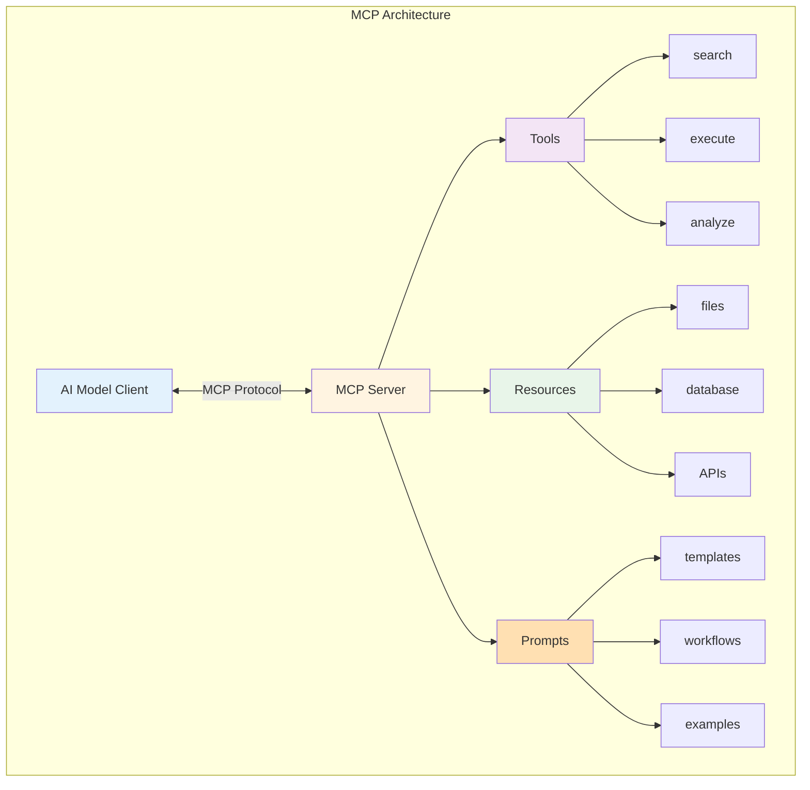
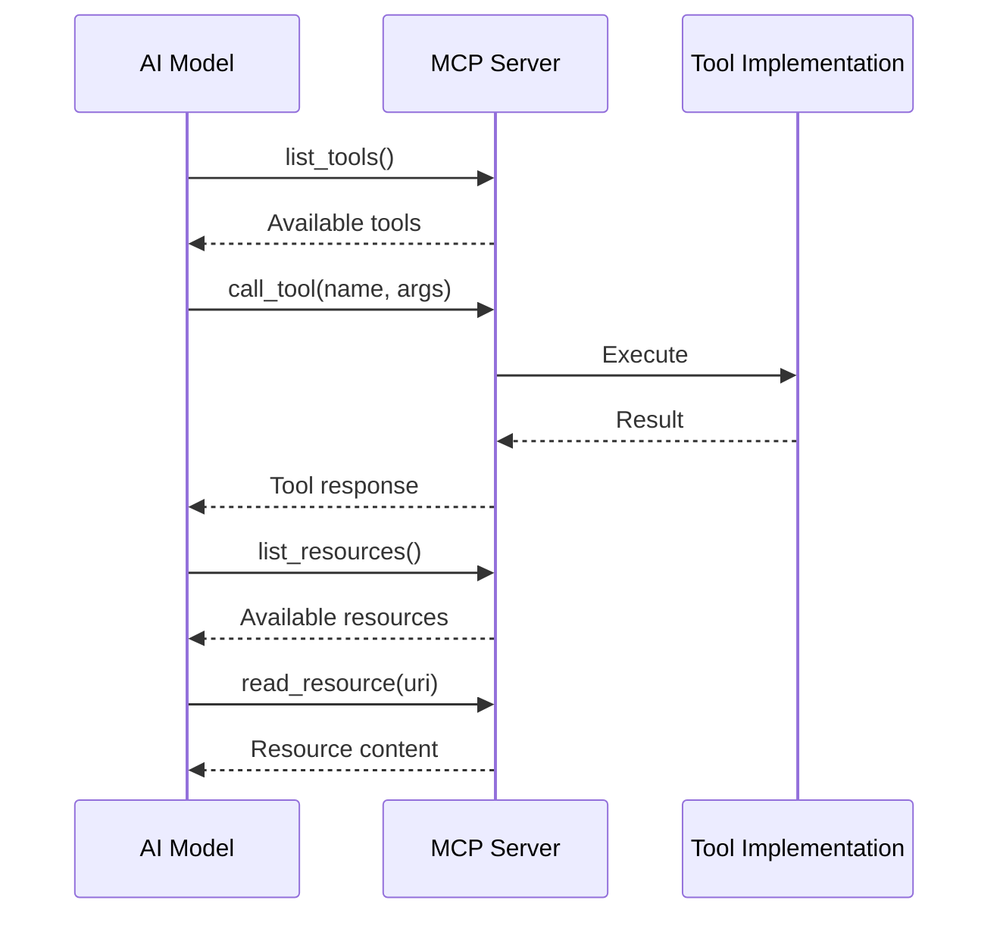
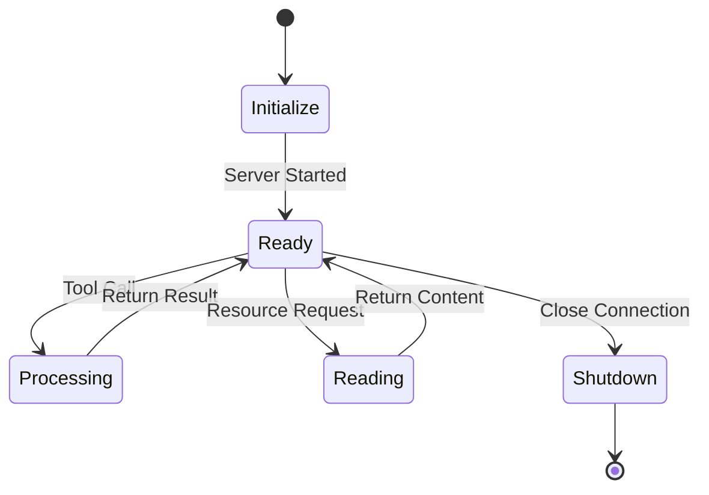
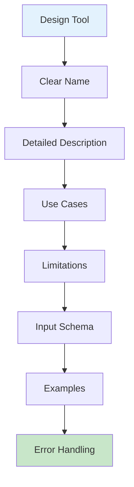
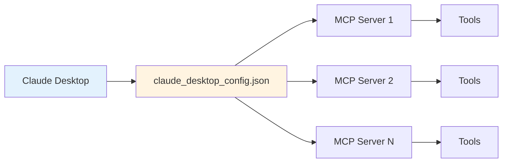
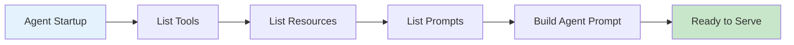
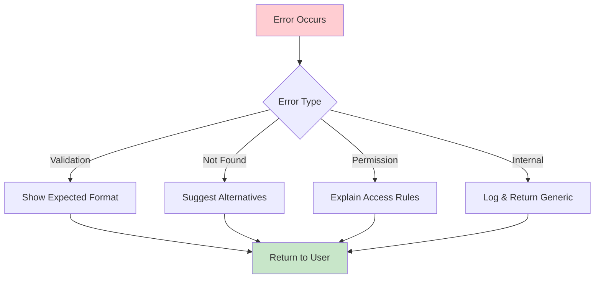

# Model Context Protocol (MCP)


MCP를 활용한 표준화된 도구 통합입니다.

## MCP Overview

Model Context Protocol (MCP)은 Anthropic에서 개발한 AI 모델과 외부 도구/데이터 간의 표준 통신 프로토콜입니다.



## MCP Communication Flow



## MCP Concepts

| Concept | Description |
|---------|-------------|
| **Server** | 도구와 리소스를 제공하는 서버 |
| **Client** | MCP 서버에 연결하는 AI 클라이언트 |
| **Tools** | 실행 가능한 함수/작업 |
| **Resources** | 읽기 가능한 데이터 소스 |
| **Prompts** | 재사용 가능한 프롬프트 템플릿 |

## Creating MCP Server

### Basic Server

```python
from mcp.server import Server
from mcp.server.stdio import stdio_server
from mcp.types import Tool, TextContent

# Create server
server = Server("my-tools-server")

# Define tool
@server.list_tools()
async def list_tools() -> list[Tool]:
    return [
        Tool(
            name="search_web",
            description="Search the web for information",
            inputSchema={
                "type": "object",
                "properties": {
                    "query": {
                        "type": "string",
                        "description": "Search query"
                    }
                },
                "required": ["query"]
            }
        )
    ]

# Implement tool
@server.call_tool()
async def call_tool(name: str, arguments: dict) -> list[TextContent]:
    if name == "search_web":
        query = arguments.get("query")
        # Implementation
        results = await perform_search(query)
        return [TextContent(type="text", text=results)]

    raise ValueError(f"Unknown tool: {name}")

# Run server
async def main():
    async with stdio_server() as (read_stream, write_stream):
        await server.run(read_stream, write_stream)

if __name__ == "__main__":
    import asyncio
    asyncio.run(main())
```

### Server Lifecycle



### With Resources

```python
from mcp.server import Server
from mcp.types import Resource, ResourceTemplate

server = Server("file-server")

# List available resources
@server.list_resources()
async def list_resources() -> list[Resource]:
    return [
        Resource(
            uri="file:///config/settings.json",
            name="Settings",
            description="Application settings",
            mimeType="application/json"
        ),
        Resource(
            uri="file:///data/users.csv",
            name="Users",
            description="User database export",
            mimeType="text/csv"
        )
    ]

# Read resource content
@server.read_resource()
async def read_resource(uri: str) -> str:
    if uri.startswith("file://"):
        path = uri.replace("file://", "")
        with open(path, "r") as f:
            return f.read()

    raise ValueError(f"Unknown resource: {uri}")

# Resource templates for dynamic resources
@server.list_resource_templates()
async def list_templates() -> list[ResourceTemplate]:
    return [
        ResourceTemplate(
            uriTemplate="file:///logs/{date}.log",
            name="Daily Logs",
            description="Access log files by date"
        )
    ]
```

### With Prompts

```python
from mcp.types import Prompt, PromptArgument, PromptMessage

@server.list_prompts()
async def list_prompts() -> list[Prompt]:
    return [
        Prompt(
            name="code_review",
            description="Template for code review requests",
            arguments=[
                PromptArgument(
                    name="code",
                    description="Code to review",
                    required=True
                ),
                PromptArgument(
                    name="language",
                    description="Programming language",
                    required=False
                )
            ]
        )
    ]

@server.get_prompt()
async def get_prompt(
    name: str,
    arguments: dict
) -> list[PromptMessage]:
    if name == "code_review":
        code = arguments.get("code")
        language = arguments.get("language", "unknown")

        return [
            PromptMessage(
                role="user",
                content=f"""Please review this {language} code:

```{language}
{code}
```

Focus on:
1. Code quality
2. Potential bugs
3. Performance
4. Security
5. Best practices
"""
            )
        ]
```

## Tool Design for MCP

### Tool Schema Best Practices



```python
TOOL_SCHEMA = {
    "name": "query_database",
    "description": """
    Execute SQL queries against the application database.

    Use this tool to:
    - Retrieve user data
    - Check order status
    - Get analytics data

    Limitations:
    - Read-only queries only (SELECT)
    - Maximum 1000 rows returned
    - No access to sensitive tables (auth, payments)

    Example queries:
    - SELECT * FROM users WHERE created_at > '2024-01-01'
    - SELECT COUNT(*) FROM orders WHERE status = 'pending'
    """,
    "inputSchema": {
        "type": "object",
        "properties": {
            "query": {
                "type": "string",
                "description": "SQL SELECT query"
            },
            "database": {
                "type": "string",
                "enum": ["analytics", "content", "public"],
                "description": "Target database",
                "default": "public"
            },
            "limit": {
                "type": "integer",
                "description": "Maximum rows to return",
                "default": 100,
                "minimum": 1,
                "maximum": 1000
            }
        },
        "required": ["query"]
    }
}
```

### Tool Categories

```python
# Information Retrieval Tools
SEARCH_TOOL = Tool(
    name="search",
    description="Search across all indexed content",
    inputSchema={...}
)

READ_TOOL = Tool(
    name="read_document",
    description="Read content from a specific document",
    inputSchema={...}
)

# Action Tools
SEND_EMAIL_TOOL = Tool(
    name="send_email",
    description="Send an email to specified recipients",
    inputSchema={...}
)

CREATE_TASK_TOOL = Tool(
    name="create_task",
    description="Create a new task in project management",
    inputSchema={...}
)

# Analysis Tools
ANALYZE_TOOL = Tool(
    name="analyze_data",
    description="Perform statistical analysis on data",
    inputSchema={...}
)
```

## Claude Desktop Integration



### Configuration

```json
// ~/Library/Application Support/Claude/claude_desktop_config.json
{
  "mcpServers": {
    "my-tools": {
      "command": "python",
      "args": ["/path/to/my_mcp_server.py"],
      "env": {
        "API_KEY": "your-api-key"
      }
    },
    "database": {
      "command": "npx",
      "args": ["-y", "@modelcontextprotocol/server-postgres"],
      "env": {
        "POSTGRES_CONNECTION_STRING": "postgresql://..."
      }
    }
  }
}
```

### Available MCP Servers

| Server | Description |
|--------|-------------|
| `@modelcontextprotocol/server-filesystem` | File system access |
| `@modelcontextprotocol/server-postgres` | PostgreSQL database |
| `@modelcontextprotocol/server-sqlite` | SQLite database |
| `@modelcontextprotocol/server-brave-search` | Brave web search |
| `@modelcontextprotocol/server-github` | GitHub integration |
| `@modelcontextprotocol/server-slack` | Slack integration |

## Agent Prompt with MCP

### MCP-Aware Agent Prompt

```python
MCP_AGENT_PROMPT = """
You have access to tools and resources through MCP servers.

## Available Tools

The following tools are available:
{tool_list}

## Available Resources

You can read from these resources:
{resource_list}

## Guidelines

1. **Tool Selection**
   - Review available tools before responding
   - Use the most specific tool for the task
   - Combine tools when needed

2. **Resource Access**
   - Resources provide context and data
   - Read resources before making decisions
   - Reference resource data in responses

3. **Error Handling**
   - Handle tool errors gracefully
   - Retry with different parameters if needed
   - Inform user of limitations

4. **Security**
   - Never expose sensitive resource data
   - Validate inputs before tool calls
   - Respect access limitations
"""
```

### Dynamic Tool Discovery



```python
async def build_agent_prompt(mcp_client):
    # Get available tools
    tools = await mcp_client.list_tools()
    tool_descriptions = "\n".join([
        f"- {t.name}: {t.description}"
        for t in tools
    ])

    # Get available resources
    resources = await mcp_client.list_resources()
    resource_descriptions = "\n".join([
        f"- {r.uri}: {r.description}"
        for r in resources
    ])

    return MCP_AGENT_PROMPT.format(
        tool_list=tool_descriptions,
        resource_list=resource_descriptions
    )
```

## Best Practices

### Server Design

```python
# Good: Focused, single-purpose server
class DatabaseServer(Server):
    """Server for database operations only"""
    tools = ["query", "list_tables", "describe_table"]

# Bad: Monolithic server with everything
class EverythingServer(Server):
    """Does everything"""
    tools = ["search", "query", "email", "file", ...]
```

### Tool Naming

```python
# Good: Clear, action-oriented names
"search_web"
"read_file"
"create_ticket"
"analyze_sentiment"

# Bad: Vague or unclear names
"do_thing"
"process"
"helper"
"misc"
```

### Error Messages



```python
# Good: Informative error
async def call_tool(name, args):
    try:
        result = await execute(name, args)
        return [TextContent(type="text", text=result)]
    except ValidationError as e:
        return [TextContent(
            type="text",
            text=f"Invalid input: {e.message}. "
                 f"Expected: {e.expected_format}"
        )]

# Bad: Generic error
except Exception:
    return [TextContent(type="text", text="Error")]
```

## Resources

- [MCP Specification](https://spec.modelcontextprotocol.io/)
- [MCP GitHub](https://github.com/modelcontextprotocol)
- [MCP Servers Repository](https://github.com/modelcontextprotocol/servers)
