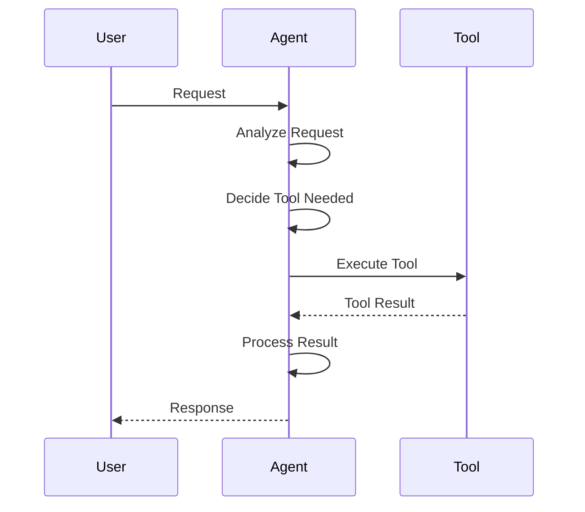
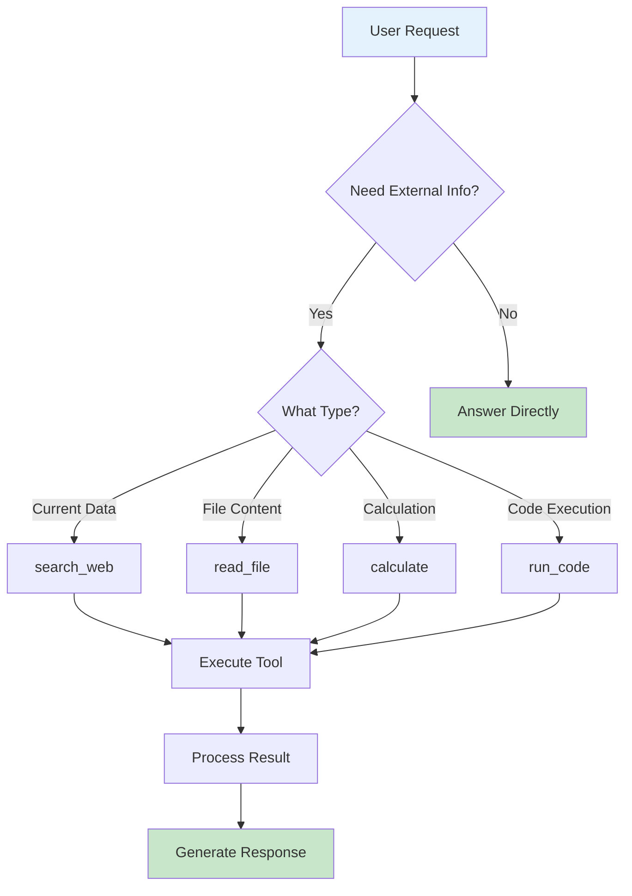
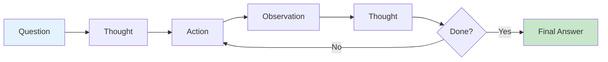
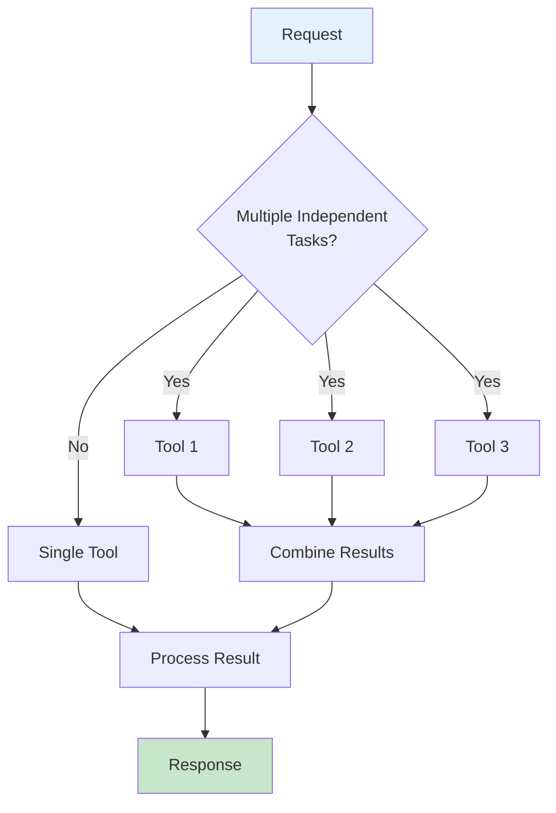
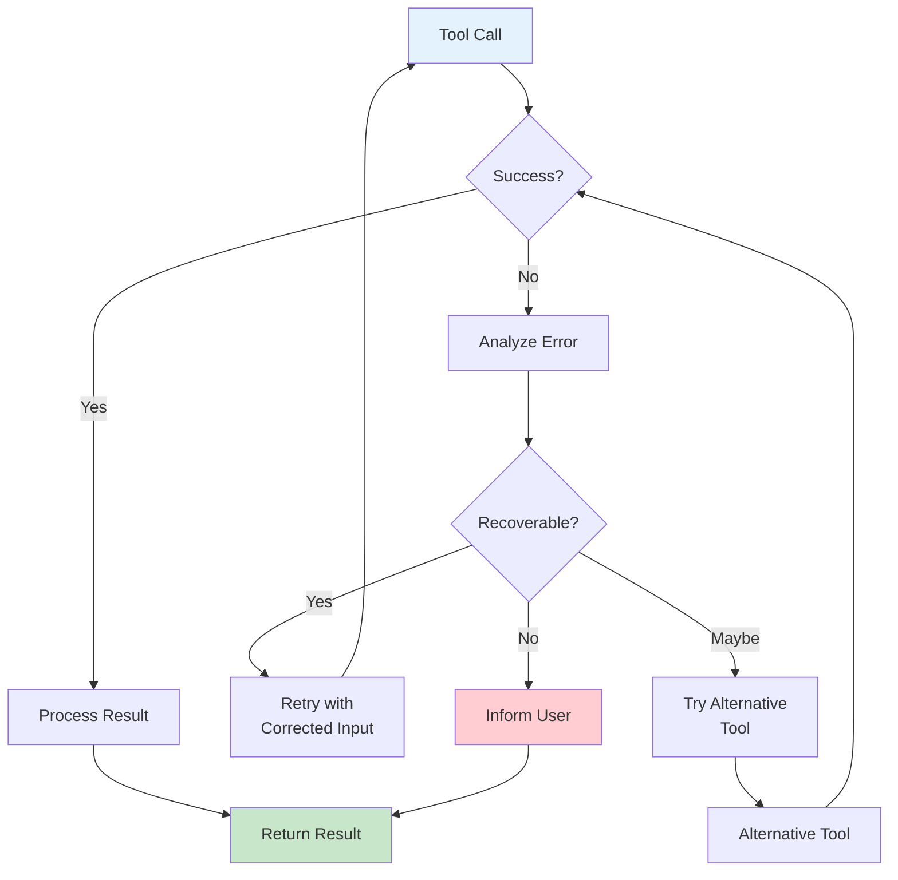
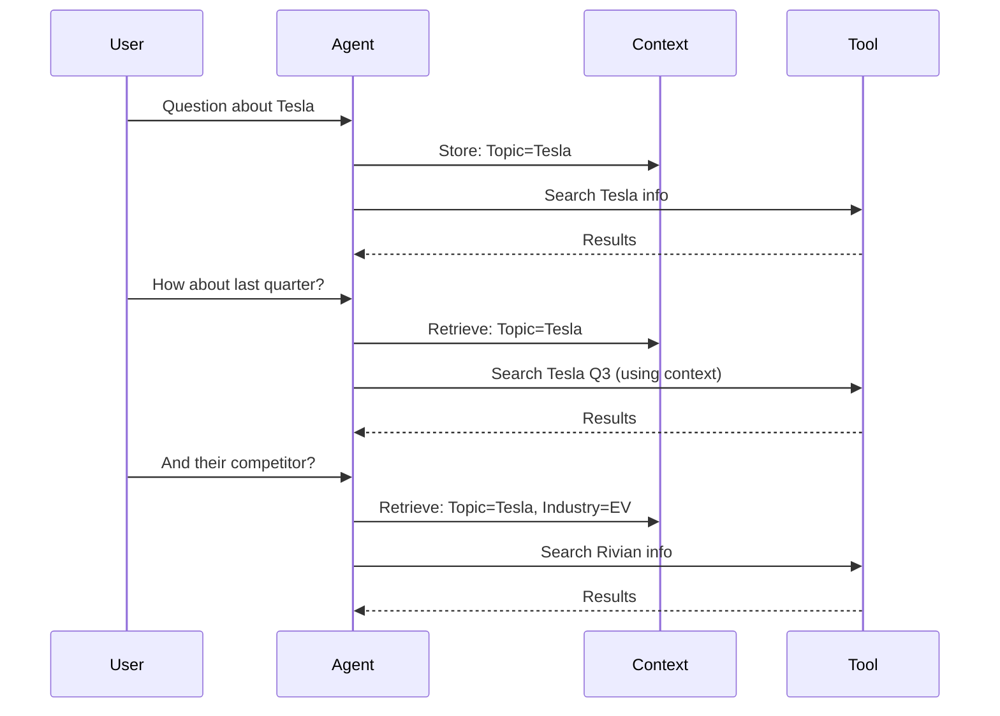
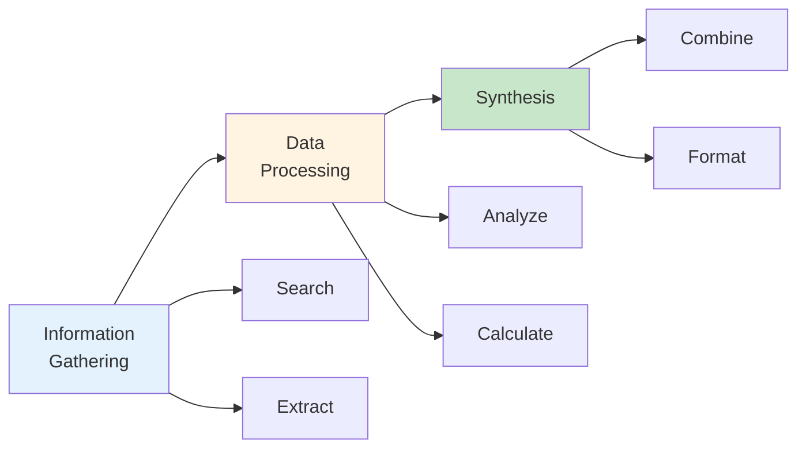

# Tool Calling


에이전트가 도구를 효과적으로 호출하도록 프롬프트를 설계합니다.

## Tool Calling Flow



## Decision Process



## Prompting for Tool Use

### Basic Tool Instructions

```python
TOOL_USE_PROMPT = """
You have access to the following tools:

{tool_descriptions}

## When to Use Tools

Use tools when you need to:
- Get current or real-time information
- Perform calculations
- Access external data
- Execute actions

Do NOT use tools when:
- You already know the answer
- The question is about general knowledge
- Simple reasoning is sufficient

## How to Use Tools

1. Identify if a tool is needed
2. Select the most appropriate tool
3. Provide required parameters
4. Wait for the result
5. Incorporate result into your response

Always explain your reasoning before using a tool.
"""
```

### Tool Selection Guidance

```python
TOOL_SELECTION_PROMPT = """
## Available Tools

### search_web
- USE FOR: Current events, recent information, fact verification
- NOT FOR: Historical facts, general knowledge, opinions

### calculate
- USE FOR: Math calculations, unit conversions, formulas
- NOT FOR: Estimates, rough numbers, already-computed values

### read_file
- USE FOR: Accessing file contents, checking file data
- NOT FOR: Hypothetical files, example content

### run_code
- USE FOR: Complex calculations, data processing, testing logic
- NOT FOR: Simple operations, demonstrations

## Selection Criteria

Before choosing a tool, ask:
1. Do I need external information? → search_web
2. Do I need precise calculation? → calculate
3. Do I need file content? → read_file
4. Do I need to process data? → run_code
5. Can I answer without tools? → Don't use tools
"""
```

## Tool Calling Patterns

### ReAct Pattern



```python
REACT_PROMPT = """
You are an AI assistant that solves problems step by step.

Use this format:

Question: [The user's question]
Thought: [Your reasoning about what to do]
Action: [Tool name to use]
Action Input: [Parameters for the tool]

After receiving the observation:

Observation: [Tool result]
Thought: [Your reasoning about the result]
... (repeat as needed)

Final Answer: [Your complete response]

Example:

Question: What is the population of Tokyo?
Thought: I need current population data. I should search for this.
Action: search_web
Action Input: {"query": "Tokyo population 2024"}

Observation: Tokyo's population is approximately 13.96 million (2024)
Thought: I have the information I need.
Final Answer: Tokyo's population is approximately 13.96 million as of 2024.
"""
```

### Function Calling Pattern

```python
FUNCTION_CALL_PROMPT = """
You can call functions to help answer questions.

When you need to use a function:
1. Determine which function is needed
2. Provide the function call in JSON format
3. Wait for the result before continuing

Format your function calls like this:

```json
{
  "name": "function_name",
  "arguments": {
    "param1": "value1",
    "param2": "value2"
  }
}
```

Important:
- Only call one function at a time
- Ensure all required parameters are provided
- Use the exact parameter names from the function definition
"""
```

### Parallel Tool Calls



```python
PARALLEL_TOOLS_PROMPT = """
You can call multiple tools simultaneously when they are independent.

## When to Use Parallel Calls

Use parallel calls when:
- Multiple pieces of information are needed
- The calls don't depend on each other
- Speed is important

Example parallel calls:
```json
[
  {"name": "search_web", "arguments": {"query": "AI trends 2024"}},
  {"name": "search_web", "arguments": {"query": "AI market size 2024"}},
  {"name": "search_academic", "arguments": {"query": "AI research papers 2024"}}
]
```

## When NOT to Use Parallel Calls

Don't use parallel calls when:
- One result is needed for the next call
- The order matters
- Results need to be combined before proceeding
"""
```

## Error Handling



### Tool Failure Prompt

```python
TOOL_ERROR_PROMPT = """
## Handling Tool Errors

If a tool returns an error or fails:

1. **Understand the Error**
   - Read the error message carefully
   - Identify the cause (invalid input, service issue, etc.)

2. **Try Recovery**
   - Retry with corrected parameters
   - Try an alternative tool
   - Use a different approach

3. **Inform the User**
   - If recovery fails, explain what happened
   - Suggest alternatives
   - Never pretend the tool succeeded

Example:

Tool Error: "Search service unavailable"

Bad Response: "Based on my search..." (lying about tool use)

Good Response: "I tried to search for current information, but the
search service is temporarily unavailable. Based on my existing
knowledge, [answer]. For the most current data, please try again
later or check [reliable source]."
"""
```

### Graceful Degradation

```python
DEGRADATION_PROMPT = """
## When Tools Aren't Working

If tools are unavailable or failing repeatedly:

1. Acknowledge the limitation
2. Provide what help you can without tools
3. Clearly indicate what information might be outdated
4. Suggest how the user can get the information

Example:
"I'm currently unable to access web search. Based on my training
data (current as of [date]), [answer]. For the latest information,
I recommend checking [specific sources]."
"""
```

## Context in Tool Calls

### Maintaining Context



```python
CONTEXT_TOOL_PROMPT = """
## Using Conversation Context in Tool Calls

When making tool calls, consider:

1. **Previous Answers**: Reference earlier information
2. **User Preferences**: Remember stated preferences
3. **Topic Focus**: Stay on the discussed topic
4. **Progressive Detail**: Build on previous searches

Example:

User: "Tell me about Tesla's latest earnings"
[search: Tesla earnings Q4 2024]

User: "How does that compare to last quarter?"
[search: Tesla earnings Q3 2024]  # Context: Tesla, earnings

User: "And their main competitor?"
[search: Rivian earnings Q4 2024]  # Context: EV companies, same period
"""
```

### Tool Call Chaining



```python
CHAINING_PROMPT = """
## Chaining Tool Calls

For complex tasks, chain tools logically:

1. **Information Gathering**
   - Search for initial data
   - Identify specific sources
   - Extract detailed information

2. **Data Processing**
   - Analyze gathered data
   - Calculate metrics
   - Compare findings

3. **Synthesis**
   - Combine results
   - Draw conclusions
   - Format response

Example Chain:
1. search_web("company quarterly reports")
2. read_webpage(found_url)
3. analyze_data(extracted_numbers, "comparison")
4. Synthesize into response
"""
```

## Best Practices

### Do's

```python
TOOL_DOS = """
## Tool Calling Best Practices

✅ DO:
- Explain why you're using a tool
- Use specific, focused queries
- Verify tool results make sense
- Cite tool results in your response
- Handle errors gracefully
- Use the right tool for the task

Example:
"I'll search for the current stock price since I need real-time data."
[Uses search_web with specific query]
"According to my search, the current price is $X."
"""
```

### Don'ts

```python
TOOL_DONTS = """
## Tool Calling Anti-Patterns

❌ DON'T:
- Use tools for information you already know
- Make up tool results
- Ignore tool errors
- Use vague tool parameters
- Chain tools unnecessarily
- Use tools without explaining why

Bad Example:
[Uses search for "things"]  # Too vague
"Based on my research..."  # What research? What did you find?

Good Example:
"Let me search for Tesla's Q4 2024 revenue figures."
[Uses search_web with query "Tesla Q4 2024 revenue financial results"]
"According to Tesla's Q4 2024 earnings report, revenue was $25.17 billion."
"""
```

## Implementation

### With LangChain

```python
from langchain.agents import AgentExecutor, create_openai_tools_agent
from langchain_openai import ChatOpenAI
from langchain.prompts import ChatPromptTemplate, MessagesPlaceholder

prompt = ChatPromptTemplate.from_messages([
    ("system", TOOL_USE_PROMPT + TOOL_SELECTION_PROMPT),
    ("human", "{input}"),
    MessagesPlaceholder(variable_name="agent_scratchpad"),
])

llm = ChatOpenAI(model="gpt-4")
agent = create_openai_tools_agent(llm, tools, prompt)
executor = AgentExecutor(agent=agent, tools=tools, verbose=True)

result = executor.invoke({"input": "What's the current Bitcoin price?"})
```

### With OpenAI Direct

```python
from openai import OpenAI

client = OpenAI()

response = client.chat.completions.create(
    model="gpt-4",
    messages=[
        {"role": "system", "content": TOOL_USE_PROMPT},
        {"role": "user", "content": "What's the weather in Tokyo?"}
    ],
    tools=[
        {
            "type": "function",
            "function": {
                "name": "get_weather",
                "description": "Get current weather for a location",
                "parameters": {
                    "type": "object",
                    "properties": {
                        "location": {"type": "string"}
                    },
                    "required": ["location"]
                }
            }
        }
    ],
    tool_choice="auto"
)

# Handle tool call
if response.choices[0].message.tool_calls:
    tool_call = response.choices[0].message.tool_calls[0]
    # Execute tool and continue conversation
```
