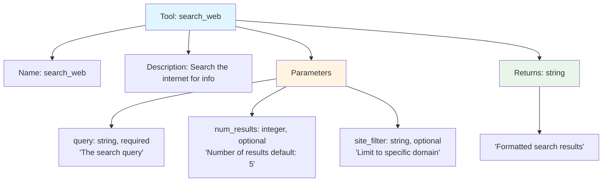
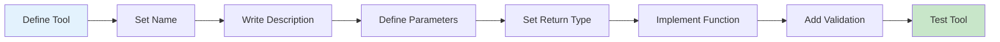
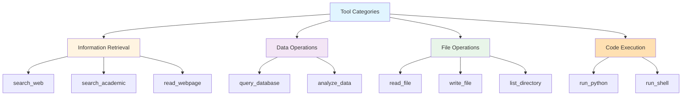
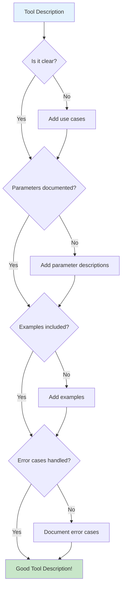
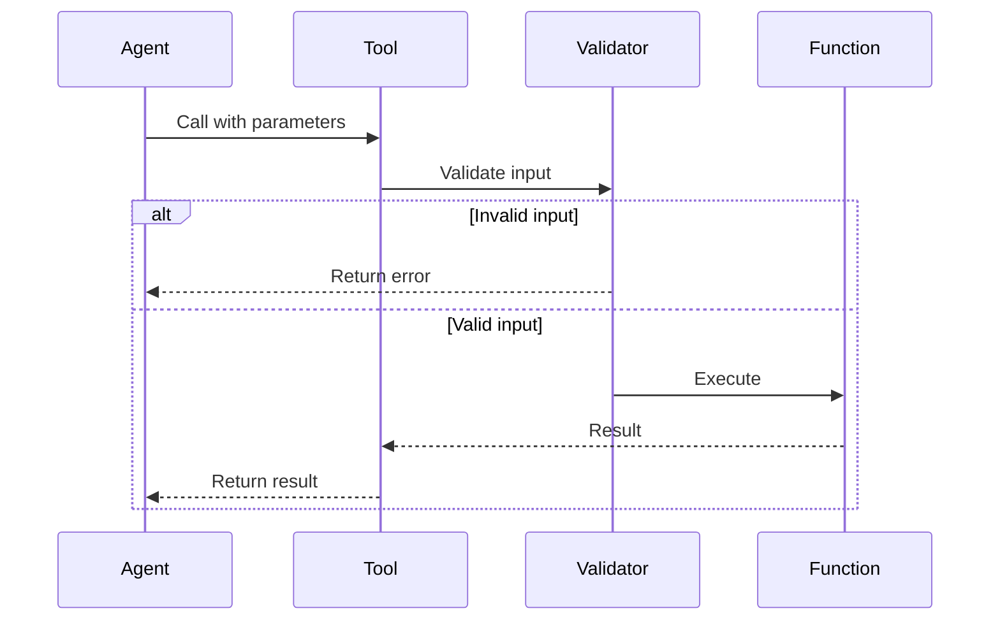

# Tool Definition


에이전트가 사용할 도구를 정의하는 방법입니다.

## Tool Anatomy



## Tool Definition Flow



## OpenAI Function Schema

```python
search_tool = {
    "type": "function",
    "function": {
        "name": "search_web",
        "description": "Search the internet for information on a given topic. Use this when you need current information or facts you don't know.",
        "parameters": {
            "type": "object",
            "properties": {
                "query": {
                    "type": "string",
                    "description": "The search query. Be specific and include relevant keywords."
                },
                "num_results": {
                    "type": "integer",
                    "description": "Number of results to return (1-10)",
                    "default": 5
                },
                "time_range": {
                    "type": "string",
                    "enum": ["day", "week", "month", "year", "all"],
                    "description": "Time range for results"
                }
            },
            "required": ["query"]
        }
    }
}
```

## LangChain Tool Definition

### Using @tool Decorator

```python
from langchain.tools import tool
from typing import Optional

@tool
def search_web(
    query: str,
    num_results: int = 5,
    time_range: Optional[str] = None
) -> str:
    """
    Search the internet for information.

    Use this tool when you need to find current information,
    verify facts, or discover new data on a topic.

    Args:
        query: The search query. Be specific for better results.
        num_results: Number of results to return (1-10). Default is 5.
        time_range: Filter by time - day, week, month, year, or all.

    Returns:
        Formatted search results with titles, snippets, and URLs.

    Example:
        search_web("latest AI developments 2024", num_results=3)
    """
    # Implementation
    results = search_api.search(query, num_results, time_range)
    return format_results(results)
```

### Using StructuredTool

```python
from langchain.tools import StructuredTool
from pydantic import BaseModel, Field
from typing import Optional, List

class SearchInput(BaseModel):
    """Input schema for web search."""
    query: str = Field(
        description="Search query with relevant keywords"
    )
    num_results: int = Field(
        default=5,
        ge=1,
        le=10,
        description="Number of results (1-10)"
    )
    domains: Optional[List[str]] = Field(
        default=None,
        description="Limit search to these domains"
    )

def search_implementation(
    query: str,
    num_results: int = 5,
    domains: Optional[List[str]] = None
) -> str:
    """Execute the search"""
    # Implementation
    pass

search_tool = StructuredTool(
    name="search_web",
    description="""Search the internet for information.

    Best used for:
    - Current events and news
    - Factual information
    - Research topics
    - Verifying claims

    Not suitable for:
    - Personal opinions
    - Private information
    - Internal company data
    """,
    func=search_implementation,
    args_schema=SearchInput
)
```

## Tool Categories



### Information Retrieval

```python
@tool
def search_web(query: str) -> str:
    """Search the web for general information."""
    pass

@tool
def search_academic(query: str, source: str = "arxiv") -> str:
    """Search academic papers and research.

    Args:
        query: Research topic or paper title
        source: Database - arxiv, semantic_scholar, pubmed
    """
    pass

@tool
def read_webpage(url: str, extract: str = "main") -> str:
    """Extract content from a webpage.

    Args:
        url: Full URL of the page
        extract: What to extract - main, full, summary
    """
    pass
```

### Data Operations

```python
@tool
def query_database(
    query: str,
    database: str = "default"
) -> str:
    """Execute SQL query against database.

    Args:
        query: SQL SELECT query (read-only)
        database: Target database name
    """
    pass

@tool
def analyze_data(
    data: str,
    analysis_type: str
) -> str:
    """Analyze data with specified method.

    Args:
        data: Data to analyze (JSON or CSV format)
        analysis_type: Type - summary, trend, correlation, outliers
    """
    pass
```

### File Operations

```python
@tool
def read_file(path: str) -> str:
    """Read contents of a file.

    Args:
        path: Absolute file path
    """
    pass

@tool
def write_file(path: str, content: str) -> str:
    """Write content to a file.

    Args:
        path: Absolute file path
        content: Content to write
    """
    pass

@tool
def list_directory(path: str) -> str:
    """List files in a directory.

    Args:
        path: Directory path
    """
    pass
```

### Code Execution

```python
@tool
def run_python(code: str) -> str:
    """Execute Python code in sandbox.

    Args:
        code: Python code to execute

    Security:
        - Runs in isolated sandbox
        - No network access
        - Limited file access
        - 30 second timeout
    """
    pass

@tool
def run_shell(command: str) -> str:
    """Execute shell command.

    Args:
        command: Shell command (bash)

    Security:
        - Limited to safe commands
        - No sudo access
        - Sandboxed environment
    """
    pass
```

## Tool Description Best Practices



### Good Description

```python
@tool
def calculate_mortgage(
    principal: float,
    annual_rate: float,
    years: int
) -> str:
    """
    Calculate monthly mortgage payment and total cost.

    Use this tool when a user asks about:
    - Monthly mortgage payments
    - Total loan costs
    - Mortgage affordability

    Args:
        principal: Loan amount in dollars (e.g., 300000)
        annual_rate: Annual interest rate as percentage (e.g., 6.5)
        years: Loan term in years (e.g., 30)

    Returns:
        Monthly payment, total payment, and total interest

    Example:
        calculate_mortgage(300000, 6.5, 30)
        → "Monthly: $1,896.20, Total: $682,632, Interest: $382,632"
    """
    pass
```

### Bad Description

```python
# Too vague - model won't know when to use it
@tool
def calc(a, b, c):
    """Calculate something."""
    pass
```

## Validation & Error Handling



```python
from pydantic import BaseModel, Field, validator
from typing import Literal

class QueryInput(BaseModel):
    query: str = Field(min_length=2, max_length=500)
    database: Literal["users", "orders", "products"]

    @validator("query")
    def validate_query(cls, v):
        # Only allow SELECT statements
        if not v.strip().upper().startswith("SELECT"):
            raise ValueError("Only SELECT queries allowed")
        # Block dangerous keywords
        dangerous = ["DROP", "DELETE", "INSERT", "UPDATE", "TRUNCATE"]
        for word in dangerous:
            if word in v.upper():
                raise ValueError(f"{word} not allowed")
        return v

@tool(args_schema=QueryInput)
def safe_query(query: str, database: str) -> str:
    """Execute a safe, read-only database query."""
    # Validated input guaranteed
    pass
```

## Tool Composition

```python
class ResearchToolkit:
    """Composed toolkit for research tasks."""

    def __init__(self):
        self.search = SearchTool()
        self.scrape = ScrapeTool()
        self.analyze = AnalyzeTool()

    @tool
    def deep_research(self, topic: str) -> str:
        """
        Conduct comprehensive research on a topic.

        This combines:
        1. Web search for sources
        2. Content extraction from top results
        3. Analysis and synthesis

        Args:
            topic: Research topic

        Returns:
            Comprehensive research report
        """
        # Step 1: Search
        search_results = self.search.run(topic)
        urls = extract_urls(search_results)

        # Step 2: Scrape top results
        contents = []
        for url in urls[:5]:
            content = self.scrape.run(url)
            contents.append(content)

        # Step 3: Analyze
        analysis = self.analyze.run(
            "\n\n".join(contents),
            analysis_type="synthesis"
        )

        return analysis

    def get_tools(self) -> list:
        return [
            self.search.as_tool(),
            self.scrape.as_tool(),
            self.analyze.as_tool(),
            self.deep_research
        ]
```

## Tool Testing

```python
import pytest

def test_search_tool():
    """Test search tool functionality"""
    result = search_web.run("test query")

    assert result is not None
    assert len(result) > 0
    assert "error" not in result.lower()

def test_search_tool_validation():
    """Test input validation"""
    with pytest.raises(ValueError):
        search_web.run("")  # Empty query

    with pytest.raises(ValueError):
        search_web.run("a" * 1000)  # Too long

def test_search_tool_error_handling():
    """Test graceful error handling"""
    # Mock API failure
    with patch("search_api.search", side_effect=Exception("API Error")):
        result = search_web.run("test")
        assert "error" in result.lower() or "unable" in result.lower()
```

## Summary

| Aspect | Best Practice |
|--------|---------------|
| Name | Descriptive, action-oriented (verb_noun) |
| Description | When to use, what it does, limitations |
| Parameters | Typed, with descriptions and examples |
| Validation | Use Pydantic for input validation |
| Errors | Return clear error messages |
| Testing | Unit tests for all tools |
